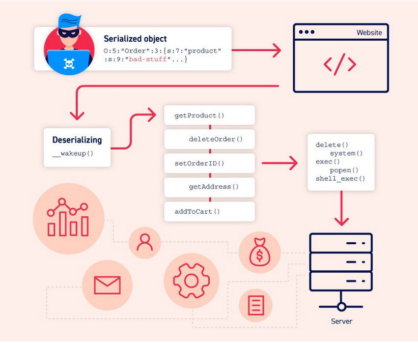
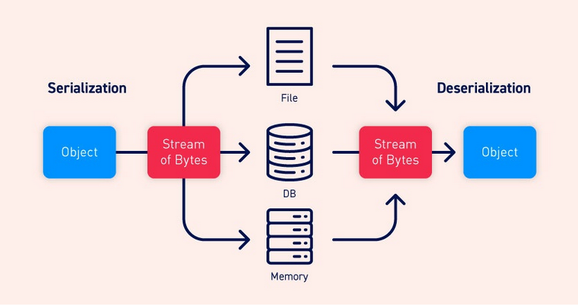

# Insecure deserialization

## What is serialization?

Serrialization is the process of converting complex data structures, such as objecsts and their files, into a "flatte" format that can be sent and received as a sequential stream of bytes.

- Write complex data to inter-process memory, a file, or a database.
- Send complex data, for example, over a network, betyween different components of an application, or in an API call.

## Serializtion vs deserialization

Deserialization is the process of restoring this byte stream to a fully functional replica of the original object, in the exact state as when it was serialized.

## Insecure deserialization

Insecure deserialization is when user-controllable data is deserialized by a website. This potentially enables an attacker to manipulate serialized objecst in order to pass harmful data into the application code.

It is even possible to replace a serialized object with an object of an entirely different class. Alarmingly, objects of any class that is available to the website will be deseriallized and instantiated.

## How do these vulns arise?

Insecure deserialization typically arises becasue there is a general lack of understanding of how dangerous deserializing user-controllable data can be. Ideally, user input should never be deserialized at all.

## How to prevent?

Generally speaking, deserialization of user input should be avoided unless absolutely necessary.
Finally, remember that the vulnerability is ther deserialization of user input, not the presence of gadget chains that subsequently handle the data.
