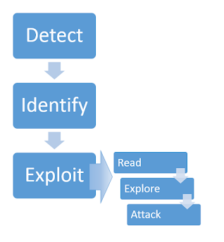

# Server-side Template Injection

## What is server-sdie template injection?

Server-side template injection is when an attacker is able to use native template syntax to inject a malicious payload into a template, which is then executed server-side

Template engines are designed to generate web pages by combining fixed templates with volatile data.

Server-side template injection attacks can occur when user input is concatenated directly into a template, rather than passed in as data.

This allows attacker to inject arbitrary template directives in order to manipulate the template engine, often enabling them to take complte control of the server.

## Constructing a server-side template injection attack

## How to prevent server-side template injection vulns?

The best way to prevent server-side template injection is to now allow any users to modify or submit new templates. However, this is sometimes unavoidable due to business requirement.

Another complementary approach is to accept that arbitrary code execution is all but inevitable and apply your own sanboxing.
