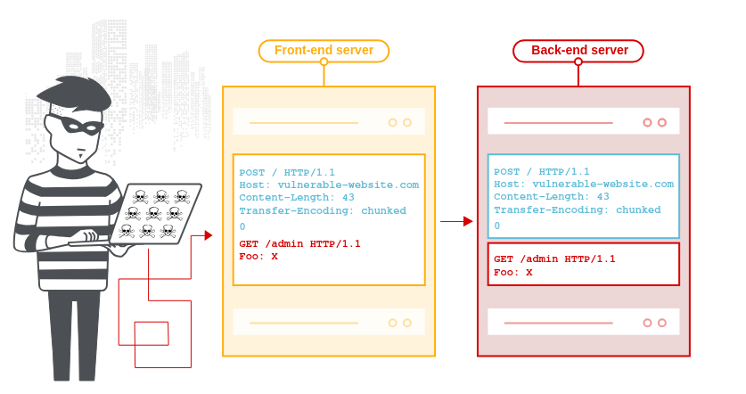
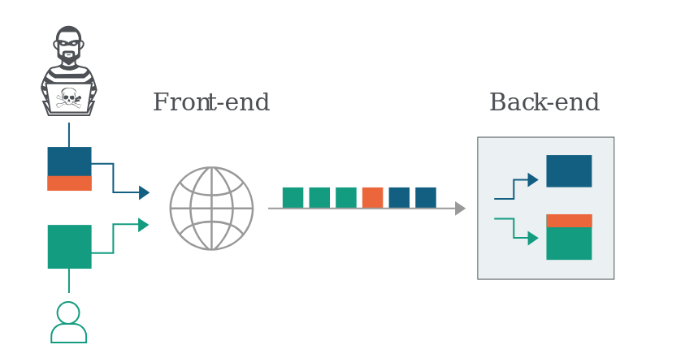

# HTTP request smuggling

## What is HTTP request smuggling



HTTP request smuggling is a technique for interfering with the way a website processes sequences of HTTP requests that are received from one or more users. 

Request smuggling vuln are often critical in nature, allowing an attacker to bypass security controls, gain unauthorized access to sensitive data, and directly compromise other application users

Request smuggling is primarily associated with HTTP/1 request. However, websites that support HTTP/2 may be vulnerable.

## What happen in an HTTP request smuggling attack?



Here, the attcker causes part of their front-end request to be interpreted by the back-end server as the start of the next request.

It is effectively prepended to the next request, and so can interfere with the way the application processes that request.

## How do HTTP reqeust smuggling vuln arise?

Most HTTP request smuggling vuln arise becasue the HTTP/1 specification provides 2 different way to specify where a reqeust ends: the `Content-Length` header and the `Transfer-Encoding` header.

- The `Content-Length`:
```
POST /search HTTP/1.1
Host: normal-website.com
Content-Type: application/x-www-form-urlencoded
Content-Length: 11

q=smuggling
```

- The `Transfer-Encoding`:
```
POST /search HTTP/1.1
Host: normal-website.com
Content-Type: application/x-www-form-urlencoded
Transfer-Encoding: chunked

b
q=smuggling
0
```

> Note: this means that the message body contains one or more chunks of data. Each chunk consists of the chunk size in bytes

## How to perform an HTTP request smuggling attack?

Done depends on the behavior of the 2 servers:

- CL.TE: frontend use `Content-Length` header and the back-edn server uses the `Transfer-Encoding` header.
- TE.CL: ...
- TE.TE: ...(tự biết)


### CL.TE vuln

```
POST / HTTP/1.1
Host: vulnerable-website.com
Content-Length: 13
Transfer-Encoding: chunked

0

SMUGGLED
```

The frontend server process the `Content-Length` header and determines that the request body is 13 bytes long, up to the end of `SMUGGLED`. This request is forwarded on to the back-end server.

### TE.CL vuln

```
POST / HTTP/1.1
Host: vulnerable-website.com
Content-Length: 3
Transfer-Encoding: chunked

8
SMUGGLED
0
``` 

> Note: include the trailing sequence `\r\n\r\n` following the final `0`.

The front-end server processes the `Transfer-Encoding` header, and so treats the message body as using chnked encoding. It processes the first chunk, which is started to be 8 bytes long, up to the start of the line following `SMUGGLED`. It processess the second chunk, this request is forwarded on to the back-end server.


The back-end server processess the `Content-Length` header and determines that the request body is 3 bytes long, up to the start of the line following `8`. The following bytes, starting with `SMUGGLED`, and are left unprocessed, and the back-end server will treat these as being th start of the next request in the sequence.


### TE.TE

```
Transfer-Encoding: xchunked

Transfer-Encoding : chunked

Transfer-Encoding: chunked
Transfer-Encoding: x

Transfer-Encoding:[tab]chunked

[space]Transfer-Encoding: chunked

X: X[\n]Transfer-Encoding: chunked

Transfer-Encoding
: chunked
```

## How to prevent?

- Use HTTP/2 end to end and disable HTTP downgrading if possible
- Make the front-end server normallize ambigous request and make the back-end server reject any that are still ambiguois,
- Never assume that request won't have a body.
- Default to discarding the connection if server-level exceptions are triggered when handling request.
- If you reoute traffic through a forward proxy, ensure that upstraeam HTTP/2 is enabled if possible.
