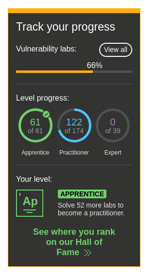

# Web_Vulnerability Lab Overview

Đây là thư mục tổng hợp các bài lab bảo mật web đã thực hiện từ các phòng thí nghiệm PortSwigger Web Security Academy.

## Mục tiêu chung

- Tập trung vào các lỗ hổng và kỹ thuật khai thác web phổ biến
- Lưu trữ nội dung hướng dẫn, giải pháp và ví dụ thực tế dưới dạng `lab.md`

## Các chủ đề lab đã có

Thư mục này chứa các bài lab theo các danh mục chính sau:

- Access Control
- API Testing
- Authentication
- Business logic vulnerabilities
- Clickjacking
- CORS
- Cross-site Scripting
- CSRF
- DOM-based vulnerabilities
- File Upload
- HTTP Host header attacks
- HTTP Request Smuggling
- Information Disclosure
- Insecure Deserialization
- JWT
- NoSQL injection
- OAuth Authentication
- OS Command Injection
- Path Traversal
- Race Condition
- Server-side Template Injection
- SQL Injection
- SSRF
- Web Cache Deception
- WebSockets
- XML External Entity (XXE)

## Cách sử dụng

Mỗi thư mục con chứa một file `lab.md` đã được dịch và tổng hợp từ nội dung phòng thí nghiệm gốc. Bạn có thể mở từng file này để xem:

- mô tả bài lab
- giải pháp từng bước
- ví dụ yêu cầu HTTP và payload
- hình ảnh minh họa (nếu có)

## Các topic mà đã làm 

| ID | Topic | Apprentice | Practitioner | Expert | 
| --- | --- | :---: | :---: | :---: |
|    | **Server-side topics** ||||
| 01 | SQL injection | :heavy_check_mark: 2/2 | :heavy_check_mark: 15/15 | - |
| 02 | Authentication | :heavy_check_mark: 3/3 | :heavy_check_mark: 9/9 | :heavy_check_mark: 2/2 | 
| 03 | Directory traversal | :heavy_check_mark: 1/1 | :heavy_check_mark: 5/5 | - |
| 04 | Command inection | :heavy_check_mark: 1/1 | :heavy_check_mark: 4/4 | - |
| 05 | Business logic vulnerabilities | :heavy_check_mark: 4/4 | :heavy_check_mark: 7/7 | - |
| 06 | Information disclosure | :heavy_check_mark: 4/4 | :heavy_check_mark: 1/1 | - |
| 07 | Access control | :heavy_check_mark: 9/9 | :heavy_check_mark: 4/4 | - |
| 08 | File upload vulnerabilities | :heavy_check_mark: 2/2 | :heavy_check_mark: 4/4 | :heavy_multiplication_x: 0/1 |
| 09 | Server-side request forgery (SSRF) | :heavy_check_mark: 2/2 | :heavy_check_mark: 3/3 | :heavy_check_mark: 2/2 |
| 10 | XXE injection | :heavy_check_mark: 2/2 | :heavy_check_mark: 6/6 | :heavy_check_mark: 1/1|
|    | **Client-side topics** ||||
| 11 | Cross-site scripting (XSS) | :heavy_check_mark: 9/9 | :heavy_multiplication_x: 13/15 | :heavy_multiplication_x: 0/6 |
| 12 | Cross-site request forgery (CSRF) | :heavy_check_mark: 1/1 | :heavy_check_mark: 7/7 | - |
| 13 | Cross-origin resource sharing (CORS) | :heavy_check_mark: 2/2 | :heavy_check_mark: 1/1 | :heavy_multiplication_x: 0/1  |
| 14 | Clickjacking | :heavy_check_mark: 3/3 | :heavy_check_mark: 2/2 | - |
| 15 | DOM-based vulnerabilities | - | :heavy_check_mark: 5/5 | :heavy_multiplication_x: 0/2 |
| 16 | WebSockets | :heavy_check_mark: 1/1 | :heavy_check_mark: 2/2 | - |
|    | **Advanced topics** ||||
| 17 | Insecure deserialization | :heavy_check_mark: 1/1 | :heavy_multiplication_x: 5/6 | :heavy_multiplication_x: 0/3 |
| 18 | Server-side template injection | - | :heavy_multiplication_x: 2/5 | :heavy_multiplication_x: 0/2 |
| 19 | Web cache poisoning | - | :heavy_multiplication_x: 0/9 | :heavy_multiplication_x: 0/4 |
| 20 | HTTP Host header attacks | :heavy_check_mark: 2/2 | :heavy_multiplication_x: 0/4 | :heavy_multiplication_x: 0/1 |
| 21 | HTTP request smuggling | - | :heavy_multiplication_x: 1/15 | :heavy_multiplication_x: 0/7 |
| 22 | OAuth authentication | :heavy_check_mark: 1/1 | :heavy_multiplication_x: 1/4 | :heavy_multiplication_x: 0/1 |
| 23 | JWT attacks | :heavy_check_mark: 2/2 | :heavy_multiplication_x: 2/4 | :heavy_multiplication_x: 0/2 |
| 24 | Client-side prototype pollution | - | :heavy_multiplication_x: 0/5 | - |
| 25 | Essential skills | - | :heavy_multiplication_x: 0/1 | - |

## Tiến độ

Dưới đây là ảnh tiến độ hiện tại của dự án:

