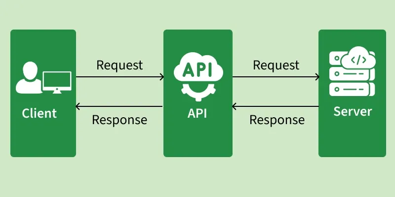

# API

Giao diện lập trình ứng dụng (API - Application Programming Interface) là một thành phần thiết yếu trong phát triền phàn mềm hiện đại, đóng vai trò như một "xương sống" vô hình cho phép các ứng dụng và hệ thống khác nhau giao tiếp và chia sẻ dữ liệu một cách hiệu quả

## Khái niệm và Cách thức hoạt động

API có thể được hiểu đơn giản thông qua ẩn dụ về một nhà hàng:

- Khách hàng (Client): người đưa ra yêu cầu (gọi món).
- Nhà bếp (Server): Nơi xử lý yêu cầu và chuẩn bị thức ăn.
- Người bồi bàn (API): Người nhận yêu cầu từ khách, chuyển đến nhà bếp và mang kết quả (món ăn) trở lại cho khách.

## Tại sao API lại quan trọng

Các dev phát triển dựa vào API để xây dựng các hệ thống có khả năng mở rộng và kết nối cao vì những lý do sau:
- Tính tái sử dụng (Reusability): Tận dụng các chức năng có sẵn thay vì phải tự xây dựng lại từ đầu.
- Hiệu quả: Tiết kiệm thời gian phát triển bằng cách tích hợp các tính năng đã được kiểm chứng.
- Tự động hóa (Automation): Cho phép các máy moc tự nói chuyện với nhau mà không cần sự can thiệp thủ công của con ng.

## Phân loại và Kiến trúc API

API được phân loại dựa trên khả năng tiếp cận và mục đích sử dụng:
- Web APIs: Try cập qua Internet bằng HTTP (ví dụ: REST, GraphQL).
- Local APIs: Sử dụng trong môi trường cục bộ hoặc hệ điều hành (ví dụ: Windows API)
- Chính sách quyền riêng tư: Gồm có Private APIs (dùng nội bộ doanh nghiệp), Partner APIs (chia sẻ với các đối tác cụ theerA), và Open (Public) APIs (công khai cho mọi nhà phát triển).

Các kiến trúc phổ biến bao gồm:

- REST (Representational State Transfer): Kiến trúc linh hoạt nhất, sử dụng các phương thức HTTP (GET, POST, PUT, DELETE) và định dạng JSON hoặc XML.
- SOAP: Giao thức cứng nhắc hơn, bảo mật cao và bắt buộc sử dụng XML.
- GraphQL: ngôn ngữ truy vấn hiện đại cho phép khách hành chỉ lấy đúng dữ liệu họ cần

## API trong mạng máy tính

Trong kiến trúc mạng, khái niệm API xuất hiện ở các vị trí quan trọng:

- Socket API: Giao diện Socket chính là API giữa tầng ứng dụng và tầng giao vận. No cung cấp các quy tắc lập trình để các ứng dụng mạng có thể gửi/nhận dữ liệu qua hạ tầng Internet.
- SDN APIs: Trong mạng điều khiển bằng phần mềm (SDN), bộ điều khiển (controller) cung cáp NOrthbound API (thường là REST) để các ứng dụng quản lý mạng có thể lập trình và điều khiển các thiết bị phần cứng bên dưới.

## Ưu điểm và hạn chế

| Đặc điểm | Chi tiết |
|----------|----------|
| Ưu điểm | Tăng tốc độ phát triển và đổi mới. Đơn giản hóa thiết kế hệ thống phân tán. Kết nối liền mạch các dịch vụ khác nhau. |
| Hạn chế | Chi phí phát triển và bảo trì cao. Rủi ro bảo mật: Các điểm cuối bị lộ có thể trở thành mục tiêu tấn công. Sự phụ thuộc: Nếu API bên thứ ba gặp sự cố, hệ thống của bạn cũng bị ảnh hưởng. |