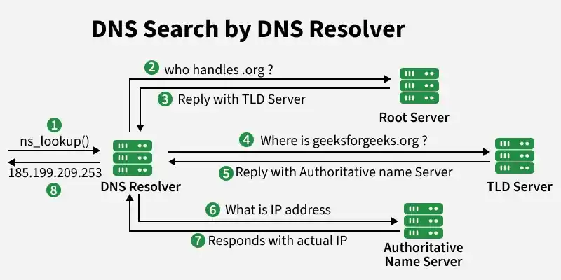

# Domain Name System (DNS)

Hệ thống phân giải tên miền (DNS - Domain Name System) là một thành phần thiết yếu của Internet, đóng vai trò như một "danh bạ" giúp chuyển đổi các tên miền dễ nhớ (như `google.com`) thành các địa chỉ IP mà máy tính có thể hiểu được.

## Dịch vụ và Chức năng chính

Nhiệm vụ cốt lõi của DNS là phân giải tên miền thành địa chỉ IP. Ngoài ra, nó còn cungcapas các dịch vụ quan trọng khác:

- Host aliasing (Bí danh host): một máy chủ có thể có một tên miền chính và nhiều tên miền phụ dễ nhớ hơn.
- Mail server aliasing: Giúp địa chỉ email trở nên dễ nhớ hơn.
- Load distribution (Phân tải): DNS có thể thực hiện xoay vòng (DNS rotation) các địa chỉ IP của các máy chủ được nhân bản để phân phối lưu lượng truy cập.

## Cấu trúc phân tầng của DNS

DNS hoạt động theo mô hình cơ sở dữ liệu phân tán và có thứ bậc để đảm bảo khả năng mở rộng:

- **Root Servers (máy chủ gốc)**: Tầng cao nhất trong các hệ thống, cung cấp địa chỉ IP của các máy chủ TLD.
- **Top-Level Domain (TLD) Servers**: Quản lý các phần mở rộng tên miền như  `.com`, `.org` và các mã quốc gia như `.vn`, `.jp`.
- **Authoritive Servers (Máy chủ có thẩm quyền)**: Nơi lưu trữ các hố sơ DNS thực tế của một tổ chức, cung cấp ánh xạ chính xác từ tên host sang địa chỉ IP.
- **Local DNS Server**: Thường được ISP cung cấp, đóng vai trò như một proxy trung gian để chuyển tiếp các truy vấn của người dùng vào hệ thống phân tầng.

## Cách hoạt động của DNS

Quá trình diễn ra qua các bước chính sau:

1. Gửi yêu cầu: Khi người dùng nhập tên miền vào trình duyệt, máy tính sẽ kiểm tra bộ nhớ đệm (cache) cục bộ trước. Nếu không có dữ liệu, yêu cầu sẽ gửi đến một Local DNS Server
2. Truy vấn phân tầng: nếu Local DNS Server không biết địa chỉ, nó sẽ bawtwsd đàu truy vấn hệ thống máy chủ phân cấp.

    - Hỏi Root Server (máy chủ gốc) để biết địa chỉ của msy chủ quản lý đuôi tên miền tương ứng.
    - Hỏi TLD Server (máy chủ tên miền cấp cao nhất) để tìm máy chủ có thẩm quyền (Authoritive server) của tên miền cụ thể đó.
    - Hỏi Authoritive server (máy chủ có thẩm quyền) để nhận địa chỉ IP chính xác của trang web.

3. Trả kết quả và kết nối: Địa chỉ IP cuối cùng gửi ngược lại cho trình duyệt. Trình duyệt sau đó sử dụng địa chỉ này để thiết lập kết nối TCP và tải nội dung trang web
4. Lưu bộ nhớ đệm (Caching): Đẻ tăng tốc cho các lần truy cập sau, các máy chủ DNS sẽ lưu kết quả vào bộ nhớ đệm trong một khoảng thời gian nhất định (TTL).

## Quá trình phân giải DNS (DNS Lookup)

Đây là quy trình chuyển đổi tên miền thành IP qua các loại truy vấn:

- Recursive Query (Truy vấn đệ quy): Máy khách yêu cầu trình phân giải (resolver) thực hiện toàn bộ quá trình tìm kiếm trả về kết quả cuối cùng hoặc lỗi.
- Iterative Query (Truy vấn lặp): Máy chủ DNS trả về thông tin tốt nhất mà nó có hoặc trỏ tới một máy chủ DNS khác có khả năng biết câu trả lời.

## Các loại bản ghi (DNS Record Types)

Mỗi bản ghi DNS là một bộ 4 thông tin (Name, Value, Type, TTL). Các loại phổ biến bao gồm:

- Bản ghi A: Ánh xạ tên host sang địa chỉ IPv4
- Bản ghi CNAME: tạo bí danh trỏ từ tên miền này sang tên miền khác.
- Bản ghi MX: Xác định máy chủ thư điện tử chịu trách nhiệm nhận email cho tên miền
- Bản ghi TXT: Lưu trữ thông tin văn bản phục vụ xác minh và bảo mật email.
- Bản ghi NS: Xác định máy chủ DNS có thẩm quyền của một miền.

> TTL (Time-to-live): Đây là một giá trị xác định thời gian một bản ghi DNS được phép lưu lại trong bộ nhớ đệm (cache) trước khi cần phải thực hiện một truy vấn mới để cập nhật thông tin.

## Bảo mật DNS

Vì DNS là cơ sở hạ tầng quan trọng, nó thường là mục tiêu của các cuộc tấn công như **DDoS** hoặc **DNS Poisoning** (đưa thông tin sai lệch vào cache).