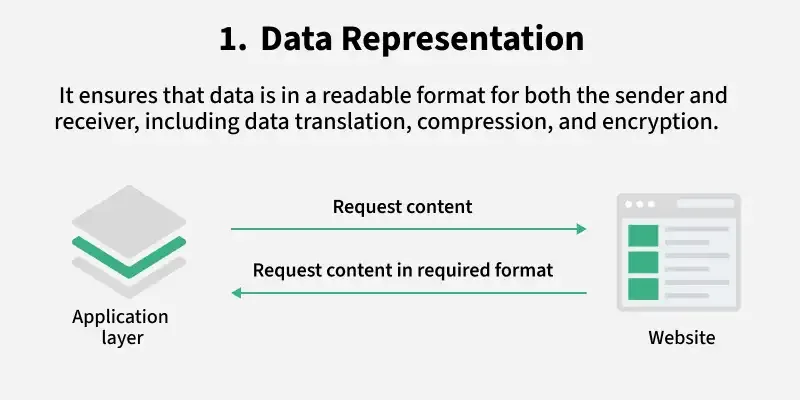
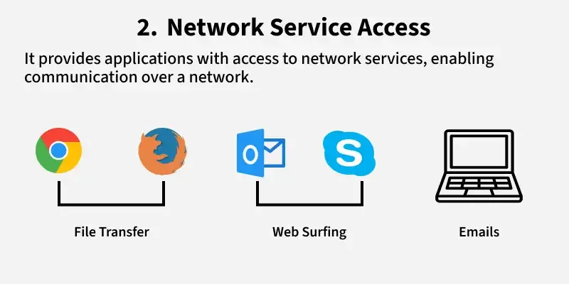
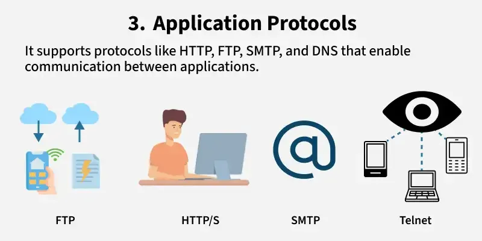
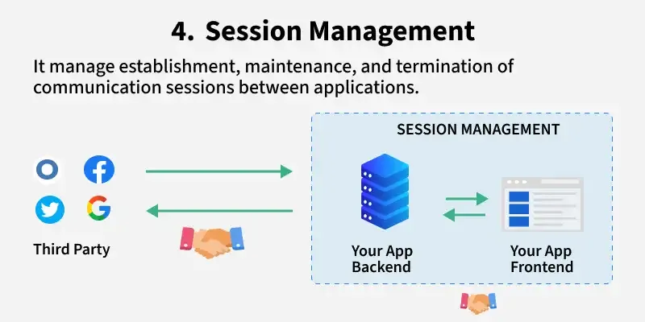
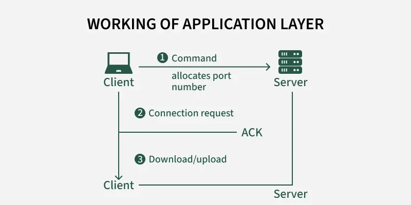
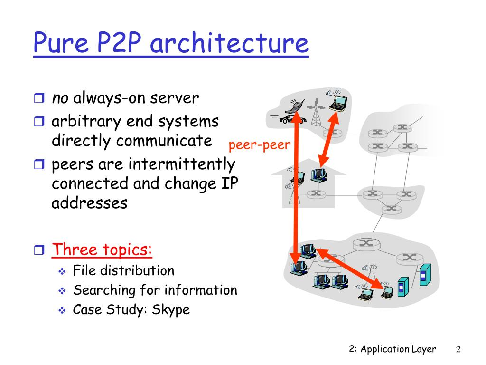

# Tầng ứng dụng (Application Layer)

Tầng ứng dụng là tầng cao nhất (tầng 7) trong mô hình OSI, đóng vai trò là giao diện trực tiếp giữa người dụng và mạng

## Chức năng chính của tầng ứng dụng

Tầng này thực hiện các nhiệm vụ thiết yếu để đảm báo giao tiếp thông suốt giữa các hệ thống:

- Biểu diển dữ liệu (Data Representation): Đảm bảo dữ liệu được định dạng sao cho cả bên gửi và bên nhận đều hiểu được, ví dụ như chuyển đổi văn bản hoặc hình ảnh thành các định dạng tương thích với mạng như ASCII, JPEG hoặc HTML.

- Truy cập dịch vụ mạng (Network Service Access): Cung cấp các giao diện để các chương trình phần mềm (như trình duyệt Web, trình quản lý email) twogn tác với mạng bên dưới.

- Giao thức ứng dụng (Applicaiton Protocol): Định nghĩa các quy tắc để trao đổi thông điệp, bao gồm định dạng, cú pháp và ý nghĩa của thông tin.

- Quản lý phiên (Session Management): Thiết lập, quản lý và kết thúc các phiên giao tiếp giữa các ứng dụng.

## Các giao thức phổ biến và Cổng (Port)

Mỗi dịch vụ trong tầng ứng dụng thường đi kèm với một giao thức và số cổng cụ thể:

- HTTP (HyperText TRansfer Protocol): Dùng cho giao tiếp Web (cổng 80)
- DNS (Domain Name System): Dịch tên miền thành địa chỉ IP (Cổng 53)
- SMTP (simple Mail Transfer Protocol): Dùng để gửi email (Cổng 25)
- FTP (File Transfer Protocol): Dùng để truyền tệp tin (Cổng 20 cho dữ liệu, 21 cho điều khiển)
- DHCP (Dynamic Host Configuration Protocol): Cấp phát địa chỉ IP động (Cổng 67 & 68)

## Cơ chế hoạt động: Tiến trình và Socket

- Tiến trình (Processess): Trong mạng máy tính, các chương trình thực sự giao tiếp với nhau được gọi là các tiến trình.
- Giao diện socket: Đây là "cửa ngõ" giữa tiến trình ứng dụng và tầng giao vận. Ứng dụng đảy thông điệp qua socket để gửi vào mạng.
- Định dang tiến trình: Để gửi dữ liệu đến đúng wngd dụng trên máy địch, cần có 2 thông tin: địa chỉ IP  của máy chủ và số cổng (port number) của tiến trình đó.

## Kiến trúc ứng dụng mạng

Có 2 mô hình kiến trúc chủ yếu được sử dụng:
- Mô hình Client-Server: Có một máy chủ (server) luôn hoạt động để phục vụ yêu cầu từ nhiều máy khách (clients). Server thường có địa chỉ IP cố định.

- Mô hình Peer-to-Peer (P2P): Tận dụng giao tiếp trực tiếp giữa các cặp máy chủ (được gọi là các peer) mà không cần phụ thuộc nhiều vào các máy chủ trung tâm. Ví dụ điển hình là giao thức BitTorrent.

## Yêu cầu dịch vụ từ Tầng giao vận

Các ứng dụng khác nhau yêu cầu các loại dịch vụ khác nhau từ tầng bên dưới (tầng giao vận):

- Độ tin cậy (Reliable Data Transfer): Một số ứng dụng yêu cầu dữ liệu phải đến đầy đủ và chính xác (như email, chuyển tiệp), trong khi ứng dụng đa phương tiện có thể chấp nhận mất một lượng nhỏ dữ liệu.
- Thông lượng (Throughput): Các ứng dụng nhạy cảm với băng thông (như video streaming) cần một tốc độ truyền bit tối thiểu để hoạt động mượt mà.
- Thời gian (Timing): Các ứng dụng thời gian thực như trò hơi trực tuyển hoặc điện thoại Internet yêu cầu độ trễ thấp.

