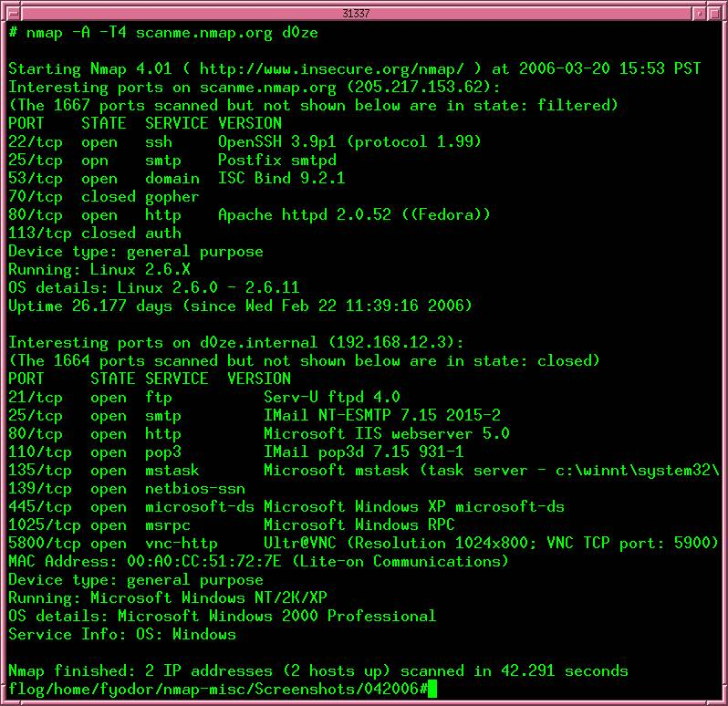

# Port - Services

## Khái niệm và Vai trò của Port

- Định nghĩa: Port là một số hiệu định danh duy nhất (16 bit) được sử dụng để cho phép lưu lượng mạng truyền đến đúng dịch vụ hoặc ứng dụng cụ thể trên một thiết bị.
- Vai trò: Port kết hợp với địa chỉ IP để tọa thành một "cửa ngõ" logic, giúp phân biệt giữa các tiến trình khác nhau đang chạy trên cùng một máy chủ.

## Phân loại Port theo tiêu chuẩn IANA

Các số hiệu cổng nằm trong khoảng từ 0 đến 65535 và được tổ chức IANA (Internet Assigned Numbers Authority) chia thành ba loại chính:

- Well-Known Ports (0 - 1023): Được dành riêng cho các giao thức và dịch vụ mạng tiêu chuẩn.
- Registered Ports (1024 - 49151): Được sử dụng bởi các ứng dụng phần mềm cụ thể hoặc các công ty. Ví dụ: SQL Server (1433), MySQL (3306).
- Dynamic hoặc Private Ports (49152 - 65535): Được hệ điều hành gán động cho các kết nối tạm thời khi ứng dụng cần giao tiếp với máy chủ.

## Các Port và Dịch vụ phổ biến

| Port | Dịch vụ (Service) | Giao thức | Mô tả |
|------|-------------------|-----------|-------|
| 20/21 | FTP | TCP | Truyền tệp tin (Dữ liệu/Điều khiển) |
| 22 | SSH | TCP | Đăng nhập từ xa bảo mật |
| 23 | Telnet | TCP | Đăng nhập từ xa không mã hóa |
| 25 | SMTP | TCP | Gửi Email |
| 53 | DNS | UDP/TCP | Phân giải tên miền thành địa chỉ IP |
| 67/68 | DHCP | UDP | Cấp phát địa chỉ IP động |
| 80 | HTTP | TCP | Duyệt Web không bảo mật |
| 443 | HTTPS | TCP | Duyệt Web bảo mật |

## Khía cạnh Bảo mật

- Port Scanning: Kẻ tấn công thường sử dụng các công cụ như `nmap` để quét các cổng đang mở trên một máy chủ nhằm xác định các dịch vụ và tìm kiếm lỗ hổng bảo mật.

- Quản lý cổng: Quản trị viên mạng cần giám sát và hạn chế các cổng không cần thiết để ngăn chặn truy cập trái phép và các mối đe dọa mạng.