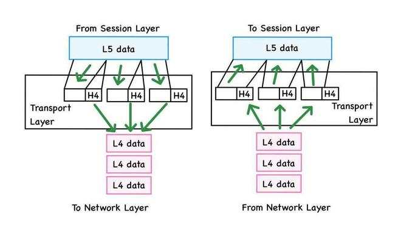
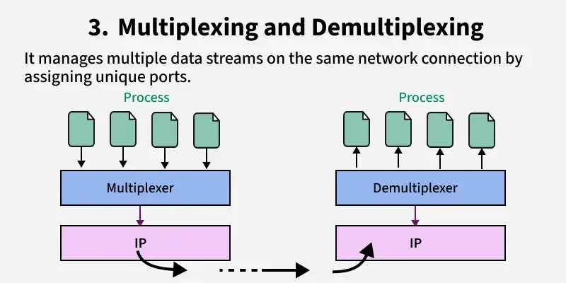
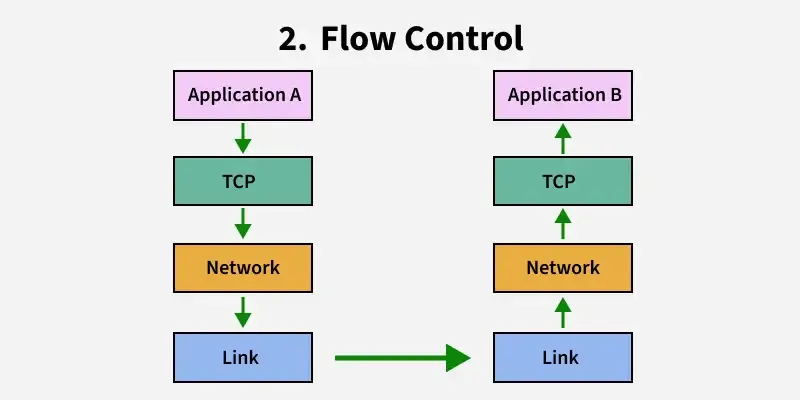
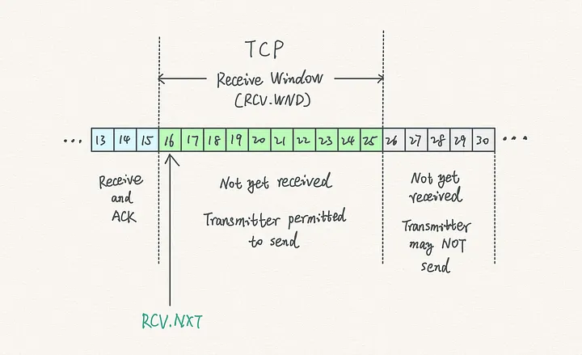
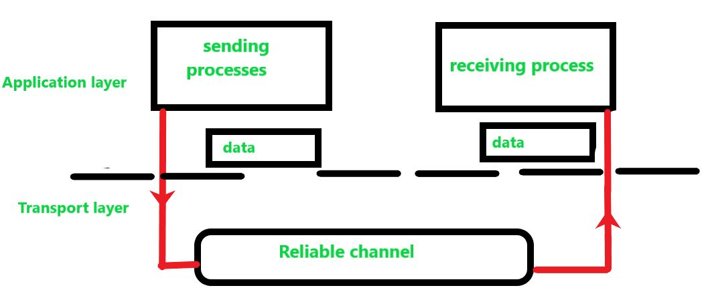
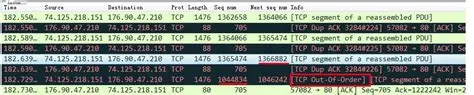
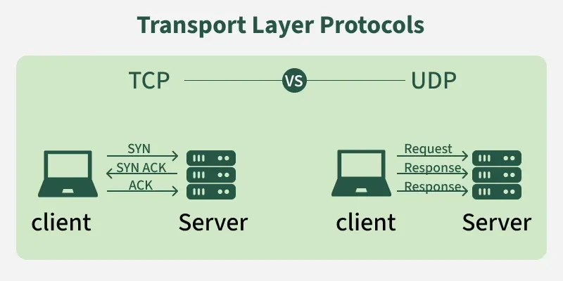
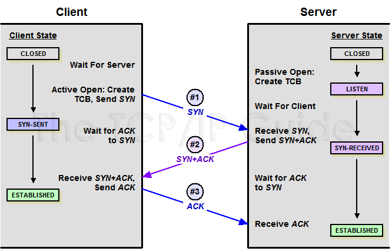
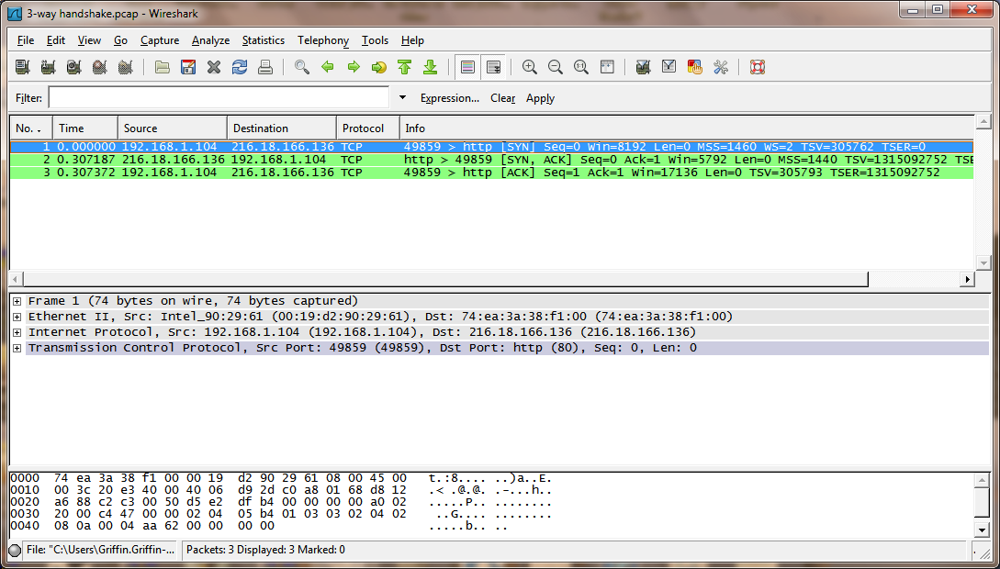

# Tầng giao vận (Transport Layer)

Tầng giao vận (Transport Layer), là tầng thứ 4 trong mô hình OSI, đóng vai trò cung cấp dịch vụ giao tiếp logic giữa các tiến trình ứng dụng chạy trên máy chủ khác nhau. Khác với tầng mạng cung cấp giao tiếp giữa các máy chủ (host-to-host), tầng giao vận mở rộng dịch vụ này thành giao tiếp giữa các tiến trình (process-to-process).

## Các chức năng cốt lõi

- Đa hợp và Giải đa hợp (Multiplexing/Demultiplexing): Đây là chức năng cơ bản nhất, sử dụng các số cổng  (port numbers) để thu nhập dữ liệu từ nhiều tiến trình khác nhau tại bên gửi và phân phối chính xác đến các socket tương ứng tại bên nhận.

- Truyền dữ liệu tin cậy (Reliable Data Transfer): Đảm bảo dữ liệu được chuyển giao mà không bị lỗi bit, không bị mất gói tin và đúng thứ tự thông qua các cơ chế như mã kiểm tra lỗi (checksum), số thứ tự (sequence numbers), và truyền lại (retransmission).

- Điều khiển luồng (Flow Control): Cơ chế giúp bên gửi điều chỉnh tốc độ truyền dữ liệu sao cho phù hợp với khả năng xử lý cảu bên nhận, tránh làm tràn bộ đệm của bên nhận.

- Điều khiển tắc nghẽn (Congestion Control): Ngăn chặn việc các máy chủ gửi quá nhiều dữ liệu vào mạng lưới, làm quá tải các bộ định tuyến và liên kết trung gian.

### Điều khiển luồng (FLow Control)

Điều khiển luồng (FLow Control) là một dịch vụ khớp tốc độ giữa bên gửi và bên nhận. Mục tiêu là ngăn chạn bên gửi truyền dữ liệu quá nhanh khiến bộ dệm của bên nhận bị tràn.

- Cơ chế Cửa sổ nhận (Receive Window - `rwnd`): TCP thực hiện điều khiển luồng bằng cách yêu cầu bên gửi duy trì một biến gọi là cửa sổ nhận. Cửa sổ này cho bên gửi biết lượng không gian trống trong bộ đệm của bên nhận

- Cách tính: `rwnd = RcvBuffer - [LastByteRcvd - LastByteRead]`, trong đó:
    - `RcvBuffer` là tổng dung lượng bộ đệm nhận.
    - `LastByteRcvd` là byte cuối cùng nhận được từ mạng
    - `LastByteRead` là byte cuối cùng ứng dụng đã đọc từ bộ đệm.

- Hoạt động: Bên nhận sẽ gửi giá trị `rwnd` hiện tại trong tiêu đề của mỗi phân doạn TCP phản hồi cho bên gửi . Bên gửi đảm bảo rằng lượng dữ liệu đã gửi những chưa được xác nhận (`LastByteSent - LastByteAcked`) luôn nhỏ hơn hoặc bằng giá trị `rwnd` mới nhất nhận đc.

- Trường hợp đặc biệt: Nếu bên nhận thông báo `rwnd = 0`, bên gửi sẽ tạm dừng truyền nhưng vẫn tiếp tục gửi các phân đoạn có 1 byte dữ liệu để kích hoạt các phản hồi từ bên nhận, từ đó biết được khi nào bộ đệm có chỗ trống trở lại.

### Điều khiển tắc nghẽn (Congestion Control)

Khác với điều khiển luồng (do giới hạn tại nút cuối), điều khiển tắc nghẽn được thực hiện để ngăn chặn các máy chủ gửi quá nhiều dữ liệu làm quá tải mạng lưới.

- Biến Cửa sổ tắc nghẽn (`cwnd`): TCP duy trì biến  `cwnd` để giới hạn tốc độ gửi dựa trên tình trạng tắc nghẽn mạng cảm nhận dược.Tốc độ gửi của TCP xấp xỉ bằng `cwnd/RTT` (byte/giây)
- Giới hạn truyền: Lượng dữ liệu chưa được xác nhận tại bên gửi bị giới hạn bởi giá trị nhỏ nhất của cả 2 cửa sổ: `LastByteSent - LastByteAcked <= min{cwnd, rwnd}`.

- Các giai đoạn của thuật toán điều khiển tắc nghẽn:
    - Slow Start (khởi đầu chậm): `cwnd` bắt đầu từ 1 MSS (Maximum Segment Size) và tăng gấp đôi sau mỗi RTT (tăng trưởng theo hàm mũ) để nhanh chóng tìm ra băng thông khả dụng.
    - Congestion Avoidance (Tránh tắc nghẽn): Khi `cwnd` đạt đến ngưỡng `ssthresh`, tốc độ tăng sẽ chậm lại, chỉ tăng thêm 1 MSS cho mỗi RTT (tăng trưởng tuyến tính)
    - Fast Recovery (Phục hồi nhanh): Được kích hoạt khi nhận đc 3 ACK trùng lập. TCP sẽ giảm một nửa `cwnd` (thay vì đưa về 1) và tiếp tục tăng tuyến tính để duy trì hiệu suất.

> Note: RTT (Round Trip Time) là khoảng thời gian (ms) để một gói tin (packet) hoàn thành chu trình di chuyển từ nguồn đến đích và phản hồi ngược lại.

> Ssthresh (slow start threshhold) là một khái niệm trong TCP. Nó chỉ ra điểm mà congestion window (cwnd) ngừng tăng trưởng nhanh chóng và chuyển sang giai đoạn congestion avoidance.

### Truyền dữ liệu tin cậy (Reliable Data Transfer)

Một trong những vấn đề cơ bản và quan trọng nhất trong mạng máy tính. Mục tiêu của nó là triển khai một kênh truyền tin cậy bên trên một kênh truyền không tin cậy (như tầng mạng IP).

#### Các cơ chế đảm bảo độ tin cậy 

Để biến một kênh truyền không tin cậy thành tin cậy, các giao thức sử dụng:

- Kiểm tra lỗi (Checksum): Bên gửi tính toán một giá trị dựa trên nội dung dữ liệu và gửi kèm trong gói tin. Bên nhận thực hiện tính toán lại, nếu kết quả không khớp, nó biết rằng gói tin đã bị lõi trong quá trình truyền
- Phản hồi từ bên nhận (ACKs): Vì bên gửi và bên nhận ở cá máy chủ khác nhau, cách duy nhất để bên gửi biết bên nhận đã nhận được gì là thông qua phản hồi:
    - ACK: thông báo gói tin đã nhận chính xác.
    - Negative ACK (NAK): thông báo gói tin bị lỗi và cần gửi lại (TCP thường dùng ACK trùng lặp thay vì NAK).
- Sequence Numbers: Mỗi gói tin được gắn một con số duy nhất. Điều này cho pehps bên xác nhận
    1. Xác định xem có gói tin nào bị mất không? (dựa trên khoảng trống giữa các số thứ tự)
    2. Phát hiện và loại bỏ các gói tin bị trùng lặp. (xảy ra khi ACK bị mất hoặc đến chậm)
    3. Sắp xếp lại dữ liệu theo đúng thứ tự ban đầu trước khi chuyển lên tầng ứng dụng.

- Bộ định thời (Timers) và Truyền lại: Nếu bên gửi không nhận đc ACK trong một khoảng thời gian nhất định (timeout), nó giả định rằng gói tin hoặc ACK đã bị mất và sẽ thực hiện truyền lại gói tin đó.

*Ví dụ cho packet loss trong wireshark*

## Hai giao thức Internet chính

Internet cung cấp hai giao thức tầng giao vận chính cho lớp ứng dụng

- TCP (Transmission Control Protocol): là giao thức hướng kết nối, cung cấp dịch vụ truyền dữ liệu tin cậy, đảm bảo dữ liệu đúng thứ tự và đẩy đủ. TCP sử dụng cơ chế "bắt tay 3 bước" (3-way handshake) để thiết lập kết nối trước khi truyền dữ liệu thực tế.

- UDP (User Datagram Protocol): Là giao thức không kết nối, cung cấp dịch vụ "nỗ lực tối đa" nhưng không tin cậy. UDP không có các cơ chế kiểm soát phức tạp như TCP nên có độ trễ thấp h ơn, phù hợp cho các ứng dụng thời gian thực như truyền phát video hoặc DNS.

> Ngoài ra còn có SCTP (Stream Control Transmission Protocol): cũng là một giao thức ở tầng giao vận, kết hợp các đặc tính của cả TCP và IDP nhưng bổ sung thêm các tính năng nâng cao:

    - Giống như TCP, là một giao thức hướng kết nối và đảm bảo vận chuyển dữ liệu tin cậy
    - Đa luồng (Multi-Streaming): cho phép truyền nhiều dữ liệu ứng dụng độc lập bên trong một kết nối duy nahast.
    - Hỗ trợ đa địa chỉ (Multi-homing): cho phép một điểm cuối (endpoint) sử dụng đồng thời nhiều địa chỉ IP.
    - Ứng dụng thực tế: mạng di động **4G LTE** và **5G**

### Bảng so sánh TCP và UDP

| Tiêu chí | TCP | UDP |
|---|---|---|
| Hướng kết nối | Có (connection-oriented) | Không (connectionless) |
| Kiểm tra lỗi | Có cơ chế kiểm tra và khôi phục lỗi | Chỉ có checksum cơ bản |
| Xác nhận | Có gói tin xác nhận (ACK) | Không có gói tin xác nhận |
| Tốc độ | Chậm hơn | Nhanh hơn |
| Độ tin cậy | Có, truyền lại gói tin bị mất | Không, không truyền lại gói tin bị mất |
| Độ dài header | Biến đổi từ 20 đến 60 byte | Cố định 8 byte |

### Bắt Tay 3 bước

Quy trình bắt tay ba bước (three-way handshake) là cơ chế mà giao thức TCP sử dụng để thiết lập một kết nối tin cậy giữa máy khách (client) và máy chủ (server) trước khi dữ liệu thực sự bắt đầu được truyển đi. Quy trình này đảm bảo rằng cả 2 bên đều đã sẵn sàng và đồng bộ hóa các thông số cần thiết.

Chi tiết ba bước của quá trình này:

#### Bước 1: SYN (Client -> Server)

- Phía máy khách gửi một phân đoạn TCP đặc biệt đến máy chủ để yêu cầu khởi tạo kết nối.
- Trong phân đoạn này, bit SYN (synchronize) trong phần tiêu đề được dặt thành 1.
- Máy khách cx chọn một số thứ tự khởi tạo (Initial Sequence Number - ISN) ngẫu nhiên, gọi là `client_isn`, và đặt nó vào trường số thứ tự

#### Bước 2: SYNCACK (Server -> Client)

- Khi nhận được gói tin SYN, máy chủ sẽ cấp phát các bộ đệm và biến cần thiết cho kết nối.

- Máy chủ phản hồi bằng một phân đoạn gọi là *SYNACK* để xác nhận yêu cầu.

- Phân đoạn này chứa 3 thông tin quan trọng:
    - Bit SYN được set thành 1
    - Trường xác nhận (Acknowledgement field) được đặt thành `client_isn + 1`. Đây là cách máy chủ báo rằng: "Tôi đã nhận được yêu cầu từ bạn"
    - Máy chủ tự chọn số thứ tự khởi tạo riêng của mình, goi là `server_isn`, và đặt vào trường số thứ tự.

#### Bước 3: ACK (Client -> Server)

- Khi nhận được gói SYNACK, máy khách cx tiến hành cấp phát tài nguyên cho kết nối.
- Máy khách gửi một phan đoạn cuối cùng để xác nhận lại với máy chủ.
- Trong bước này:
    - Bit SYN được đặt về 0 (vì kết nối đã được thiết lập)
    - Trường xác nhận được đặt thành `server_isn + 1` để xác nhận đã nhận được số thứ tự của máy chủ.
    - Đặc biệt, phân đoạn thứ ba này có thể mang theo dữ liệu ứng dụng (payload)

#### Example

