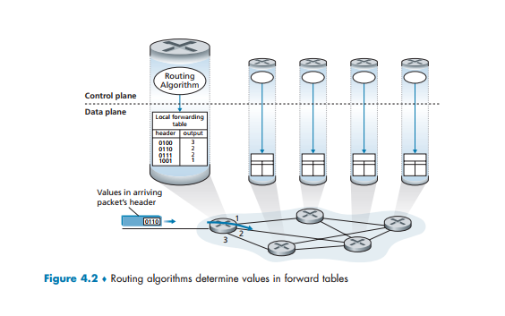

# Tầng mạng (Network Layer)

Trong mô hình OSI, tầng mạng (Network Layer) là tầng thứ 3, đóng vai trò quan trọng trong việc vận chuyển dữ liệu giữa các máy chủ (host) nằm trên các mạng khác nhau. Trong khi tầng liên kết dữ liệu chỉ đảm nhận việc chuyển gói tin giữa các nút kề cận trong một phân đoạn mạng, tầng mạng chịu trách nhiệm phân phối gói tin từ đầu cuối đến đầu cuối (end-to-end)

## Cấu trúc Mặt phẳng Dữ liệu và Mặt phẳng Điều khiển

Chúng ta có thể chia tầng mạng thành 2 phần tương tác (dựa vào sách *Computer Networking: A Top-Down Approach 8th Edition*):

- Mặt phẳng dữ liệu (Data Plane): Tập trung vào các chức năng tại mỗi router, cụ thể là việc chuyển tiếp (forwarding) datagram từ liên kết đầu vào sang đầu ra.

- Mặt phẳng điều khiển  (Control Plane): Tập trung vào logic toàn mạng, xác định bằng cách các datagram được định tuyến dọc thoe một con đường giữa các rourter từ nguồn đến đích. Điều này có thể được thực hiện thông qua các thuật toán định tuyến truyền thống chạy trên từng r outer hoặc thông qua một bộ điều khiển SDN tập trung (Software-Defined Networking).

### Control Plane (Mặt phẳng Điều khiển)

Mặt phẳng điều khiển (control plane) đóng vai trò là "bộ não" điều khiển toàn mạng, xác định cách thức các gói tin (datagram) được định tuyến dọc theo con đường từ nguồn đến đích.

#### Sự khác biệt giữa định tuyến (Routing) và Chuyển tiếp (Forwarding)

- Chuyển tiếp (Forwarding): Là hành động cục bộ của router, chuyển gói tin từ cổng đầu vào sagn cổng đàu ra phù hợp. Đây là chức năng của data plane.
- Định tuyến (Routing): Là quy trình trên phạm vi toàn mạng nhằm xác định các đường đi tối ưu cho gói tin. Đây là chức năng chính của control plane.

#### Hai phương thức triển khai Control Plane

#### Các thành phần và Giao thức quan trọng

Control plane không chỉ có định tuyến mà ocon bao gồm các cơ chế quản lý khác:

- Thuật toán định tuyến: 
    - Link-State (LS): Yêu cầu kiến thức toàn cụ về mạng để tính toán đường đi ngắn nhất. (ví dụ: giao thức OSFF)
    - Distance-Vector (DV): Các router trao đổi thông tin với các lân cận trực tiếp để dần xác định đường đi (ví dụ: giao thức BGP)
- Giao thức ICMP (Internet COntrol Message Protocol): Đực sử dụng bở các host và router để thông báo các lỗi trong mạng (như "đích đến không thể kết nối") và hỗ trợ các cộng cụ chuẩn đoán như `ping` hay `traceroute`.
- Quản lý mạng (SNMP và NETCONF/YANG): Cung cáp các công cụ để quản trị viên giám sát, cấu hình và điều khiển các thiết bị mạng từ xa.

## Chức năng và Trách nhiệm chính

- Đánh đại chỉ logic (Logical Addressing): Tầng mạng gán cho mỗi thiết bị một địa chỉ logic duy nhất (địa chỉ IP) để đảm bảo việc định danh và giao tiếp chính xác trên phạm vi toàn cầu.

- Định tuyến (Routing): Sử dụng các thuật toán và giao thức định tuyến để xác định con đường tối ưu nhất cho gói tin đi qua nhiều mạng trung gian trước khi đến đích.

- Chuyển tiếp (Forwarding): Đây là hành động của bộ định tuyến (router) khi chuyển một gói tin từ giao diện đầu vào sang giao diện dầu ra phù hợp dựa trên bảng chuyển tiếp.

- Đóng gói (Packetiation): Tầng này nhận các phân đoạn dữ liệu (segments) từ tầng giao vận và đóng gói chúng thành các gói tin (packets hoặc datagrams) bằng cách  thêm thông tin tiêu đề (header) chứa địa chỉ IP nguồn và đích.

- Phân mảnh và Tái hợp (Fragmentation and Reassembly): Nếu kích thước gói tin vượt quá đơn vị truyền tải tối đa (MTU) của một mạng, tầng mạng sẽ chỉa nhỏ gói tin đó và lắp ghép lại khi đến đích.

## Các giao thức phổ biến

- IP (Internet Protocol - IPv4/IPv6): Giao thức cốt lõi cung cấp cơ chế đánh địa chỉ và phân phát gói tin không tin cậy theo kiểu "nỗ lực tối đa" (best-effort).
- ICMP (Internet Control Message Protocol): Được sử dụng để thông báo lỗi và cung cấp thông tin chuẩn đoán mạng (như lệnh ping hoặc traceroute)
- ARP (Address Resolution Protocol): Giúp ánh xạ địa chỉ IP sang địa chỉ MAC vật lý cảu thiết bị trong cùng một mạng cục bộ.
- NAT (Network Address Translation): Cho phép các mạng nội bộ sử dụng địa chỉ IP riêng có thể giao tiếp với Internet bằng cách ánh xạ chúng sang địa chỉ IP công cộng.
- IPSec: Một bộ giao thức giúp bảo mật các giao tiếp IP thông qua xác thực và mã hóa (này được sử dụng trong VPN).

## Ưu điểm và hạn chế

- Ưu điểm: cho phép giao tiếp giữa cacs hệ thống không đồng nhất, hỗ trợ khả năng mở rộng thông qua phân chia mạng con (subnetting) và định tuyến linh hoạt.

- Hạn chế: Không có cơ chế kiểm soát luồng (flow control) trực tiếp, dẫn đến khả năng xảy ra tắc nghẽn nếu có quá nhiều datagram cùng lưu thông; router có thể loại bỏ gói tin khi bị quá tải, gây mất dữ liệu. Tầng mạng thường dựa vào các tầng cao hơn (như tầng giao vận) để dảm bảo độ tin cậy của dữ liệu.