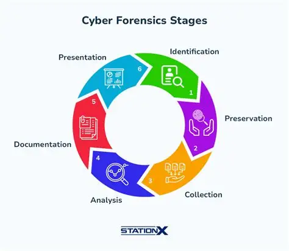

# Digital Forensics

Điều tra số (Digital Forensics) là quá trình thu thập và phân tích chứng cứ ký thuật số theo cách đảm bảo tính toàn vẹn và có khả năng được chấp nhận làm bắng chứng tại tòa án. Đây là một lĩnh vực của khoa học pháp y, được sử dụng không chỉ điều tra tội phạm mạng mà còn hỗ trợ các vụ án hình sự và dân sự khác.

## Quy trình điều tra số (4 bước theo NIST)

Quy trình này tuân thủ nghiêm ngặt nguyên tắc chuỗi hành trình chưng cứ (chain of custody) để đảm bảo dữ liệu không bị thay đổi hoặc giả mạo:

- Thu thập dữ liệu (Data collection): Xác định các thiết bị lưu trữ liên quan và tạo bản sao pháp y (forensics duplicate) chính xác của dữ liệu.
- Kiểm tra (Examination): Quét qua dữ liệu và siêu dữ liệu (metadata) để tìm dấu vết hoạt động tội phạm, bao gồm việc khôi phục dữ liệu đã xóa từ bộ nhớ đệm hoặc không gian đĩa còn trống. 
- Phân tích (Data Analysis): Sử dụng các phương pháp chuyên dụng như phân tích trực tiếp (live analysis) trên hệ thống đang chạy hoặc đảo ngược kỹ thuật ẩn mã (reverse steganography) để tìm dữ liệu ẩn.
- Báo cáo (Reporting): Tạo báo cáo chính thức mô tả quá trình phân tích, những gì đã xảy ra và đề xuất các biện pháp khắc phục lỗ hổng.

## Các kỹ năng cốt lõi

Để thành công trong lĩnh vực nào, một chuyên gia cần có nền tảng kỹ thuật vững chắc.

- Hiểu biết sâu về Hệ điều hành: Nắm vững cấu trúc tệp (NTFS, FAT32, ext4), nhật ký hệ thống (system logs) và cấu hình trên các nền tảng như Windows , macOS, Linux, Android và iOS.
- Phân tích mạng và Giao thức: Biết cách sử dụng các công cụ từ mã nguồn mở đến thương mại như Autopsy, Volatility, FTK, EnCase, Cellebrite để tạo ảnh pháp y và trích xuất dữ liệu.
- Kỹ năng khôi phục dữ liệu: Có kinh nghiệm khôi phục dữ liệu từ các thiết bị hỏng hoặc bị xóa bằng các công cụ như TestDisk, PhotoRec, và hiểu về cấu trúc RAID/SSD.
- Phân tích bộ nhớ và Mã độc: Khả năng trích xuất dữ liệu từ RAM để tìm mã độc không dùng tệp (fileless malware) và thực hiện đảo ngược mã nguồn để hiểu cơ chế hoạt động của chúng.

> Note: Ngoài ra có thể bổ sung thêm những kỹ năng mềm và kiến thức pháp lý để phục vụ cho việc đảm bảo bằng chứng có giá trị pháp lý tại tòa, giao tiếp và viết báo cáo

## Các nhánh của Digital Forensics

- Computer forensics: thu thập chứng cứ từ máy tính, máy tính bảng.
- Mobile device forensics: Điều tra trên điện thoại thông minh.
- Network forensics: Giám sát và phân tích lưu lượng mạng.
- Database forensics: Khám phá chứng cứ trong các hệ quản trị cơ sở dữ liệu.
- Memory forensics: Phân tích dữ liệu trong bộ nhớ RAM của thiết bị.

> Hiện nay đang đang có xu hướng kết hợp giữa điều tra số và ứng phó sự cố (DFIR). Sự kết hợp ày giúp tăng tốc độ xử lý các mối de dọa trong khi vẫn bảo vệ sđược cá bằng chứng số quan trọng phục vụ cho việc truy tố hoặc phân tích hậu sự cố.