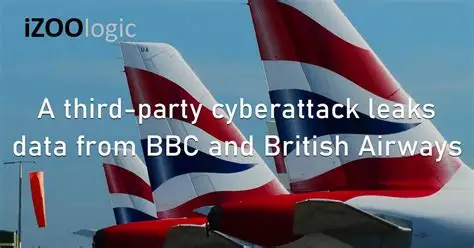

# Data Leak

Rò rỉ dữ liệu (Data Leak) là một trong những rủi ro an ninh mạng nghiêm trọng nhất mà các tổ chức phải đối mặt.

## Định nghĩa và sự khác biệt cốt lõi

- Data Leak (Rò rỉ dữ liệu): Xảy ra khi một bên nội bộ hoặc một nguồn tin cậy vô tình hoặc vô ý làm lộ dữ liệu nhạy cảm ra môi trường bên ngoài,. Nó thường là kết quả của sai sót, chẳng hạn như gửi tài liệu nhạy cảm nhầm người nhận email hoặc lưu dữ liệu trên tệp chia sẻ đám mây công cộng.
- Data Breach (Vi phạm dữ liệu): Khác với rò rỉ, vi phạm dữ liệu xảy ra khi thông tin được bảo vệ bị truy cập, đánh cắp hoặc sử dụng bởi các đối tác bên ngoài mà không có sự cho phép và thường có ý đồ độc hại

## Các nguyên nhân gây rò rỉ dữ liệu phổ biến

- Lỗi con người (Human Error): Đây là nguyên nhân hàng đầu.
> Ví dụ: Nhân viên vô tình làm mất ổ USB chứa dữ liệu nhạy cảm ở nơi công cộng hoặc in tài liệu mật tại các trung tâm in ấn công cộng.
- Cấu hình hạ tầng yếu: Các hệ thống không đc thiết lập đúng cách hoặc không được bảo trì thường xuyên, chẳng hạn như cơ sở dữ liệu mở mà không yêu cầu xác thực.
- Shadow IT: Nhân viên sử dụng các ứng dụng hoặc dịch vụ lưu trữ đám mây bên thứ ba chưa được phê duyệt để hoàn thành công việc nhanh hơn, tạo ra những điểm mù cho đội ngũ quản trị IT.
- Lỗ hổng từ bên thứ ba: Các ứng dụng hoặc nhà cung cấp có quyền truy cập vào mạng của tổ chức có thể trở thành vector tấn công nếu họ bị xâm nhập.
- Dữ liệu cũ: Khi công ty phát triển, hạ tầng được nâng cấp nhưng dữ liệu cũ có thể bị bỏ quên, không được bảo vệ và dễ dàng bị lộ lọt.
- Tấn công giả mạo (Phishing): Nhân viên bị lừa nhập vào liên kết độc hại hoặc cung cấp thông tin xác thực, từ đó dẫn đến việc lộ dữ liệu công ty.

## Hậu quả của rò rỉ dữ liệu

- Tổn thất tài chính: Bao gồm chi phí ngăn chặn, phụ hồi và đặc biệt các khoản phạt quản lý cực kỳ cao từ các tiêu chuẩn như GDPR, HIPAA hay PCI-DSS.
- Hủy hoại uy tín: Việc mấy lòng tin của khách là rất khó khôi phục, báo cáo chỉ ra rnawgf khoảng 43% doanh nghiệp bị mất khách hàng hiện tại sau một sự cố mạng.
- Kẻ xấu lợi dụng: Dữ liệu bị rò rỉ có thể được sử dụng cho các mục đích tống tiền, bôi nhọ (doxxing), gián điệp doanh nghiệp hoặc gây gián đoạn hoạt động của tổ chức.

## Ví dụ: Vụ rò rỉ dữ liệu của British Airways (2018)

Năm 2018, hệ thống của hãng hàng không British Airways (BA) bị tấn công mạng, dẫn đến việc khaonrg 430.000 khách hàng bị lộ thông tin cá nhân, bao gồm dữ liệu thẻ thanh toán (tên, địa chỉ, số thẻ thanh toán và mã bảo mật (CVV)). BA không tự phát hiện vụ tấn công vào ngày xảy ra, mà chỉ được bên thứ ba cảnh báo hơn hai tháng sau khi xảy ra sự cố. Sự cố này la fmotoj trong những vụ rò rỉ dự liệu lớn nhất trong ngành hàng không Châu Âu.

Tháng 10/2020, Văn phòng Ủy viên Thông tin của Vương Quốc Anh (ICO) kết luận rằng BA đã không triển khai đầy đủ các biện pháp kỹ thuật và tổ chức cần thiết để bảo vệ DLCN theo yêu cầu của Quy định về bảo vệ DLVN của Liên minh Châu Âu (GDPR). Kết quả, BA bị phạt 20 triệu bảng Anh- một trong những khoản tiền phạt lớn nhất tại thời điểm đó.

> Reference: <https://hmplaw.vn/vi/mot-so-vu-viec-vi-pham-bao-ve-du-lieu-ca-nhan-quoc-te-va-bai-hoc-cho-cac-doanh-nghiep-viet-nam#:~:text=Nh%E1%BB%AFng%20v%E1%BB%A5%20vi%E1%BB%87c%20nh%C6%B0%20British%20Airways%2C%20Academy%20of,quy%20m%C3%B4%20l%E1%BB%9Bn%20v%C3%A0%20b%E1%BB%8B%20x%E1%BB%AD%20ph%E1%BA%A1t%20n%E1%BA%B7ng.>

 ## Chiến lược ngăn chặn chuyên sâu

 Để bảo vệ tài sản số, các tổ chức cần triển khai chiến lược phòng thủ đa lớp:

 - Triển khai công cụ Data Loss Preventation (DLP): Các giải pháp này giám sát và kiểm soát dòng chảy dữ liệu nhạy cảm trên mạng, các thiết bị đầu cuối và đám mây để phát hiện và chặn các hoạt động truyền tải trái phép trong thời gian thực.
 - Mã hóa dữ liệu 
 - Kiếm soát truy cập dựa trên vai trò  (RBAC): Chỉ cấp quyền tối thiểu cần thiết (Least Privilage) cho nhân viên dựa trên vai trò của họ, giúp giảm thiểu rủi ro từ cá mối đe dọa nội bộ.
 - Giám sát rủi ro bên thứ ba: Duy trì sự cảnh giác và giám sát chặt chẽ các bên có quyền truy cập vào hệ thống vì tổ chức vẫn phải chịu trách nhiệm tuân thủ bảo mật ngay cả khi sự cố do bên thứ ba gây ra.
- Đào tạo nhân viên
- Phân loại và Kiểm soát dữ liệu: Biết chính xác dữ liệu nhạy cảm nằm ở đâu để ưu tiên mức độ bảo mật cao nhất cho những tài sản giá trị nhất.

## OSINT

[OSINT - Definition and Skills](./OSINT.md)

## Forensics

[Digital Forensics - Definition and Skills](./Forensics.md)