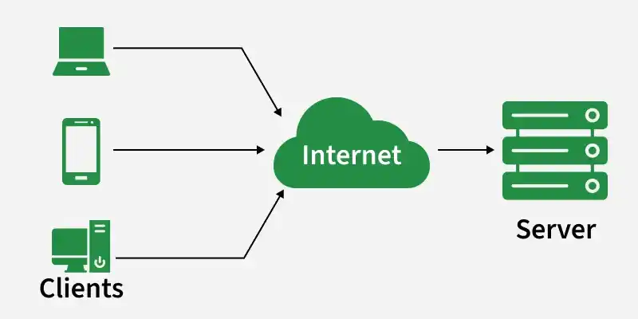
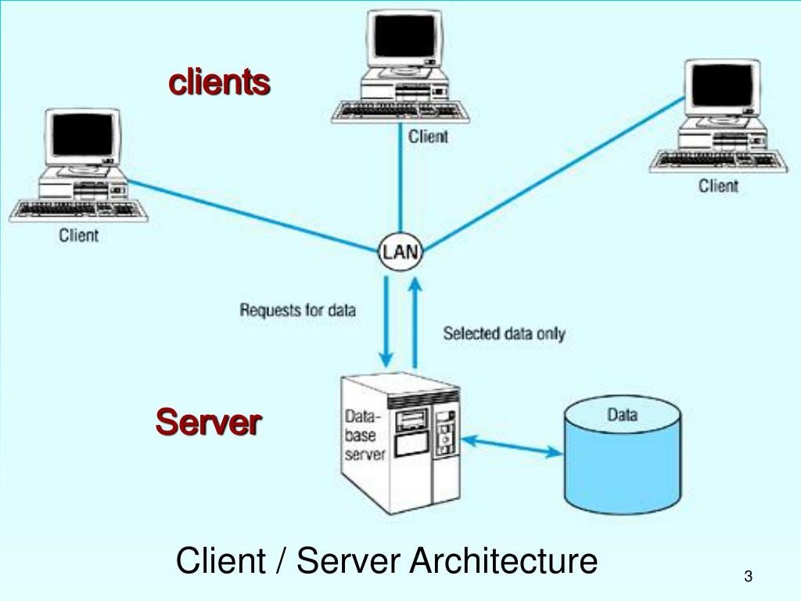

# Mô hình Client - Server

Mô hình Client - Server là một kiến trúc mạng phân chia vai trò giữa các bên yêu cầu dịch vụ và bên cung cấp dịch vụ.

## Các thành phần chính

- Máy chủ (Server): Là một hệ thống "luôn luôn mwor", có địa chỉ IP cố định và nổi tiếng để các máy khách có thể tìm thấy. Server chịu trách nhiệm lưu trữ tài nguyên, quản lý dữ liệu và xử lý các yêu cầu.

- Máy khách (Client): Là các thiết bị hoặc chương trình (như trình duyệt web, smartphone) đưa ra yêu cầu dữ liệu hoặc dịch vụ. Trong mô hình này, các máy khách thường không giao tiếp trực tiếp với nhau.

## Cơ chế hoạt động

Sự tương tác giữa hai bên tuan theo một chu kỳ có cấu trúc:

- Khởi tạo: CLient luôn là bên chủ động khởi tạo phiên liên lạc với server.
- Xử lý: Server lắng nghe, xử lý yêu cầu và thực hiện các thao tác cần thiết. 
- Trả kết quả: Server gửi phản hồi chứa tìa nguyên hoặc thông tin mà client đã yêu cầu.

## Ưu điểm và hạn chế

| Đặc điểm | Chi tiết |
|----------|----------|
| Ưu điểm | Quản lý tập trung: Dữ liệu và dịch vụ được kiểm soát tại server, giúp bảo mật, nhất quán dữ liệu và dễ dàng cập nhật hệ thống hơn |
| Hạn chế | Điểm yếu tập trung: Nếu server gặp sự cố, toàn bộ dịch vụ sẽ ngừng hoạt động (single point of failure). Ngoài ra, server có thể bị tắc nghẽn nếu có quá nhiều yêu cầu cùng lúc và tốn chi phí vận hành cao |

## Kiến trúc phổ biến

- 2-Tier (2 tầng): Cilent giao tiếp với server (thường đảm nhận cả xử lý logic và lưu trữ dữ liệu).
- 3-Tier (3 tầng): Thêm một lớp logic ứng dụng trung gian giữa client và cơ sở dữ liệu để tăng tính bảo mật và khả năng mở rộng.
    - Client: chỉ đảm nhận phần trình diễn giao diện
    - Application Server: Đóng vai trò trung gian, thực hiện các logic nghiệp vụ và truy xuất hoặc lưu trữ dữ liệu vào db.
    - Data Layer: Chueyen biệt cho việc lưu trữ và quản lý dữ liệu.
- Trung tâm dữ liệu (Data Center): Với các ứng dụng lớn (như Google, Facebook), một server đơn lẻ không thể tải nổi, do đó hàng trăm nghìn máy chủ trong các trung tâm dữ liệu được sử dụng để tạo thành các máy chủ ảo mạng mẽ.
