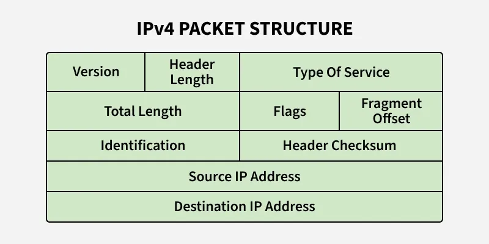

# Network Layer

Tầng mạng (Network Layer) là tầng thứ ba trong mô hình OSI, đóng vai trò then chốt trong việc vận chuển các gói tin từ máy chủ nguồn đến máy chủ đích thông qua các mạng lưới kết nối với nhau

## Vai trò và Chức năng cốt lõi

Nhiệm vụ chính của tầng mạng là di chuyển các gói tin (datagrams) xuyên suốt mạng lưới. Khác với tầng liên kết dữ liệu  chỉ tập trung vào việc truyền giữa hai nút kề nhau, tầng mạng đảm bảo việc truyền tải máy chủ đến máy chủ (host-to-host) ngay cả khi chúng nằm ở các mạng khác nhau.

Tầng mạng có thể được chia thành hai mặt phẳng tương tác với nhau:
- Mặt phẳng dữ liệu (Data Plane): Thực hiện chức năng chuyển tiếp (forwarding), là hành động cục bộ tại mỗi bộ định tuyến (router) nhằm đưa gói tin từ cổng đầu vào sang cổng đầu ra thích hợp. *(đây là chức năng cục bộ)*
- Mặc phẳng điều khiển (Control Plane): Thực hiện chức năng định tuyến (routing), xác định lộ trình từ đầu đến cuối mà gói tin sẽ đi qua thông qua các thuật toán định tuyến. *(đây là chức nawgn cho toàn mạng)*

## Cơ sở lý thuyết về Định tuyến (Routing)

Để giải quyết bài toàn tìm đường tối ưu, tầng mạng sử dụng lý thuyết đồ thì (Graph theory). Trong đó, các bộ định tuyến được coi là các nút (nodes) và các liên kết vật lý là các cạnh (edges) của đồ thị.

Có hai thuật toán định tuyến cơ bản:
- Thuật toán trạng thái liên kết (Link-State): Là thuật toán tập trung, yêu cầu thông tin đầy đủ về toàn bộ cấu trúc mạng để tính toán. Sử dụng thuật toán Dijkstra, giúp tìm đường đi ngắn nhất từ một nút nguồn đến các nút khác.
- Thuật toán vector khoảng cách (Distance-Vector DV): Là thuật toán phân tán và lặp lại, trong đó các nút chỉ trao dổi thông tin với các lân cận trực tiếp. Dựa trên phương trình Bellman-Ford để cập nhật chi phí đường đi ước tính.

## Phân cấp Định tuyến trong Internet

Do quy mô khổng lồ của Internet, việc chạy một thuật toán định tuyến duy nhất cho mọi router là không khả thi. Do đó, Internet được chia thahf các Hệ tự trị (Autoomous Systems - AS)
- Intra-AS Routing: Định tuyến bên trong một AS (ví dụ: giao thức OSPF dựa trên trạng thái liên kết)
- Inter-AS Routing: Định tuyến giữa các AS (ví dụ: giao thức BGP)

## Giao thức IP và Địa chỉ hóa

Giao thức IP (Internet Protocol) là thành phần trung tâm của tầng mạng. Nó định nghĩa cấu trúc gói tin và cơ chế địa chỉ hóa:
- IPv4: Sử dụng địa chỉ 32-bit, thường viết dưới dạng số thập phân có dấu chấm (ví dụ: 193.32.216.9). Tiêu đề IPv4 thường dài 20 byte và chứa các trường như TTL để ngăn gói tin chạy vòng lặp vô hạn
- IPv6: Ra đời để giải quyết sự cạn kiệt địa chỉ của IPv4, sử dụng địa chỉ 128 bit. Tiêu đề của nó được tinh giản xuống 40 byte cố định, loại bỏ các trường không cần thiết để tăng gốc độ xử lý tại các bộ định tuyến

### Các thành phần quan trọng trong gói tin (IPv4 Datagram)

- Địa chỉ Nguồn và Đích: Xác định nơi gửi và nơi nhận của gói tin.
- Thời gian sống (TTL): Một con số giảm dần qua mỗi bộ định tuyến; nếu TTL bằng 0, gói tin sẽ bị hủy để tránh tắc nghẽn do lặp vô hạn
- Trường Giao thức (Protocol): Chỉ định dữ liệu bên trong thuộc về giao thức tầng trên nào để máy đích biết cách xử lý.
- Header Checksum: Dùng để phát hiện các lỗi bit xảy ra trong tiêu đề của gói tin khi di chuyển qua mạng.

### Địa chỉ hóa và Phân đoạn (Addressing & Fragmentation)

- Địa chỉ IP: Không gắn liền với thiết bị mà gắn liền với giao diện mạng (interface). Một bộ định tuyến có nhiều giao diện sẽ có nhiều địa chỉ IP khác nhau.
- Subnet: IP chia mạng lớn thành các mạng con (subnet) để quản lý hiệu quả hơn bằng cá sử dụng các tiền tố địa chỉ (prefix).
- Phân đoạn (Fragmentation): Nếu gói tin IP quá lớn so với giới hạn của đường truyền (MTU), nó sẽ được bẻ nhỏ thành các mảnh tại router và được ghép lại tại điểm đích (chỉ có ở IPv4).

## Mạng điều khiển bằng phần mềm (SDN)

Trong cấu trúc hiện đại, SDN (Software-Defined Networking) tách biệt hoàn toàn mặt phẳng dữ liệu và mặt phẳng điều khiển. Thay vì mỗi router tự tính toán bảng chuyển tiếp, một bộ điều khiển trung tâm (SDN Controller) sẽ tính toán và cài đặt các bảng luồng (flow tables) vào các thiết bị chuyển tiếp. Cách tiếp cận này giúp mạng trở nên linh hoạt và dễ lập trình hơn.

## Các giao thức hỗ trợ khác

- ICMP (Internet Control Message Protocol): Được sử dụng để báo cáo lỗi và trao đổi thông tin quản lý giữa các mạng
- DHCP: Giúp tự động cấu hình và cấp phát địa chỉ IP cho các máy chủ mới tham gia vào mạng.
- NAT: Cho phép nhiều thiết bị trong mạng cục bộ chia sẻ một địa chỉ IP công cộng duy nhất để kết nối Internet.
