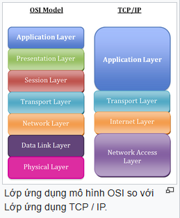
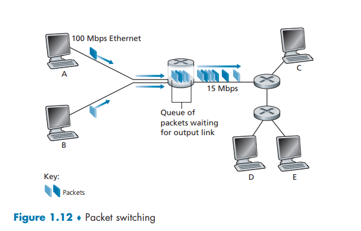
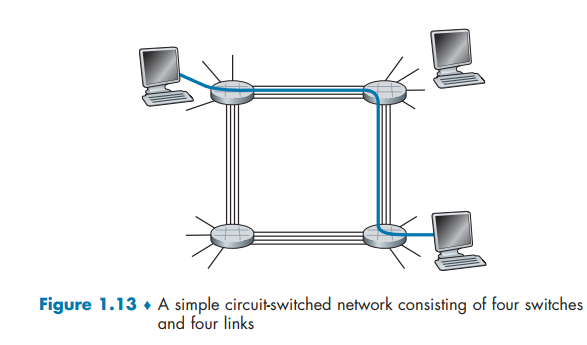
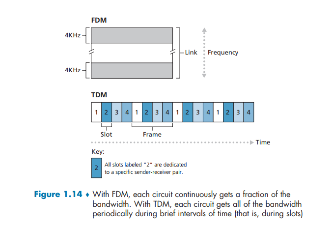

# Mạng máy tính

Nội dung chính của tài liệu này sẽ bao gồm các mục H2 sau:

- Giới thiệu về Internet và khái niệm cơ bản.
- Định nghĩa và vai trò của Protocol trong mạng.
- Mô tả mô hình OSI và các tầng mạng liên quan.
- Cấu trúc mạng Internet với Biên mạng, Mạng truy cập và Lõi mạng.
- So sánh hai phương thức chuyển mạch chính: Packet Switching và Circuit Switching.
- Đánh giá hiệu suất và bảo mật mạng.

## Internet Là Gì?

Internet có thể hiểu đơn giản là một mạng lưới toàn cầu kết nối hàng tỷ thiết bị điện tử lại với nhau từ máy tính, điện thoại, máy chủ cho đến các thiết bị IoT.

### Những bước đi đầu tiên của Internet trên thế giới

Internet xuất hiện lần đầu vào năm 1969 với tên gọi là ARPANET, được phát triển bởi Bộ Quốc phòng Hoa Kì nhằm kết nối các máy tính từ xa.

Trong suốt giai đoạn thập niên 1970-1980, các giao thức quan trọng như  TCP/IP, Email và Ethernet ra đời, giúp việc kết nối trở nên thống nhất và hiểu quả hơn.

### Từ mạng nghiên cứu quân sự đến sự toàn cầu hóa

Cột mốc quan trọng nhất là năm 1989, khi WWW (World Wide Web) được phát triển bởi Tim Berners-Lee, tạo ra giao diện web thân thiện đầu tiên.

### Internet tại Việt Nam

**Mốc thời gian phát triển Internet Việt Nam**:

- **1991-1997**: Bắt đầu thử nghiệm kết nối giữa Việt Nam - Úc, sử dụng hạn chế trong các trường đại học, cơ quan nghiên cứu
- **1997**: Chính thức hòa mạng Internet toàn cầu.
- **1998-2005**: Phổ biến dịch vụ dial-up; từ 2003 xuất hiện ADSL, số lượng ng dùng tăng nhanh.
- **2006-2015**: Bùng nổ Internet băng thông rộng, phổ cập 3G, triển khai IPv6.

## Protocol là gì?

Protocol (giao thức) là thành phần cốt lõi điều khiển việc gửi thông tin trong mạng. Một giao thức định nghĩa định dạng và thứ tự của các thông điệp được trao đổi giữa hai hoặc nhiều thực thể truyền thông, cũng như các hành động được thực hiện khi truyền và/hoặc nhận một thông điệp hoặc một sự kiện khác.

Các giao thực quan trọng nhất trên Internet bao gồm TCP, IP, HTTP và SMTP.

## Mô Hình OSI

Mô hình OSI là một khuôn mẫu khái niệm được phát triển bởi Tổ chức Tiêu chuẩn hóa Quốc tế (ISO), nhằm mô tả cách dữ liệu được truyền tải qua mạng lưới thông qua một kiến trúc cấu trúc gồm bảy tầng.

- Chia nhỏ quá trình truyền thông mạng thành bảy tầng chức năng riêng biệt.
- Phân chia trách nhiệm cụ thể cho từng tầng.
- Thúc đẩy tính tương thích giữa các hệ thống mạng khác nhau.
- Đơn giản hóa việc thiết kế, triển khai và khắc phục sự cố mạng.

### Kiến trúc phân tầng và Mô hình dịch vụ 

Mỗi tầng cung cấp dịch vụ cho tầng ngay trên nó. Chồng giao thức Internet gồm 5 tầng:

1. Tầng ứng dụng (Application): HTTP, SMTP, DNS.
2. Tầng giao vận (Transport): TCP, UDP.
3. Tầng mạng (Network): IP, các giao thức định tuyến.
4. Tầng liên kết (Link): Ethernet, Wifi, PPP.
5. Tầng vật lý (Physical): Truyền các bit thực tế trên dây dẫn hoặc sóng vô tuyến.
6. Đóng gói (Encapsulation): Khi dữ liệu đi xuống các tầng, mỗi tầng sẽ thêm thông tin tiêu đề (header) của riêng mình và thông điệp từ tầng trên.

Khi mà data di chuyển từ máy này sang máy khác, chúng sẽ đi qua 7 tầng trong mô hình OSI. Đầu tiên, data sẽ di chuyển xuống 7 tầng từ gửi và lại di chuyển lên với người nhận.

## Cấu Trúc Mạng

Cấu trúc mạng Internet là một hệ thống cực kì phức tạp như có thể được hiểu rỡ hơn khi chia thành các thành phần chính: Biên mạng (Network Edge), mạng truy cập (Access Networks) và Lõi mạng (Network Core)

### Biên mạng (Network Edges)

Biên mạng là nơi tập trung các thiết mà chúng ta sử dụng hằng để kết nối với Internet.

- Hệ thống đầu cuối (End Systems/Hosts): Đây là các thiết bị như máy tính cá nhân, điện thoại thông minh, náy chủy các thiết bị IoT.
- Mô hình Client-Server: Các ứng dụng mạng thường hoạt động the mô hình này, trong đó máy khách (client) gửi yêu cầu và máy chủ (server) phản hồi dữ liệu. Các máy chủ mạng mẽ này thường được đặt tập trung trong các Trung tâm dữ liệu (Data Centers).

### Mạng truy cập (Access Networks)

Đây là phần mạng vật lý kết nối các hệ thống đầu cuối với bộ định tuyến đầu tiên của mạng. Các loại mạng truy cập phổ biến bao gồm:

- Truy cập tại nhà:
    - DSL (Digital Subscriber Line): Sử dụng đường dây điện thoại có sẵn để truyền dữ liệu. 
    - Cáp (cable): Sử dụng hạ tầng của truyền hình cáp (kết hợp cap quang và cáp đồng trục - HFC). Điểm khác biệt quan trọng là một môi trường chia sẻ, nghĩa là nhiệu hộ gia đình cùng chia sẻ băng thông của một tuyến cáp.
    - FTTH (Fiber to the Home): Cung cấp đường truyền cáp quang trực tiếp đến tận nhà, cho tốc độ cực cao lên đến hàng Gigabit mỗi giây.

- Truy cập doanh nghiệp (Enterprise Access): Thường sử dụng công nghệ Ethernet hoặc Wifi để kết nối các thiết bị trong một mạng cục bộ (LAN) trước khi kết nối vào Internet rộng lớn hơn.

- Truy cập không dây diện rộng : Sử dụng hạ tầng mạng di dộng như 4G LTE và 5G để cung cấp kết nối từ khoảng cách xa hàng chục km.

### Những thành phần chính trong mạng (Network Core)

**Core Networks** là "mạng lưới của các mạng, bao gồm các bộ định tuyến (router) các liên kết kết nối các mạng nhỏ lại với nhau. Có 2 phương thức chuyển mạch chính để vận chuyển dữ liệu qua lõi mạng:

#### Chuyển mạch gói (Packet Switching) 

Trong mạch chuyển mạch gói, dữ liệu từ các ứng dụng được chia thành các khổi nhỏ gọi là gói tin (packets).

- Dữ liệu được chia nhỏ thành các gói tin (packets)
- Sử dụng cơ chế lưu và chuyển tiếp (store-and-forward): router phải nhận toàn bộ gói tin trước khi bắt đầu truyển nó đi.
- Có thể xảy ra trễ hàng đợi và mất gói (packet loss) nếu lượng dữ liệu đến nhanh hơn khả năng xử lý của router.

#### Chuyển mạch mạch  (Circcuit Switching)

Khác với chuyển mạch gói, phương thức này dành riêng các tài nguyên cần thiết dọc theo một con đường để cung cáp cho việc liên lạc giữa các hệ thống đầu cuối.

- Cơ chế hoạt động: Trước khi gửi dữ liệu, mạng phải thiết lập một kết nối chuyên dụng gọi là mạch (circuit) giữa bên gửi và bên nhận. Trong suốt thời gian kết nối, một phần băng thông của các liên kết trên đường truyền được giữ riêng cho phiên liên lạc này, đảm bảo tốc độ truyền không đổi.

- Phân chia tài nguyên (Multiplexing): Một mạch trong liên kết được thực h iện thoongqua hai kỹ thuật chính:
    - FDM (Frequency-Division Multiplexing): Phân chia theo tần số. Phổ tàn số của liên kết được chia thành các băng tần, mỗi kết nối được cấp theo một băng tần riêng.
    - TDM (Time-Division Multiplexing): Phân chia theo thời gian. Thời gian được chia thành các khung có thời lượng cố định, mỗi khung chia thành các  khe thời gian (slots). Mỗi kết nối được cấp một khe thời gian cố định trong mỗi khung.

- Ưu và nhược điểm: Chuyển mạch đảm bảo chất lượng dịch vụ (không có trễ hành đợi) nhưng có thể gây lãng phí tài nguyên nếu mạch được thiết lập nhưng không có dữ liệu thực tế để truyển.

#### So sánh và tóm tắt

| Tiêu chí | Packet Switching | Circuit Switching |
|---|---|---|
| Tài nguyên | Sử dụng theo nhu cầu (On-demand) | Được dành riêng (Reserved) |
| Trễ | Biến động do hàng đợi | Cố định và có thể dự đoán |
| Hiệu suất | Hiệu quả hơn cho dữ liệu “bùng nổ” (bursty data) | Có thể gây lãng phí tài nguyên khi nhàn rỗi |
| Ứng dụng | Phổ biến cho Internet | Truyền thống cho điện thoại (tuy đang dần chuyển sang gói) |

## Hiệu Suất Mạng

Trong mạng chuyển mạch gói, dữ liệu sẽ gặp phải các loại đỗ trễ và có thể bị mất:

- Các loại trễ một nút (Nodal Delay): bao gồm trễ xử lý (processing), trễ hàng đợi (queuing), trễ truyền dẫn (transmission - L/R) và trễ lan truyền (propagation - d/s).
- Mất gói (Packet Loss): Xảy ra khi gói tin đến một hàng đợi đã đầy bội nhớ đệm.
- Thông lượng  (Throughput): Tốc độ truyền bit giữa bên gửi và bên nhận. Thông lượng thường bị giới hạn bởi liên kết thắt nút (bottleneck link) có tốc độ thấp nhất trên đường truyền.

## Bảo Mật Mạng

Mạng máy tính dễ bị tấn công theo nhiều cách khác nhau, bao gồm:
- Malware: Phần mềm độc hại xâm nhập vào host.
- Tấn công từ chối dịch vụ (DoS/DDoS): Làm tê liệt mạng hoặc máy chủ bằng cách làm quá tải tài nguyên.
- Đánh chặn gói tin (Packet Sniffing): Đọc trộm thông tin trên các liên kết quảng bá.
- Giả mạo IP (IP Spoofing): Gửi gói tin với địa chỉ nguồn giả.
