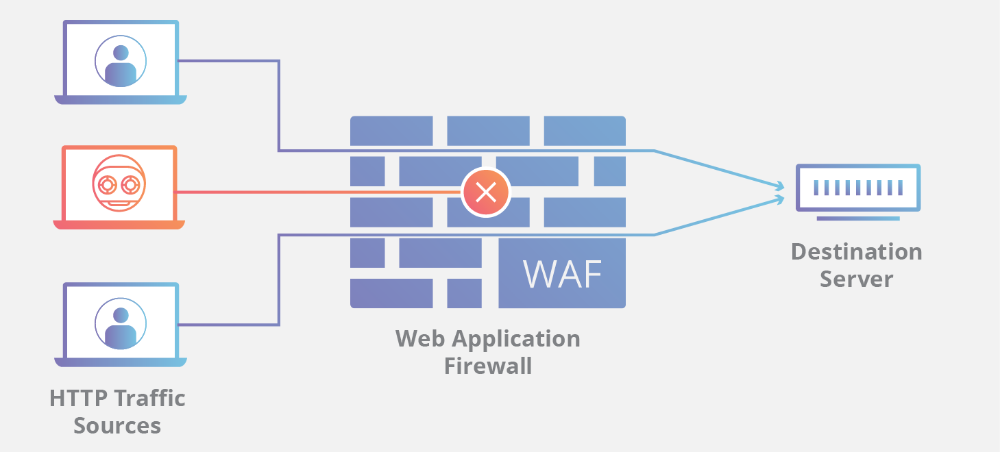
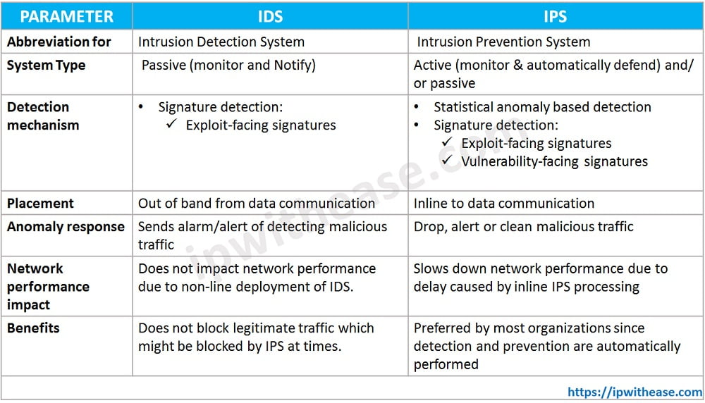
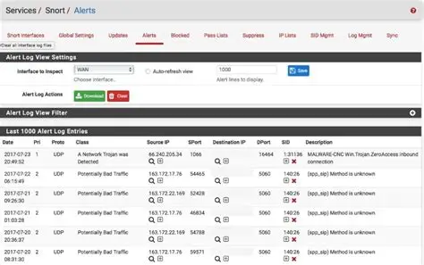
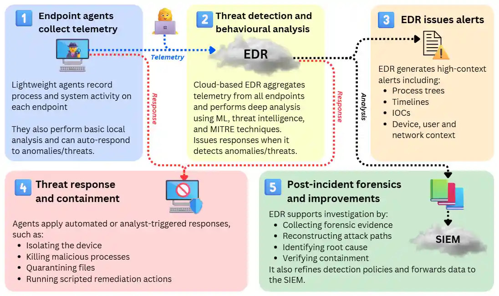

# Security Control

Trong an ninh mạng, việc chỉ phụ thuộc vào một công cụ duy nhất chính là một "công thức dẫn đến thảm họa". Các tổ chức thường sử dụng chiến lược Phòng thủ chiều sau (Defense-in-Depth), giúp phân tách các cơ chế bảo mật thành nhiều lướp khác nhau. Bằng cách này, nếu kẻ tấn công có thể vượt qua được lớp này, thì lớp khác sẽ ngay lập tức phát hiện và ngăn chặn chúng.

## WAF 

Tường lửa ứng dụng Web (Web  Application Firewall - WAF) là một thiết bị hoặc dịch vụ an ninh được thiết kế để bảo vệ các tổ chức ở tầng ứng dụng (Application Layer),

### Chức năng cốt lõi

WAF hoạt động bằng cách lọc, giám sát và phân tích lưu lượng truy cập giao thức truyền tin HTTP và HTTPS giữa ứng dụng web và Internet. Khác với tường lửa mạng thông thường chỉ kiểm tra các tiêu đề gói tin, WAF đi sâu vào nội dung cảu lưu lượng web để phát hiện các dấu hiệu tấn công.

### Vai trò trong quản lý lỗ hổng bảo mật
 
- Bản vá ảo (Virtual Patching): WAF có thể sử dụng các "chữ ký" từ nhà cung cấp để chặn đứng các nỗi lực khai thác những lỗ hổng đã biết, chẳng hạn như các lỗ hổng trong danh mục KEV,  giúp bảo vệ hệ thống trong khi chờ đội bản vá chính thức.
- BẢo vệ tài sản đối mặt với Internet: WAF được coi là một trong những tài sản quan trọng nhất tiếp xúc trự tiếp với Internet, giúp thu hẹp bề mặt tấn công của tổ chức.

### Vị trí trong kiến trúc mạng

- Thiết bị trung gian (Middlebox): WAF thường được triển khai như một hộp trung gian, nằm trên đường dẫn dữ liệu giữa máy khách và máy chủ ứng dụng.
- Khả năng lập trình: Trong các mạng hiện đại  điều khiển bằng phần mềm (SDN), các chức năng của WAF có thể được thực hiện trực tiếp trên các bộ định tuyến thông qua các quy tắc "khớp và hành động" (match-plus-action) tổng quát.

> Note: SDN (Software Defined Networking) là một kiến trúc mạng hiện đại cho phép quản lý và điều khiển mạng một cách linh hoạt thông quan phần mềm thay vì phần cứng truyền thống. SDN giúp tối ưu óa tốc độ và hiệu quả mạng, cho phép doanh nghiệp kiểm soát lưu lượng truy cập dễ dàng hơn và đáp ứng nhu cầu quản lý linh hoạt hơn.

### Các hình thức triển khai

- Thiết bị phần cứng hoặc phần mềm chuyên dụng: Được cài đặt tại biên của mạng tổ chức.
- Dịch vụ quản trị (Managed WAF Service): Được cung cấp bở các nhà cung cấp bảo mật để hỗ trợ tổ chức giám sát và bảo vệ ứng dụng mà không cần tự vận hành hạ tầng phức tạp.

## IDS/IPS

Hệ thống phát hiện xâm nhập (IDS) và hệ thống ngăn chặn xâm nhập (IPS) là 2 công cụ an ninh mạng quan trọng được thiết kế để bảo vệ hệ thống và mạng lưới trước các mối đe dọa trực tuyến.

### IDS (Hệ thống phát hiện xâm nhập)

IDS là một công cụ phần cứng hoặc phần mềm chuyên giám sát và phân tích các hoạt động mạng hoặc hệ thống để tìm kiếm các dấu hiệu truy cập trái phép hoặc vi phạm chính sách.

- Cơ chế hoạt động: IDS hoạt động ở chế độ giám sát thụ động. Nó thực hiện "kiểm tra gói tin sâu" (Deep Packet Inspection), xem xét khoogn chỉ các tiêu đề mà cả nội dung tải (payload) của dữ liệu.
- Hành động: Khi phát hiện mội mối đe dọa tiềm tàng, IDS sẽ gửi cảnh báo cho quản trị viên hệ thống nhưng không thực h iện bất kì hành động chủ động nào.

### IPS (Hệ thống ngăn chặn xâm nhập)

IPS là một hệ thống an ninh nâng cao không chỉ phát hiện mà còn ngăn chặn các hoạt động độc hại diễn ră trong thời gian thực

- Cơ chế hoạt động: IPS hoạt đông ở chế độ chủ động. Nó nằm trực tiếp trên đường truyền dữ liệu để đánh chặn lưu lượng mạng.
- Hành động: IPS so sánh dữ liệu với các dấu hiệu đe dọa đã biết và ngay lập tức chặn lưu lượng đó, ngăn không cho mã độc xâm nhập vào mạng

### So sánh

### Các phương pháp phát hiện đe dọa

Cả IDS và IPS thường sử dụng hai phương pháp chính để nhận diện tấn công

- Dựa trên chữ ký (Signature-based): Sử dụng một cơ sở dữ liệu khổng lồ về các "chữ ký" tấn công đã biết (quy tắc) để đối chiếu.
- Dựa trên sự bất thường (Anommaly-based): Xây dựng môt hồ sơ lưu lượng mạng bình thường và tìm kiếm các luồng dữ liệu bất thường về mặt thống kê (ví dụ: quét cổng tăng đột ngột). Phương pháp này có thể phát hiện các cuộc tấn công mới (zero-day) nhưng khó phân biệt giữa lưu lượng bất thường và tấn công thực sự.

### Triển khai trong thực tế

- Vị trí: thường được đặt tại ranh giới mạng hoặc các khu vực nhạy cảm như vùng phi quân sự (DMZ).
- Công cụ phổ biến: Snort là một hệ thống IDS mã nguồn mở cực kì phổ biến, cho phép các quản trị viên tự viết các quy tắc (signatures) để phát hiện các hành vi cụ thể như quét mạng từ công cụ nmap.
- Lợi ích phối hợp: Trong một chiến lược phòng thủ đa lớp, IDS/IPS thường được sử dụng kết hợp với tưởng lửa (firewall). IPS có thể đóng vai trò như một "bản vá ảo", giúp bảo vệ hệ thống khỏi các lỗ hổng đã biết trong khi chờ đợi bản vá chính thức từ các nhà cung cấp.

## EDR

Phát hiện và Phản hồi điểm cuối (Endpoint Detection and Response - EDR) là một giải pháp an ninh mạng chuyên sâu, tập trung vào việc giám sát liên tục và thiết bị đầu cuối để phát hiện các mối đe dọa nâng cao trong thời gian thực.

### EDR hoạt động như thế nào?

Quy trình bao gồm 4 giai đoạn chính:
- Giám sát liên tục: Thu thập dữ liệu thực tế về các tiến trình, thay đổi tệp, kết nối mạng và hành vi người dùng trên điểm cuối để thiết lập một "bản nền" hoạt động bình thường.
- Phát hiện: Khi có hoạt động sai lệch so với dự kiế, EDR sử dụng phân tích hành vi và các tín hiệu ngữ cảnh để nhận diện mối đe dọa, bao gồm cả mã độc chưa từng đc biết đến.
- Điều tra: Cung cấp các công cụ trực quan như process tree và dòng thời gian đẻ các đội ngũ bảo mật hiểu rõ cuộc tấn công bắt đàu từ đâu  và đã thực hiện những gì.
- Phản hồi: Thực hiện các hành động thủ công hoặc tự động để ngăn chặn thiệt hại, chẳng hạn như cách ly thiết bị bị nhiễm hoặc dừng các tiến trình độc hại.

### Các tính năng cốt lõi của EDR

- Dữ liệu từ xa (Telemetry): Thu thập chi tiết các sự kiện hệ thống để cung cấp cái nhìn toàn diện về môi trường mạng.
- Phản hồi tự động: Cho phép thiết lập các quy tắc để tự động cô lạp máy tính ngay khi phiast hiện dấu hiệu.
- Tích hợp tri thức đe dọa (Threat Intelligence): Kết hợp các chỉ số thỏa hiệp (IoC) đã biết giúp ưu tiên các cảnh báo quan trọng nhất.
- Hỗ trợ điều tra số (Forensics): Lưu trữ nhật ký chi tiết giúp tái dựng lại cuộc tấn công phục vụ cho việc phân tích sau sự cố.

## SIEM

Quản lý Sự kiện và Thông tin An Ninh (SIEM - Security Information and Event Management) là một giải pháp an ninh giúp các tổ chức nhận diện và xử lý các mối đe dọa cũng như lỗ hổng bảo mật tiềm tàng trước khi chúng làm gián đoạn hoạt động kinh doanh

Ban đầu, các nền tảng SIEM chỉa là công cụ quản lý nhật ký (logs). Hiện nay, SIEM hiện đại đã tích hợp thêm phân tích hành vi người dùng và thực thể (UEBA), trí tuệ nhân tạo (AI) và học máy để phát hiện các hành vi bất thường và các dấu hiệu của mối đe dọa nâng cao.

### Cách thức hoạt động của SIEM

- Quản lý nhật ký (log management): SIEM thu thập dữ liệu sự kiện từ nhiều nguồn trong toàn bộ hạ tầng IT (tại chỗ và đám mây), bao gồm người dùng, thiết bị đầu cuối, ứng dụng, tường lửa và phần mềm diệt virus.
- Tương quan sự kiện và Phân tích: Đây là phần thiết yếu giúp hiểu các mẫu dữ liệu phức tạp nahnh chóng và xác định các mối đe dọa. SIEM giúp cải thiện thời gian trung bình để phát hiện (MTTD) và phản ứng (MTTR) bằng cách tự động hóa các quy trình phân tích thủ công.
- Giám sát sự cố và Cảnh báo an ninh: SIEM tập hợp các phân tích vào một bảng điều khiển trung tâm (dashboard), giúp các đội ngũ an ninh giám sát hoạt động, phân loại cảnh báo và khởi tạo phản ứng.
- Quản lý tuân thủ và Báo cáo: SIEM tự động thu nhập và xác minh dữ liệu tuân thủ, tạo báo cáo thời gian thực cho các tiêu chuẩn như PCI-DSS (tài chính và thanh toán), GDPR (quyển riêng tư và bảo vệ dữ liệu cá nhân), HIPAA (y tế) và SOX (quản trị doanh nghiệp)

### Lợi ích của SIEM

- Nhận diện mối đe dọa thời gian thực
- Tự động hóa dự trên AI
- Hỗ trợ điều tra số (Forensics)
- Tăng hiệu quả tổ chức