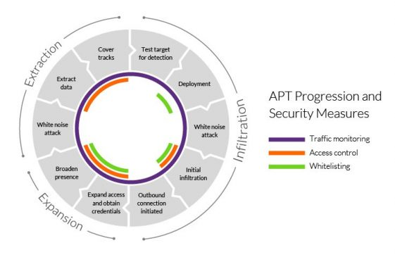

# APT (Advanced Persistent Threat)

Mối đe dọa dai dẳng nâng cao (Advanced Persistent Threat - APT) là một loại hình tấn công mạng cực kì tinh vi, thường được thực hiện bởi các nhóm tác nhân có tổ chức cao (thường là quốc gia tài trợ) nhằm xâm nhập và duy trì sự hiện diện lâu dài trong hệ thống mục tiêu.

## Đặc điểm chính của APT

- **Advanced (Nâng cao)**: Sử dụng kỹ thuật và công cụ tinh vi, thường là các cuộc tấn công zero-day, kỹ thuật xã hội phức tạp, và mã độc tùy chỉnh để vượt qua các biện pháp phòng thủ tiêu chuẩn.
- **Persistent (Dai dẳng)**: Duy trì sự hiện diện trong hệ thống mục tiêu trong thời gian dài (nhiều tháng, thậm chí nhiều năm) mà không bị phát hiện.
- **Threat (Đe dọa)**: Có mục tiêu cụ thể (gián điệp, đánh cắp dữ liệu, phá hoại) chứ không phải tấn công tràn lan.

## Mục tiêu của APT

- **Gián điệp mạng**: Đánh cắp bí mật quốc gia, sở hữu trí tuệ, thông tin nhạy cảm.
- **Phá hoại cơ sở hạ tầng**: Làm suy yếu hoặc phá hủy hệ thống năng lượng, viễn thông, tài chính.
- **Tấn công chuỗi cung ứng**: Xâm nhập qua các nhà cung cấp hoặc đối tác để tiếp cận mục tiêu cuối cùng.

## Các giai đoạn điển hình của một cuộc tấn công APT

1. **Reconnaissance (Trinh sát)**: Thu thập thông tin về mục tiêu qua OSINT, kỹ thuật xã hội, quét hạ tầng.
2. **Initial Compromise (Xâm nhập ban đầu)**: Khai thác lỗ hổng, gửi email phishing, xâm nhập qua thiết bị ngoại vi.
3. **Establish Foothold (Thiết lập chỗ đứng)**: Cài đặt backdoor, duy trì kết nối C2 (Command & Control).
4. **Privilege Escalation (Leo thang đặc quyền)**: Chiếm quyền admin/domain để mở rộng quyền kiểm soát.
5. **Lateral Movement (Di chuyển ngang)**: Mở rộng sang các hệ thống khác trong mạng.
6. **Data Exfiltration (Trích xuất dữ liệu)**: Thu thập và gửi dữ liệu ra ngoài qua các kênh mã hóa hoặc ẩn.

## Các nhóm APT nổi tiếng

- **APT1** (Trung Quốc): Chuyên đánh cắp sở hữu trí tuệ từ các ngành công nghệ, quốc phòng.
- **APT28 / Fancy Bear** (Nga): Nhóm liên quan đến gián điệp chính trị và tấn công cơ sở hạ tầng (theo dõi bởi Microsoft, Mandiant).
- **APT38 / Lazarus Group** (Triều Tiên): Nổi tiếng với các vụ tấn công tài chính và ransomware (WannaCry, vụ hack Sony).
- **APT33 / Elfin** (Iran): Nhắm vào các tổ chức năng lượng, hàng không vũ trụ.
- **Equation Group** (NSA): Một trong những nhóm APT tinh vi nhất, nổi tiếng với các công cụ như Stuxnet, EquationDrug.

## So sánh APT với tấn công thông thường

| Đặc điểm | Tấn công thông thường | APT |
|---|---|---|
| Mục tiêu | Tràn lan, cơ hội | Có chủ đích, cụ thể |
| Kỹ thuật | Công cụ có sẵn, đơn giản | Tùy chỉnh, phức tạp, zero-day |
| Thời gian | Ngắn hạn (vài phút/giờ) | Dài hạn (nhiều tháng/năm) |
| Phát hiện | Dễ bị phát hiện bởi các công cụ bảo mật cơ bản | Rất khó phát hiện, ẩn mình kĩ |
| Nguồn lực | Cá nhân hoặc nhóm nhỏ | Chính phủ hoặc tổ chức lớn tài trợ |

## Cách phòng chống APT

- **Phát hiện sớm**: Sử dụng hệ thống EDR (Endpoint Detection and Response), SIEM, phân tích hành vi bất thường.
- **Phân đoạn mạng**: Giới hạn khả năng di chuyển ngang của kẻ tấn công.
- **Quản lý phiên bản (Patch Management)**: Vá lỗi zero-day và các lỗ hổng đã biết kịp thời (tham khảo KEV).
- **Đào tạo nhận thức**: Huấn luyện nhân viên phát hiện phishing và kỹ thuật xã hội.
- **Zero-Trust Architecture**: Không tin tưởng mặc định bất kỳ người dùng hay thiết bị nào.
