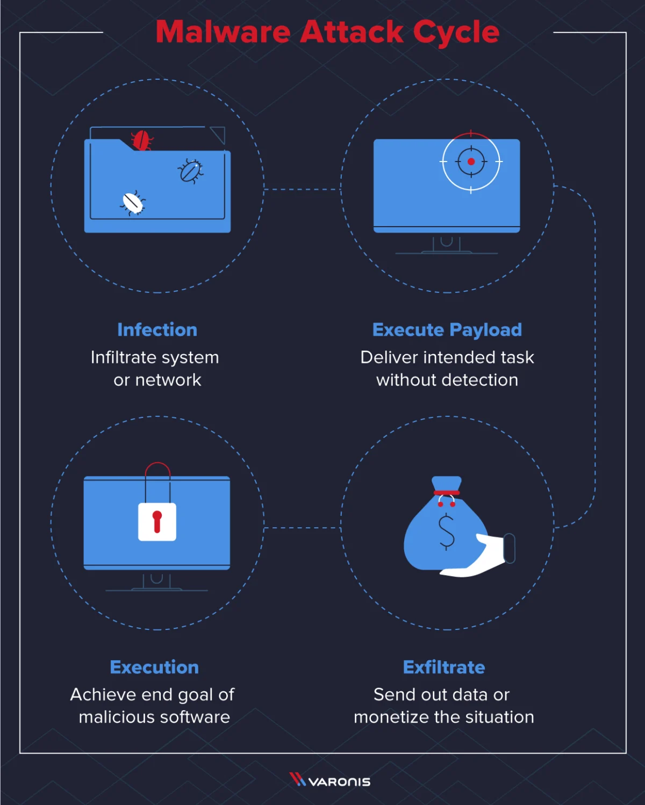

## Malware Campain

Malware Campagin (Chiến dịch mã độc) được hiểu là một nhóm các hoạt động xâm nhập sử dụng phần mềm độc hại, được thực hiện trong một khoảng thời gian cụ thể với mục tiêu và đối tượng tấn công chung.

## Quy trình thực hiện (Anatomy of a Malware Campaign)

Một chiến dịch mã độc thường trải qua các gia đoạn có cấu trúc sau:

- Tạo mã độc (Creation): Kẻ tấn công sử dụng các ngôn ngữ lập trình như Python, C/C++ hoặc Go để viết mã. Họ cũng tận dụng các khung khai thác như Metasploit hoặc Cobalt Strike để chế tọa các loại mã độc tinh vi.
- Xâm nhập ban đầu (Inital Infection): Đây là bước đưa mã độc vào hệ thống mục tiêu thông qua các vector như: Email Phishing, tải tệp độc hại từ web, sử dụng các bội khai thác, ổ USB nhiễm mã độc hoặc kỹ thuật xã hội.
- Lan truyền và duy trì (Propagation & Pesistence):
    - Mã độc tìm cách lây lan sang các máy tính khác trong mạng
    - Kẻ tấn công sử dụng các kỹ thuật đẻ mã độc có thể tự khởi động lịa sau khi máy tính tắt chẳng hạn như sửa đổi Registry của hệ thống, thiết lập Scheduled Tasks hoặc sử dụng Rootkits để ẩn mình.
- Thực thi tải trả (Payload Delivery): Đây là giai đoạn mã độc thực hiện hành vi gây hại thực sự như đánh cắp dữ liệu, mã hóa tệp tin đòi tiền chuộc (Ransomware), thiết lập mạng máy tính ma (Botnet) hoặc ghi lại thao tác phím (Keyloggers)
- Chỉ huy và kiểm soát (Command and Control - C2): Mã độc cần giao tiếp vơi smays chủ của kẻ tấn công thông qua các phương thức như HTTP/HTTPS, DNS, FastFlux hoặc thậm chí qua mạng xã hội để nhận lệnh mới.
- Trích xuất dữ liệu (Data Exfiltration): Dữ liệu bị đánh cắp được đưa ra ngoài thông qua tải xuống trực tiếp, gửi qua email, DNS Tunnelling hoặc tải lên các dịch vụ đám mây.

## Các ví dụ về chiến dịch mã độc thực tế

- Chiến dịch WannaCry: Một chiến dịch Ransomware quy mô toàn cầu lây lan qua email phishing có chứa tệp đính kèm độc hại. Sau khi người dùng mở tệp, mã độc sẽ mã hóa dữ liệu và yêu cầu thanh toán tiền chuộc.
- Chiến dịch SolarWinds (2020): Một cuộc tấn công chuỗi cung ứng cực kỳ itnh vi do nhóm APT29 thực hiện. Kẻ tấn công đã tiêm mã độc vào quá trình xây dựng phần mềm chính thống để xâm nhập vào khoảng 18000 khách hàng, bao gồm nhiêu cơ quan chính phủ Hoa Kỳ.
- Các cuộc tấn công lưới diện Ukraine (2015/2016/2022): Do nhóm Sandworm Team thực hiện. Họ đã sử dụng các loại mã độc như BlackEnergy3, KillDisk và Industroyer để thâm nhập hệ thống điều khiển SCADA và gây ra tình trạng mất điện trên diện rộng.

Việc xác định và theo dõi các chiến dịch này giúp các chuyên gia bảo mật hiểu được hành vi của kẻ thù (TPPs) để xây dựng các hàng rào phòng thủ chủ động hơn.