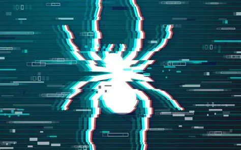
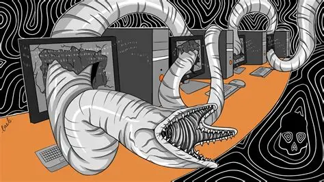

# Threat Actor 

Tác nhân đe dọa (Threat Actor), còn được gọi là tác nhân gây hại, là những cá nhân hoặc nhóm ngưòi có hành vi cố ý gây hại cho các thiết bị hoặc hệ thống kỹ thuật số. Họ lợi dụng các lỗ hổng trong hệ thống máy tính, mạng và phầm mềm để thực hiện các cuộc tấn công mạng nhằm đạt được những mục tiêu cụ thể.

## Các loại tác nhân đe dọa phổ biến

- Tội phạm mạng (Cybercriminals): Đây là nhóm phổ biến nhất, hoạt động chủ yếu vì lợi nhuận tài chính. 

    

    - *Ví dụ*: Nhóm Scattered Spiders đã thực hiện các chiến dịch nhắm vào những công ty viễn thông và thuê ngoài quy trình kinh doanh (BPO) để đánh cắp dữ liệu và thực hiện các giao dịch tài chính trái phép thông qua kỹ thuật xã hội và hoán đổi SIM.

- Tác nhân quốc gia (Nation-state actors): Được các chính phủ tài trợ để thực hiện hành động gián điệp, đánh cắp bí mật quốc gia hoặc phá hoại cơ sở hạ tầng trọng yếu của đối phương.

    
    - Sandworm Team (Nga): Nổi tiếng với các cuộc tấn công vào lưới điện Ukraine năm 2015 và 2016, gây mất điện diện rộng.
    - APT29 (Cozy Bear - Nga): Thực hiện vụ xâm nhập chuỗi cung ứng cực kì tinh vi vào phần mềm SolarWinds, gây ảnh hưởng đến hàng ngàn tổ chức chính phủ và tư nhân trên toàn cầu.
    - Lazarus Group (Triều Tiên): Thực hiện chiến dịch "Operatoin Dream Job" nhắm vào các lĩnh vực quốc phòng và hàng không vũ trụ.
    - Ocean Buffalo (APT32 - Việt Nam): sử dụng các công cụ tùy chỉnh để xâm nhập vào mạng lưới của tổ chức mục tiêu.

- Tin tặc vì mục tiêu chính trị (Hacktivists): Những người này sử dụng kỹ thuật tấn công mạng để thúc đẩy các chương trình nghị sự chính trị hoặc xã hội

    
    - Điển hình là nhóm **Anonymous**, tập thể hacktivist quốc tế chuyên tấn công các tổ chức để ủng hộ tự do ngôn luận. Một ví dụ khác là nhóm CyberAv3ngers, đơn vị đã thực hiện làm biến đổi giao diện (defacement) các bộ điều khiển logic lập trình (PLC) cẩu hãng Unitronics tại nhiều quốc gia để truyền tải thông điệp chính trị.

- Người tìm kiếm sự phấn khích (Thrill seekers): Họ tấn công hệ thống chủ yếu để giải trí, thách thức bản thân hoặc thể hiện kỹ năng.
- Mối đe dọa nội bộ (Insider Threat): NHững người bên trong tổ chức (nhân viên, đối tác) có quyền truy cập hệ thống.

    - Bốn luật sư tại công ty luật **Elliot Greenleaf** đã bị cáo buộc đánh cắp và xóa các tệ tin của công ty đẻ giúp một công ty đổi thủ mở một văn phòng mới.
    - Một nhân viên tại thành phố **Dallas** đã vô tình gây ra vụ rò rỉ dữ liệu khổng lồ (gần 32 terabytes) do sơ suất trong quá trình xử lý công việc năm 2021.

- Khủng bố mạng (Cyberterorists): Thực hiện các cuộc tấn công vì mục tiêu ý thức hệ hoặc tôn giáo nhằm gaya ra sự sợ hãi hoặc bạo lực.

    Ví dụ: Các cuộc tấn công vào hạ tầng trọng yếu (như hệ thống nước, năng lượng) với mục đích đe dọa an toàn công cộng hoặc gây ra thiệt hại vật lý thực sự. Chiến dịch **Homeland Justice** do các tác nhân liên kết với nhà nước Iran thực hiện vào mạng chính phủ Albania được coi là một hành động trả đũa chính trị mang tính phá hoại. 

> Note: Hacker là người có kỹ năng kỹ thuật để xâm nhập hệ thống. Một "ethical hacker" có thể dùng kỹ năng để giúp tổ chức vá lỗ hổng. Threat Acor là thuật ngữ rộng hơn, bao gồm bất kỳ ai gây ra mối đe dọa, ngay cả khi họ không có kỹ năng kỹ thuật cao, vdu như một nhân viên vô tình làm mất USB chứa dữ liệu quan trọng.
