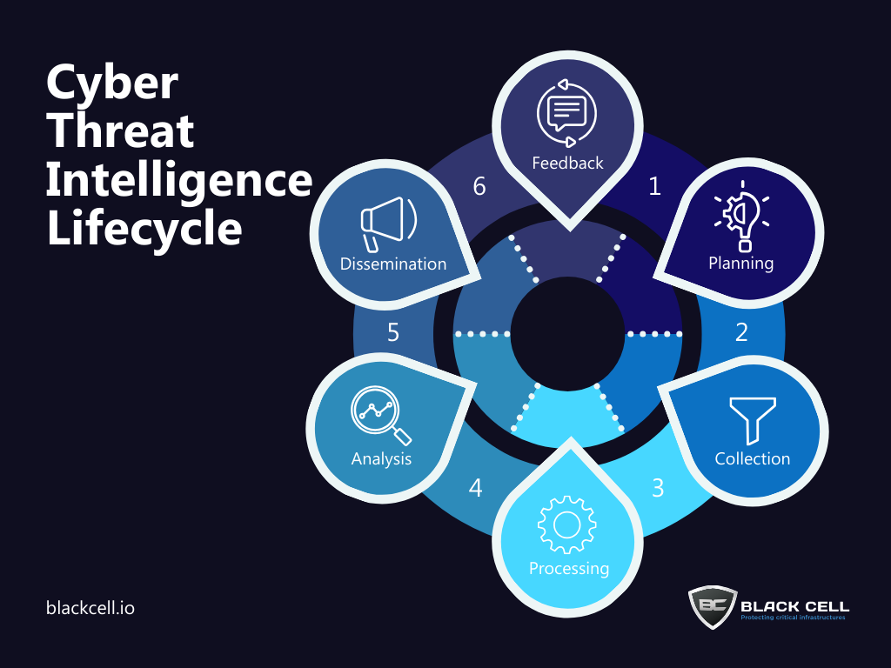
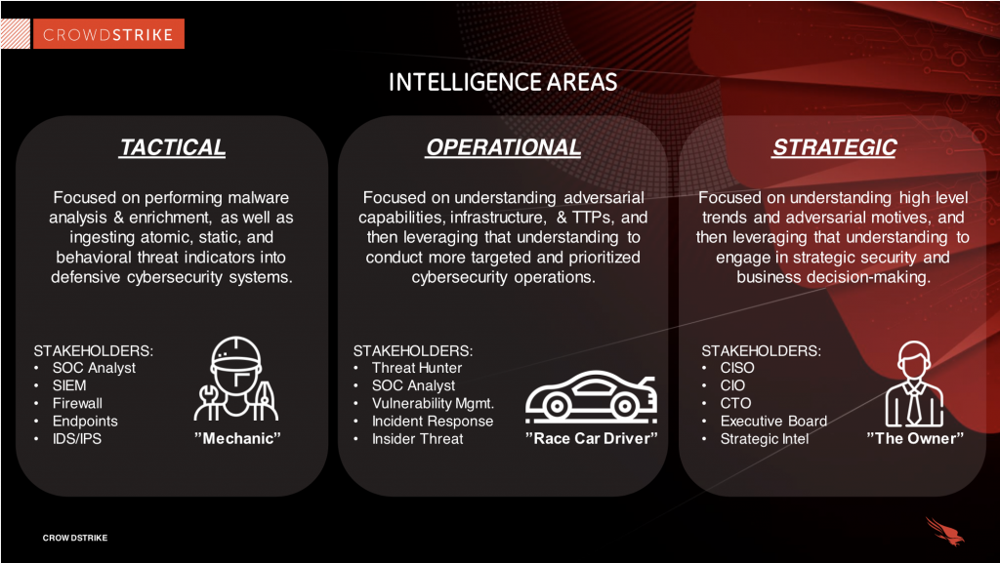

# Threat Intelligence

Tri thức về mối đe dọa mạng (Cyber Threat Intelligence - CTI) là việc thu thập, xử lý và phân tích để hiểu rõ về động cơ, mục tiêu và phương thức tấn công của các tác nhân gây hại. Thay vì chỉ phỏng thủ thụ động, CTI giúp các tổ chức cung cấp các thông tin dựa trên bằng chứng về mối đe dọa hiện hữu hoặc mới nổi.

# Tại sao lại phải là Threat Intelligence

Cyber Threat Intelligence được hình thành để giải quyết các nhu cầu thiết yếu sau:
- Chuyển đổi vị thế phòng thủ: Giúp tổ chức chuyển từ trạng thái phản ứng (chỉ xử lý sau khi sự cố xảy ra) sang tư thế chủ động (dự báo và ngăn chặn trước khi cuộc tấn công xảy ra)
- Thấu hiểu đối thủ: Tình báo giúp xác định động cơ, mục tiêu và phương thức tấn công của các tác nhân đe dọa.
- Giảm thiểu sự không chắc chắn: nó mở mạng những điều mà mình chưa biết, uncovẻ các mối đe dọa ẩn nấp để tổ chức không bị bất ngờ trước các cuộc tấn công chưa từng thấy.
- Học hỏi từ quá: Như các hồ của CIA nhấn mạng, tình báo giúp phân tích các thất bại trong quá khứ để xác định các yêu cầu cho sự thành công, từ đó giúp các chuyên gia đối phó hiệu quả hơn với những vấn đề hóc búa như tấn công quân sự hay các thay đổi chính sách đột ngột.

### Tầm quan trọng đối với nhà điều hành (Decision-maker)

Tình báo đóng vai trò "bộ não" hỗ trợ các cấp quản lý đưa ra quyết định dựa trên dữ liệu:
- Hỗ trợ đầu tư chiến lược: Cung cấp bức tranh toàn cảnh về rủi ro để các lãnh đạo đưa ra quyết định đầu tư bảo mật đúng đắn, giảm thiểu rủi ro và tăng hiệu quả vận hành.
- Xác định ưu tiên xử lý:
- Xây dựng lộ trình an nih dài hạn
- Tối ưu hóa hiệu quả tổ chức: Bằng cách cung cấp thông tin kịp thời và phù hợp, tình báo giúp cải thiện thời gian trung bình để phát hiện (MTTD) và phản ứng (MTTR) trước các mối đe dọa.

### Đặc điểm cốt lõi để đưa ra quyết định

- Tính cá nhân hóa
- Khả năng thực thi
- Tư duy phản biện: Giúp nhà phân tích thách thức các giả định cũ và dự báo nhiều kết quả khác nhau để tránh những sai lầm do định kiến chủ quan.

> Tóm lại, tình báo sinh ra để giúp tổ chức **luôn đi trước kẻ tấn công một bước**, biến dữ liệu thô thành các quyết định chiến lược và hành động phòng thủ hiệu quả.

## Vòng đời của Threat Intelligence (Lifecycle)

CTI không phải là  một tập dữ liệu tĩnh mà là một quy trình liên tục gồm 6 bước để biến dữ liệu thô thành tri thức có thể hành động được:

- Yêu cầu (Requirements/Planning): Xác định mục tiêu và phương pháp luận phù hợp với nhu cầu của các bên liên quan, chẳng hạn như hiểu động cơ cảu kẻ tấn công hoặc xác định bề mặt tấn công
- Thu thập (Collection): Ghi lại thông tin từ các nguồn như nhật ký lưu lượng mạng (logs), dữ liệu công khai, diễn đàn, mạng xã hội và các chuyên gia.
- Xử lý (Processing): Làm sạch và tổ chực lại dữ liệu thô (giải mã tệp, dịch thuật, định dạng lại) để sẵn sàng cho việc phân tích.
- Phân tích (Analysis): Đánh giá dữ liệu đã xử lý để đưa ra các nhận định và khuyến nghị thực tế.
- Phổ biến (Dissemination): Trình bày kết quá dưới dạng báo cáo hoặc tài liệu phù hợp với từng đối tượng (lãnh đạo hoặc kỹ thuật).
- Phản hồi (Feedback): thu thập ý kiến từ các bên liên quan để điều chỉnh và cải thiện quy trình cho các chu kì tiếp theo.

## Ví dụ về thực tế

Dựa trên tài liệu lịch sử [tình báo của CIA](../assets/intelligence_success_and_failure.pdf) và các báo cáo về an ninh mạng hiện đại, đươi dây là các ví dụ tiêu biểu về thành công và thất bại trong lĩnh vực tình báo:

- **Intelligence Failure**: 
  - Chiến tranh Trung Đông 1973 (Yom Kippur War) - Thất bại trong việc dự đoán cuộc tấn công bất ngờ từ các quốc gia Ả Rập vào Israel, do sự nhiễu loạn thông tin và các rào cản về mặt nhận thức.
  - Cách mạng Iran (1978-1979) - Đây là một thất bại lớn khi tình báo Mỹ không thể dự báo và giám sát được các động lực dẫn đến cuộc cách mạng lật đổ chế độ Shah.
- **Intelligence Success**: 
  - Dự báo về sự kế vị của Andropov: CIA đã thành công trong việc phân tích và dự báo các thay đổi trong hàng ngũ lãnh đạo Liên Xô. 

> Tóm lại, thất bại tình báo thường bắt nguồn từ các rào cản như: quá tải dữ liệu (noise), sự đánh lừa (deception) của đối thủ, định kiến cá nhân của nhà phân tích, hoặc áp lực chính trị. Ngược lại, thành công đòi hỏi sự kết hợp giữa tri thức chuyên sâu, việc kiểm chứng giả định và khả năng hành động nhanh chóng dựa trên các bằng chứng thực tế.

## Ba loại hình Threat Intelligence chính

Tùy vào độ phức tạp và mục tiêu sử dụng, CTI được chia làm 3 cấp độ:

- Tatical (Chiến thuật): tập trung vào các chi tiết kỹ thuật ngắn hạn. Nó chủ yếu xử lý các **Chỉ số thỏa hiệp** (Indicators of Compromise - IOCs) như địa chỉ IP đọc hại, URLs, mã băm tệp (hashes) và tên miền. Loại này thường được tự động hóa và tích hợp trức tiếp và các công cụ bảo mật như tường lửa.
- Operational (Vận hành): Đi sâu vào các câu hỏi *"ai", "tại sao" và "như thế nào"*. Nó tập trung vào TTPs (Tactics, Technique, and Procedures) - các chiến thuật và kỹ thuạt mà kẻ tấn công sử dụng. Loại này đòi hỏi sự phân tích của ocn người và có giá trị lâu dài hơn vì kẻ tấn công khó có thể thay đổi phương thức hoạt động nhanh chỏng như thay đổi công cụ.
- Strategic (Chiến lược): Cung cấp cái nhìn cáp cao về mối liên hệ giữa các mối đe dọa mạng với các sự kiện toàn cầu, đại chính trị và rủi ro tổ chức. Đây là thông tin quan trọng để ban lãnh đạo  (CISOs, CIOs) đưa ra các quyết định đầu tư và chiến lược bảo mật dài hạn.

## Lợi ích đối với các vai trò trong tổ chức

CTI mạng lại giá trị thực té cho nhiều bộ phận khác nhau:

- Nhân viên phân tích IT/Security: Giúp chặn các IPs, tên miền độc hại hiệu quả hơn thông qua các nguồn cấp dữ liệu (feeds).
- Trung tâm vận hành bảo mật (SOC): Giúp ưu tiên các sự cố dựa trên mức độ rủi ro và tác động thực tế.
- Nhóm ứng phó sự cố (CSIRT): Đẩy nhanh quá tình điều tra bằng cách cung cấp ngữ cảnh về kẻ tấn công và phân tích nguyên nhân gốc rễ.
- Ban lãnh đạo: Đưa ra các quyết định đàu tư thông minh hơn dựa trên bức tranh tổng thể về rủi ro mạng.

## Intelligence Report

Một Intelligence Report (báo cáo tình báo) là sản phẩm cuối cùng của quá trình phân tích dữ liệu, nhằm trình bày các thông tin đã được tinh lọc và xử lý thành một định dạng dễ hiểu cho các bên liên quan. Thay vì chỉ cung cấp dữ liệu thô, báo cáo này biến dữ liệu thanh tri thức có giá trị thực tế giúp dỗi ngũ an ninh hoặc nhà lãnh đạo đưa ra các quyết định sáng suốt dựa trên dữ liệu

### Các thành phần chính của một Intelligecne Report

Một báo cáo tình báo điển hình thường bao gồm các thanh phân sau dựa trên chu kỳ tình báo:

- Mục tiêu và Yêu cầu (Requirement/Objective): Xác định rõ câu hỏi hoặc vấn đề cụ thể mà báo cáo cần giải quyết, đảm bảo nội dung bám sát nhu cầu của các bên liên quan.
- Analyze Findings: Trình bày kết quả cốt lõi từ việc phân tích dữ liệu đã được xử lý (như xu hướng tấn công, các chỉ số thỏa hiệp IoC, hoặc hành vi của tác nhân đe dọa)
- Context; Cung cấp thông tin nền tảng về "ai", "tại sao" và "như thế nào" đằng sau một mối đe dọa, đặc biệt quan trọng trong tình báo vận hành và chiến lược.
- Risk Assessment: Cung cấp cái nhìn chiến lược về rủi ro đối với tổ chức, giúp các nhà quản lý (CISO, CIO) hiểu rõ tác động tiềm tàng của mối đe dọa.
- Actionable Recommendations: Đề xuất các biện pháp cụ thể để ứng phó hoặc phòng ngừa, chẳng hạn như chặn các địa chỉ IP độc hại, vá lỗ hổng cụ thể hoặc điều chỉnh lộ trình đầu tư bảo mật.

### Điểm quan trọng nhất để đưa ra quyết định

Điểm then chốt của một báo cáo tình báo để người ta có thể đưa ra quyết định chính là tính thực thi (Actionability). Để đạt được điều này, báo cáo phải hội đủ các yếu tố sau:

- Sự phù hợp và Cá nhân hóa: Báo cáo phải được thiết kế riêng cho nhu cầu và môi trường cụ thể của tổ chức, trành tình trạng làm người đọc quá tải bởi các thông tin kỹ thuật không liên quan.
- Tốc độ: Trong an ninh mạng, tốc độ là yếu tố sống còn, thông tin tình báo phải được cung cấp đủ nhanh để tổ chức kịp thời phản ứng trước khi thiệt hại xảy ra.
- Evidence-based: Kiến thức cung cấp phải dựa trên bằng chứng xác thực về các mối đe dọa hiện hữu hoặc đang nổi lên.
- Pritization: Báo cáo giúp xác định mối đe dọa nào là nguy hiểm nhất (thông qua danh mục KEV) để tập trung nguồn lực xử lý trước, thay vì cố gằng giải quyết tất cả các lỗ hổng cùng lúc.
