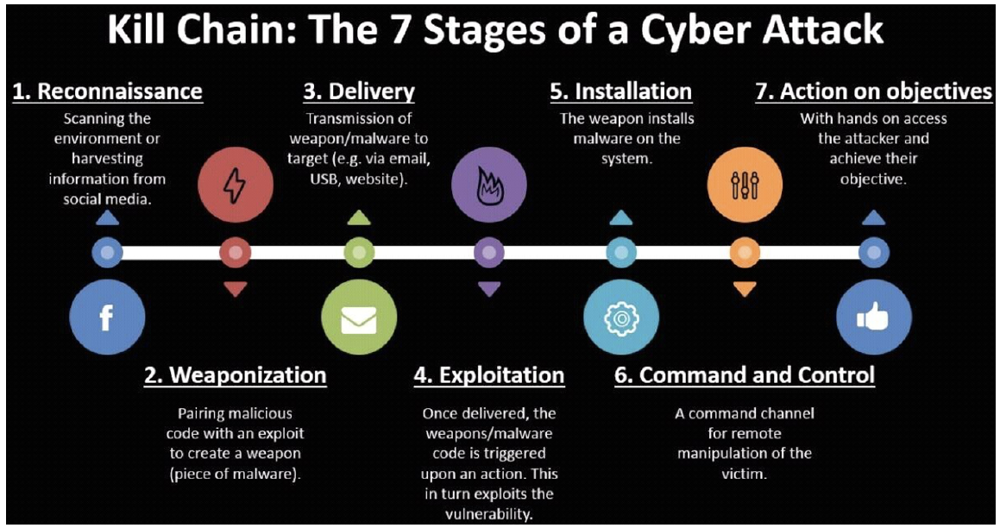

# Vulnerability and Exploitation

Vulnerabilty (lỗ hổng) và exploit (khai thác) là hai giai đoạn quan trọng và khác biệt trong một cuộc tấn công mạng điển hình.

## Vulnerability (lỗ hổng bảo mật) là gì?

Lỗ hổng là một điểm yếu, lỗi hoặc sai sót được tìm thấy trong hệ thống báo mật, quy trình, thiết kế hoặc triển khai có tiềm năng bị các tác nhân đe dọa lợi dụng để xâm nhập mạng an toàn.

- Nguồn gốc: Lỗ hổng thường xuất phát từ những sai lầm trong quá trình xây dựng và lập trình công nghệ (hay còn gọi là *"bug"*). Mặc dù bản thân các bug không nhất thiết gây hại, nhưng nếu chúng có thể bị lợi dụng để buộc phần mềm hoạt động khác đi so với dự định

- Quản lý và phân loại:
    - Khi một lỗi được xác định là lỗ hổng, nó sẽ được tổ chức MITRE đăng ký là CVE (Common Vulnerability or Exposure)
    - Mỗi lỗ hổng được gán với một điểm số CVSS (Common Vulnerability Scoring System) để phản ánh mức độ rủi ro tiềm tàng đối với tổ chức.

- Các ví dụ phổ biến:
    - SQL Injection: Kẻ tấn công tiêm mã độc để truy cập hoặc đánh cắp dữ liệu từ cơ sở dữ liệu.
    - Broken Authentication: Khi các thông tin xác thực bị xâm nhập, kẻ xấu có thể chiếm đoạt danh tính người dùng.
    - Cross-Site Scripting (XSS): Tiêm mã độc vào trang web nhắm đến người dùng cuối để đánh cắp thông tin cá nhân.
    - ...

## Exploit (Hành vi/Công cụ khai thác) là gì?

Exploit là phương thức hoặc phương tiện mà kẻ tấn công sử dụng để lợi dụng một lỗ hổng cụ thể nhằm thực hiện hoạt động độc hại. Đây là bước tiếp theo trong kế hoạch của kẻ tấn công sau khi đã phát hiện ra lỗ hổng: 

- Hình thức: Một bản khai thác (exploit) có thể tồn tại dưới nhiều dạng:
    - Một đoạn mã hoặc phần mềm chuyên dụng
    - Một chuỗi các lệnh (sequence of comamnds)
    - Các công cụ khai thác mã nguồn mở (exploit kit)

- Cơ chế hoạt động: kẻ tấn công có thể sử dụng nhiều bản khai thác cùng một lúc sau khi đánh giá phương thức nào mang lại hiệu quả cao nhất

### Exploit Flow (EF)

Exploit Flow là khái niệm về việc xây dựng các lộ trình khai thác an ninh mạng (exploitation routes) có tính module và có thể kết hợp đc.

- Bản chất Thay vì coi một cuộc tấn công là một hành động đơn lẻ, EF ghi lại trạng thái của hệ thống sau mỗi hành động khai thác riêng biệt trong một luồn.
- Cấu trúc 6 danh mục chính (lấy cảm hứng từ chuỗi tấn công - Security Kill Chain):
    1. Reconnaissance (Trinh sát): Lợi dụng lỗ hổng để xâm nhập.
    2. Exploitation (Khai thác): Lợi dụng lỗ hổng để xâm nhập
    3. Privilege Escalation (Leo thang đặc quyền ): Chiếm quyền truy cập cao hơn.
    4. Lateral Movement (Di chuyển ngang): Mở rộng tấn công sang các hệ thống khác trong mạng.
    5. Data Exfiltration (Trích xuất dữ liệu): Đánh cắp thông tin ra bên ngoài.
    6. Command and Control: Thiết lập kênh điều khiển từ xa

## Cách phòng chống và giảm thiểu rủi ro

Để bảo vệ hệ thống, các tổ chức cần thực hiện các biện pháp chủ động:
- Sử dụng công cụ quản lý lỗ hổng: Thường xuyên quét môi trường mạng đẻ so sánh với cơ sở dữ liệu các lỗ hổng đã biết.
- Kiểm thử xâm nhập (Penetration Testing)
- Triển khai hệ thống SIEM: Sử dụng cascd hệ thống quản lý và sự kiện bảo mật để kiểm soát những gi đang diễn ra trên mạng và phản ứng kịp thời với các hoạt động bất thường.

## Vendor Advisory (Cố vấn/ Thông báo từ nhà cung cấp)

Đây là các thông báo kxy thuật từ nhà cung cáp phần mềm/ phần cứng về các lỗ hỏng bảo mật.

- Vòng đời: Khi bug được phát hiện bở nhà cung cấp hoặc các nhà nghiên cứu, nó sẽ được gán mã định danh CVE. Nhà cung cấp sau đó phát hành các bản tư vấn (Advisories) để hướng dấn người dùng cách vá lỗi haowjc áp dụng các biện pháp kiểm soát bù đắp (compensating controls) như chặn cổng hoặc sử dụng chữ ký ảo (virtual patches) trên WAF/IDS.

