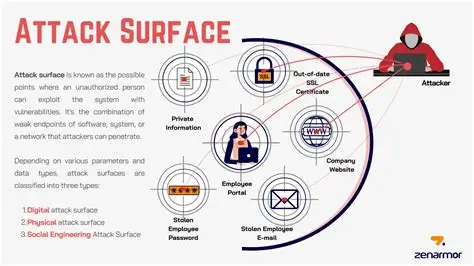

# Attack Surface

Bề mặt tấn công (Attack Surface) là tổng hợp tất cả các điểm (hay còn gọi là các vector tấn công) mà một ng dùng không được phép có thể sử dụng để truy cập vào hệ thống và lấy cắp dữ liệu. Hiểu một cách đơn giản, bề mặt tấn công càng lớn thì hệ thống càng khó bảo vệ.

## Phân loại Bề mặt tấn công

Bề mặt tấn công được chia thành hai danh mục chính:

- Bề mặt tấn công kỹ thuật số (Digital Attack Surface): Bao gồm tất cả phần cứng và phần mềm kết nối với mạng tổ chức. Các thành phần bao gồm ứng dụng, mã nguồn, các cổng (ports), máy chủ, trang web và cả Shadow IT (các thiết bị hoặc ứng dụng chưa được phê duyệt mà người dùng tự ý sử dụng).
- Bề mặt tấn công vật lý (Physical Attack Surface): Bao gồm tất cả các thiết bị đầu cuối mà kẻ tán công có thể tiếp cận trực tiếp như máy tính để bàn, ổ cứng, máy tính xách tay, điện thoại di động và ổ USB.

### Mối quan hệ giữa Vector tấn công và Bề mặt tấn công

Mặc dù có liên quan, hai khái niệm này có sự khác biệt rõ rệt: Vector tấn công là phương thức mà tội phạm mạng sử dụng để xâm nhập (ví dụ: phishing, malware) trong khi Bề mặt tấn công là không gian hoặc các điểm yếu mà kể tấn công nhắm tới

## Các Vector tấn công phổ biến

Vector tấn công phổ biến là phương thức mà tội phạm mạng sử dụng để xâm nhập. Bề mặt tấn công càng mở rộng thì rủi ro từ các vector này càng tăng:
- Phishing (tấn công giả mạo): Gửi các thông điệp giả mạo nguồn tin đáng tin cậy để lừa người dùng cung cấp thông tin hoặc nhấp vào liên kết độc hại
- Malware (mã độc): bao gồm ransomware, trojan và virus giúp tin tặc chiếm quyền điều khiển thiết bị hoặc gây hư hại dữ liệu.
- Mật khẩu bị thỏa hiệp: Do người dùng sử dụng mật khẩu yếu hoặc dùng lại mật khẩu cũ.
- Phần mềm chưa được vá lỗi (Unpatched software): Tin tặc tích cực tìm kiếm các lỗ hổng chưa được vá trong hệ điều hành và ứng dụng để làm "cửa ngõ" xâm nhập.
- Vấn đề mã hóa: Sử dụng các giao thức mã hóa dẫn đến dữ liệu bị lộ dưới dạng văn bản thuần túy (plaintext) khi bị đánh chặn.

## Quy trình quản lý Bề mặt tấn công (Attack Surface Management - ASM)

ASM là quá trình liên tục xác định, đánh giá và giám sát các điểm yếu của tổ chức. Việc này bao gồm:

- Lập bản đồ hệ thống: Xác định tất cả các thiết bị vật lý và ảo như tường lửa, bộ chuyển mạch (switches), máy in và máy chủ tệp.l
- Phân loại dữ liệu: Xác định các vị trí lưu trữ dữ liệu (đám mây, tại chỗ, thiết bị) và kiểm soát quyển truy cập của người dùng.
- Xác định ưu tiên: Sử dụng mô hình hóa mối đe dọa (threat modeling) để đánh giá các lộ trình tấn công và ưu tiên xử lý các rủi ro dựa trên kiến trúc hệ thống.

> Mô hình hóa mối đe dọa là quá trình giúp các đội ngũ an ninh đánh giá một cách hệ thống các lộ trình tấn công (attack paths) tiềm tàng vào hệ thống. Mục đính chính của nó là **Xác định ưu tiên rủi ro** và **Hiểu cách thức tấn công**.

> Tóm lại, threat modeling là việc "suy nghĩ như một kẻ tấn công" để xác định các điểm yếu trong kiến trúc hệ thống và xây dựng các rào cản phòng thủ tương ứng dựa trên dữ liệu tri thức về các mối đe dọa thực tế.

## 5 bước giảm thiểu Bề mặt tấn công

Để hạn chế cơ hội của tội phạm mạng, tổ chức cần thực hiện:

1. Triển khai chính sách Zero-Trust: Chỉ cấp quyền truy cập đúng mức cho đúng người vào đúng thời điểm.
2. Loại bỏ sự phức tạp: Vô hiệu hóa các thiết bị và phần mềm không sử dụng để đơn giản hóa mạng lưới.
3. Quét lỗ hổng định kì: Phải có khả năng hiển thị đầy đủ bề mặt tấn công đẻ phát hiện sớm các vấn đề trên cả đám mây và mạng nội bộ.
4. Phân đoạn mạng (Network Segmentation): Sử dụng tường lửa và vi phân đoạn (microsegmentation) đẻ tạo ra các rào cản ngăn chặn kẻ tấn công di chuyển ngang trong hệ thống.
5. Đào tạo nhân viên: Nâng cao nhận thức để họ nhận biết được các dấu hiệu của tấn công giả mạo và kỹ thuật xã hội (social engineering).

> Trong kỷ nguyên đám mây hiện nay, bề mặt tấn công đang mở rộng nhanh chóng do các tìa nguyên tạm thời (Ephemeral Workloads) như container hay serverless có thể xuất hiện và biến mất chỉ trong vài phút, đòi hỏi các giải pháp giám sát thời gian thực như EDR hay các nền tảng bảo vệ ứng dụng đám mây (CNAPP) để duy trì khả năng hiển thị.
