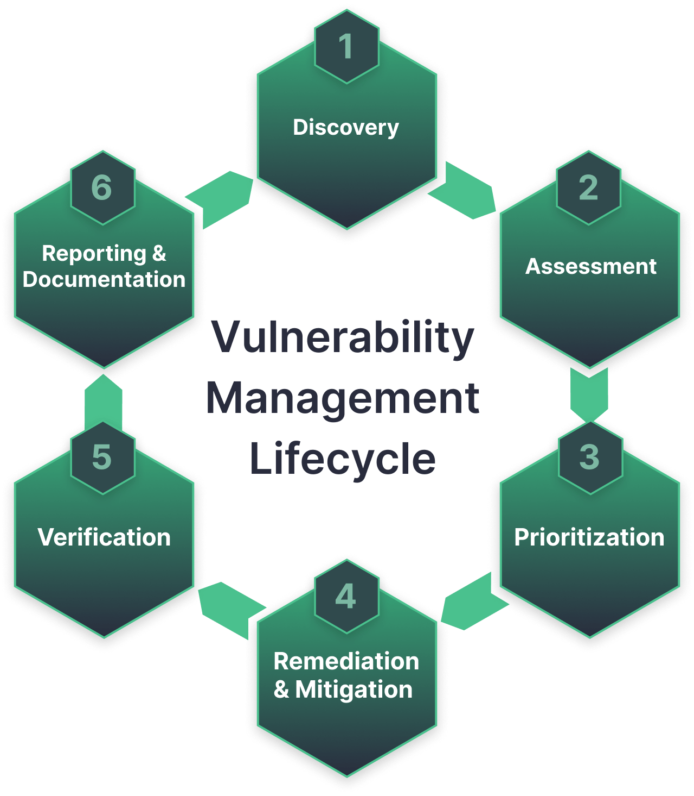
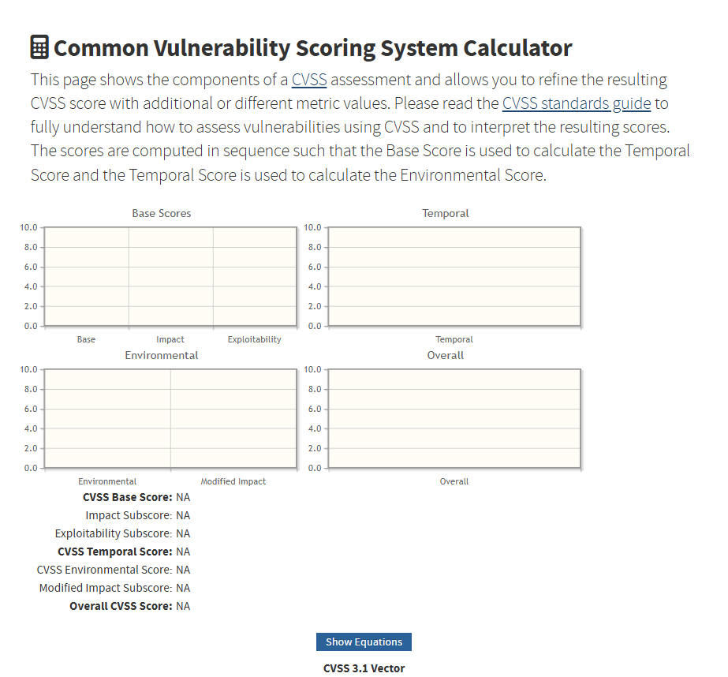
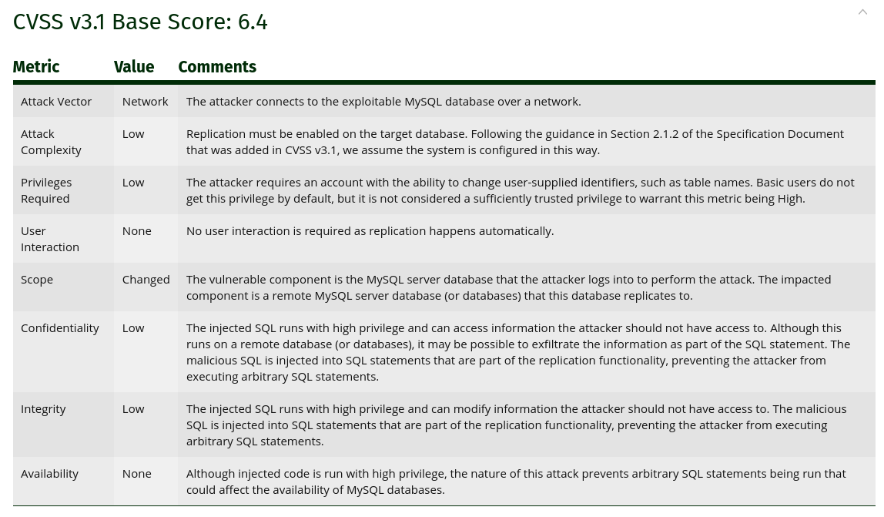
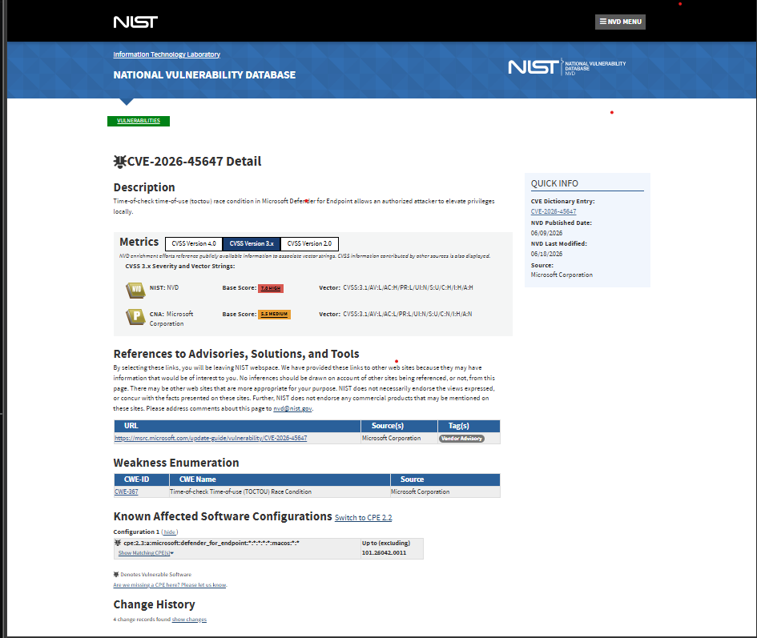
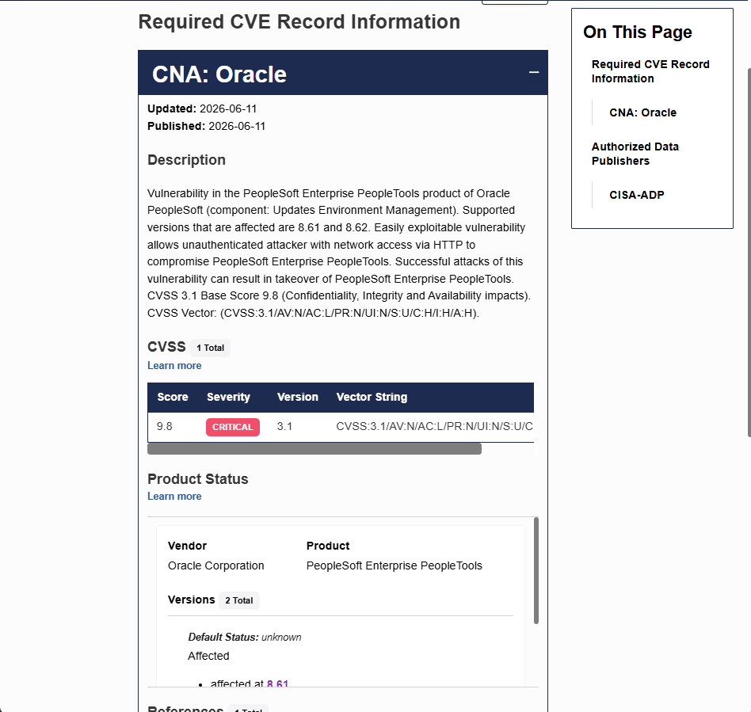

# CVE

## Vòng đời của CVE (CVE life cycles)

CVE (Commnon Vulnerabilities and Exposures) là mã đinh danh duy nhất cho một lỗ hổng bảo mật đã được xác định. Quy trình từ khi phát hiện đến khi quản lý lỗ hổng diễn ra qua các giai đoạn sau:

- Phát hiện: Các nhà nghiên cứu bảo mật, nhà cung cấp phần mềm hoặc thậm chí là kẻ tấn công phát hiện ra mội lỗi phần mềm (bug).
- Ghi danh và cấp mã: Khi lỗi được xác định là một lỗ hổng bảo mật, nó sẽ được đăng ký với tổ chức MITRE. Tại đây, nó được cấp một mã đinh danh duy nhất là CVE ID và được gán điểm số CVSS để phản ánh mức độ rủi ro tiềm tàng.

- Vòng đời quản lý lỗ hỏng (Vulnerability Management Lifecycle): Đây là một quy trình vận hành liên tục gồm 6 pha chính:

    1. Phát hiện tài sản (Asset Discovery): Lập danh mục tất cả phần cứng và phần mềm trong mạng để biết cái gì cần để bảo vệ.
    2. Đánh giá lỗ hổng (Vulnerability Assessment): Sử dụng các công cụ quét để so sánh môi trường hiện tại với cơ sở dữ liệu lỗ hổng đã biết.
    3. Đánh giá rủi ro và Ưu tiên (Prioritization): Sử dụng điểm CVSS kết hợp với cá ngữ cảnh thực tế (như dữ liệu nhạy cảm, quyền truy cập) để xác định lỗ hổng nào cần xử lý trước.
    4. Xử lý và Phản ứng (Remediation): Thực hiện vá lỗi (patching), thay thế tài ngueyen hoặc cấu hình lại hệ thống để loại bỏ lỗ hổng.
    5. Xác minh (Verification): Quét alilj để dảm bảo việc vá lỗi thanfhcoong vafk hông gây ra lỗi hệ thống khác.
    6. Báo cáo và Cải tiến: Tổng hợp dữ liệu để đưa ra các quyết định đầu từ bảo mật chiến lược.

##  Vector CVSS v3.1 (Common Vulnerability Scoring System)

CVSS là hệ thống tiêu chuẩn để đánh gái mức độ nghiêm trọng của lỗ hổng trên thang điểm từ 0 -> 10. Một vector String trong CVSS v3.1 là một chuỗi ký tự đại diện cho các giá trị đo lường cụ thể.

- Exploitability (Khả năng khai thác) bao gồm:
    - Attack Vector (AV) 
    - Attack Complexity (AX) (độ khó của cuộc tấn công)
    - Privileges Required (PR) (quyền hạn cần thiết)
    - User Interaction (UI) (có cần người dùng tương tác gì không?)
    - Scope (S) (Khả năng ảnh hưởng sang các thành phần khác)
- Impact (Tác động): Đánh giá ảnh hưởng đến tính bảo CIA (bảo mật, toàn vẹn, sẵn sàng).
- Nhóm chỉ số thời gian (Temporal Scỏe Metrics): Phản ánh trạng thái hiện tại của lỗ hổng, bao gồm:
    - Exploit Code Maturity (E): mức độ sẵn có của mã khai thác.
    - Remediation Level (RL): tính trạng có bản vá hay chưa.
    - Report Confidence (RC): mực độ tin cậy của báo cáo lỗi.

### Ví dụ cho CVE-2013-0375 (MySQL Stored SQL Injection) được chấm điểm theo CVSS v3.1

## Cơ sở dữ liệu NVD (National Vulnerability Database)

NVD là cơ sở dữ liệu quốc gia của chính phủ HOa Kỳ về các lỗ hổng bảo mật, được quản lý bởi Viện Tiêu chuẩn và Công nghệ Quốc gia (NIST)

- Chức năng: NVD đóng vai trò như một kho lưu trữ tập trung các dữ liệu quản lý lỗ hổng dựa trên tiêu chuẩn.  Nó đồng bộ hóa dữ liệu với danh sách CVE do tổ chức MITRE đăng ký để cung cấp các phân tích nâng cao.
- Điểm số CVSS: Điểm quan trọng nhất của NVD là nó gán điểm số cho mỗi lỗ hổng theo Hệ thống Chấm điểm Lỗ hổng Phổ biến (CVSS). Điểm này phản ánh mức độ rủi ro tiềm tàng dựa trên các yêu tố như tác động đến tính bảo mật, toàn vẹn và sẵn sáng cho hệ thống.

=> Đây là nguồn tài liệu tham khảo chính cho các giải pháp quản lý lỗ hổng trên toàn thế giới

## KEV (Known Exploited Vulnerabilities)

KEV là danh mục lỗ hổng **đã biết bị khai thác trong thực tế**, do Cơ quan An ninh Cơ sở hạ tầng và An ninh mạng hoa Kỳ (CISA) quản lý.

- Sự khác biệt cốt lõi: Trong khi CVE chỉ cho biết "lỗ hổng tồn tại" và CVSS ước tính "tác động lý thuyết", thì KEV khẳng định lỗ hổng đó đang bị tin tặc sử dụng tích cực trong các chiến dịch tấn công thực tế (như ransomware, đánh cắp dữ liệu).
- Vai trò trong ưu tiên: Trong quản lý rủi ro hiện đại, trạng thái KEV quan trọng hơn điểm số CVSS khi quyết định lỗ hổng nào cần vá trước. Nếu một lỗ hổng nằm trong KEV, nó đòi hòi cần phải được vá khẩn cấp (trong vài giờ hoặc vài ngày) thay vì theo chu kỳ hàng tháng thông thường.
- Ứng dụng: Các tổ chức sử dụng KEV để lọc ra nhóm nhỏ các lỗ hổng thực sự nguy hiểm trong hàng ngàn mã CVE được công bố mỗi năm, giúp tôi ưu hóa nguồn lực phòng thủ.

### Mối quan hệ hỗ trợ lần nhau giữa KEV và NVD

Trong quy trình quản lý lỗ hổng bảo mật chuyên nghiệp, các tổ chức thường kết hợp cả hai:
1. Sử dụng NVD để quét và xác định tất cả các lỗ hổng tồn tại trong hệ thống của mình.
2. Đối chiều kết quả với danh mục KEV để tách ra những lỗ hổng đang bị tấn công thực tế nhằm thực hiện vá lỗi khẩn cấp.
3. Sử dụng điểm CVSS từ NVD để lập kế hoạch vá các lỗ hổng còn lại trong các chu kỳ bảo trì định kỳ.
