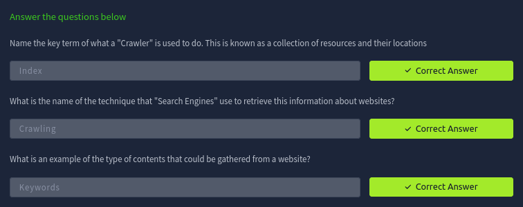
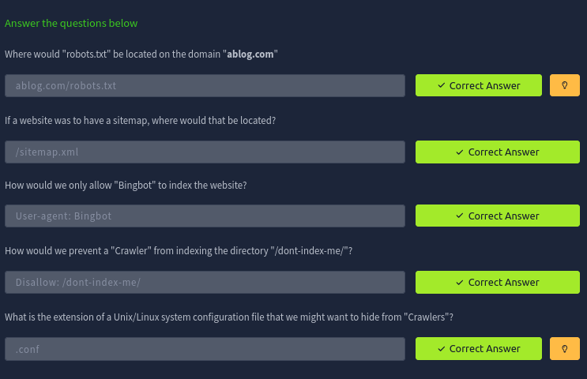
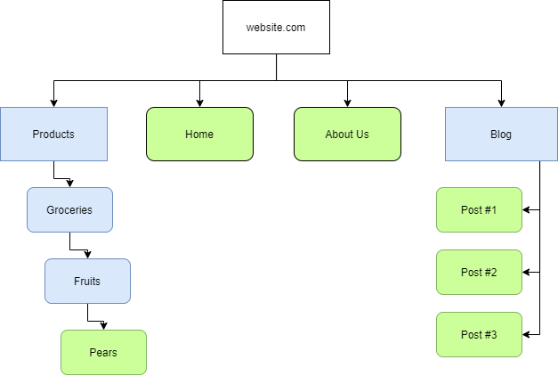
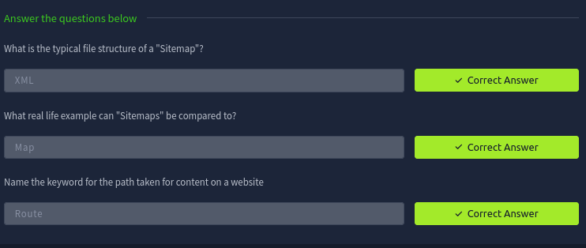
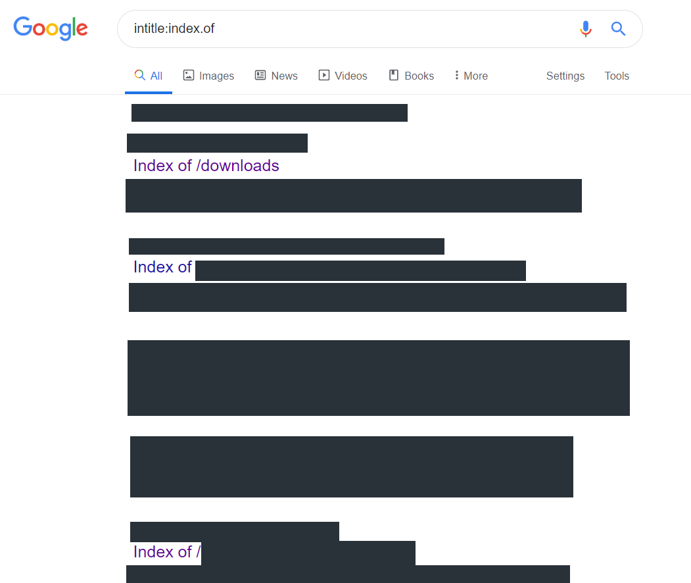
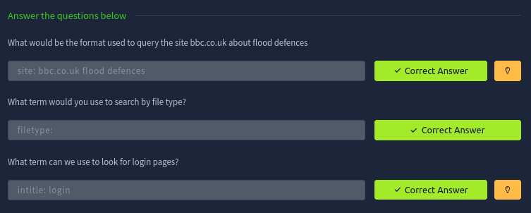

# Google Dorking

Giải thích cách thức hoạt động cảu các công cụ tìm kiếm và cách tận dụng chúng để tìm kiếm nội dung ẩn.

## Task 1: Ye Ol' Search Engine

> Phần này sẽ thuần giới thiệu search engine làm gì và giới thiệu qua các công cụ thiết yếu khi lướt internet.

## Task 2: Let's Learn About Crawlers

### What are Crawlers and how do They work??

Các trình thu thập dữ liệu này khám phá nội dung thông qua nhiều phương pháp khác nhau. Một trong số đó là bằng cách khám phá thuần túy, trong đó thu thập dữ liệu truy cập một URL và trả về thông tin về loại nội dung của trang web cho công cụ tìm kiếm.

Một phương pháp khác mà các trình thu thập dữ liueej sử dụng để khám phá nội dung là bằng cách theo dõi tất cả các URL được tìm thấy từ các trang web đã được thu nhập dữ liệu trước đó.

### Let's Visaulise Some Things...

Sơ đồ đưới đây mô tả cách thức hoạt động của các trình thu nhập dữ liệu web. Khi một trình thu nhập dữ liệu web phát hiện ra một tên miền như `mywebsite.com`, nó sẽ lập chi mục toàn bộ nội dung của tên miền đó.

Dựa vào diagram ở trên, website trên có những từ khóa như là "Apple", "Banana" và "Pear". Những từ khóa này sẽ được lưu trữ tại bởi trình thu thập dữ liệu. Thế nên khi sau này mà người dùng mà tra những từ khóa ở trên thì `mywebsite.com` sẽ được hiện ra.

Trong trường hợp mà trình thu thập dữ liệu tìm thấy "mywebsite.com", ngoài những từ khóa mà nó thu thập được thì nó còn thu thập được th một URL bên ngoài là "anotherwebsite.com", khi đó trình thu nhập dữ liệu sẽ tiếp tục thu nhập nội dung của trang web "anotherwebsite.com"

### Questions

## Task 3: Enter: Search Engine Optimisation

Tối ưu hóa công cụ tìm kiếm (SEO) là một chủ đề phổ biến và sinh lời trong các công cụ tìm kiếm hiện đại. Trên thực tế, đến mức toàn bộ các doanh nghiệp đều tận dụng việc cải thiện "thứ hạng" SEO của một tên miền. Nhìn một cách trừu tượng, các công cụ tìm kiếm sẽ "ưu tiên" những tên miền dễ lập chi mục hơn.

Có vài yếu tố ảnh hưởng đến cách tính điểm, ví dụ như:
- Độ tương thích của trang web với các loại trình duyệt khác.
- Việc thu thập thông tin trang web dễ dàng đến mức nào thông tqua việc sử dụng "Sitemap".
- Loại từ khóa mà trang web có

## Task 4: Robots.txt

### But what is it?

Tệp này phải được phục vụ tại thư mục gốc - do chính máy chủ web chỉ định, Tệp văn bản này định nghĩa các quyền mà "Trình thu thập thông tin" có đối với trang web. Ví dụ, loại "Trình thu thập thông tin" nào được phép. Hơn nữa, `robots.txt` có thể chỉ định những tệp và thư mục nào chúng ta muốn hoặc không muốn "Trình thu thập thông tin" lập chi mục (index).

**Những từ khóa được dùng trong `robots.txt`**

- User-agent: Chỉ định loại "trình thu thập thông tin" có thể lập chi mục cho trang we
- Allow: Cho phép chỉ định các thư mục hoặc tệp mà có thể lập chi mục.
- Disallow: Không cho phép chỉ định các thư mục hoặc tệp có thể lập chi mục.
- Sitemaps: Cung cấp đờng dẫn đến vị trí của sơ đồ trang web. (thông thường sẽ là đến file `sitemap.xml`)

### Questions

## Task 5: Sitemaps

Sơ đồ trang web là tài nguyên chỉ dẫn hữu ích cho các trình thu thập thông tin, vì chúng xác định các đường đẫn cần thiết để tìm nội dung trên tên miền.

Các hình chữ nhật màu xanh làm biểu thị đường dẫn đến nội dung lồng nhau, tương tự như thư mục "Products" của một cửa hàng. Trong khi đó, các hình chữ nhật bo tròn màu xanh lá biểu thị một trang thực tế.

"Sitemaps" thực sự là file XML-formatted.

### Questions

## What is Google Dorking?

Một vài thuật ngữ thông dụng mà chúng ta có thể tìm kiếm và kết hợp bao gồm:

- `filetype:`: Tìm file với extension cho trước.
- `cache:`: Xem phiên bản đã được lưu trong bộ nhớ cache của Google cho một URL cụ thể. 
- `intitle:`: Cụm từ chỉ đinh phải xuất hiện trong tiêu đề của trang.

### Questions

