# Malware Introductory

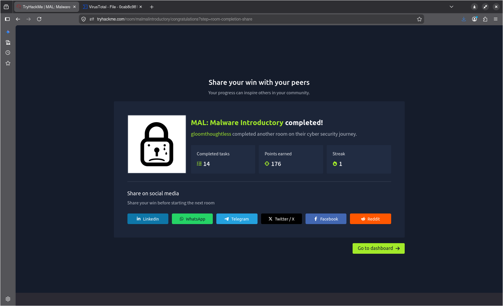

Một series of room để cover hết những thông tin cơ bản về Malware Analysis.

## Task 1: What is the purpose of Malware Analysis

Mã độc (Malware) là một chủ đề cực kỳ phổ biến trong lĩnh vực An ninh mạng, và thật không may, nó cũng là một đề tài liên tục lặp lại trên các bản tin quốc tế ngày nay.

Phân tích mã độc không chỉ là một phần của quy trình ứng phó sự cố (incident response), mà nó còn rất hữu ích trong việc giúp chúng ta hiểu được hành vi của các biến thể mã độc quyết định việc phân loại chúng ra sao.

Khi phân tích mã độc, việc cân nhắc các yêu tối sau đây là vô cùng quan trọng:
- **Điểm xâm nhập (Point of Entry - PoE)**: Vi dụ: có phải mã độc lọt qua bộ lọc email dưới dạng thư rác? 
- **Dấu hiệu thực thi**: các hiệu cho thấy mã độc thực sự đã chạy trên máy tính là gì? Có xuất hiện tập tin lạ, tiến trình (process) đáng ngờ, hay bất kì hành vi cố gắng kết nói mạng "bất thường" nào không?
- **Hành vi hoạt động**: Mã độc hoạt động như thế nào? Nó có cố gằng lây nhiễm sang cacsd thiết bị khác trong mạng không? Nó có mã hóa tệp tin hay tự động cài đặt các công cụ như backdoor? Công cụ điều khiển từ xa (RAT) không?
- **Khả năng phòng vệ**: Và quan trọng nhất - liệu cuối cùng chúng ta có thể ngăn chặn và/hoặc phát hiện các dợt lây nhiễm tiếp theo hay không?

## Task 2: Understanding Malware Campaigns

Các loại tấn công (malware campaign) được phân thành hai loại chính: Tân công mục tiêu (Targeted) và Chiến dịch quy mô lớn (Mass Campaign).

### Tấn công có mục tiêu (Targeted)

Một cuộc tấn công "có mục tiêu" đúng nghĩa nwh tên gọi của nó - nhắm vào một đối tượng cụ thể. Nhằm phục vụ một mục đích chuyên biệt chống lại một mục tiêu xác định.

### Chiến dịch quy mô lớn

Mặt khác, phân loại "Chiến dịch quy mô lớn" có thể liên hệ với nhiều ví dụ thực tế và cũng là loại hình tấn công phổ biến nhất. Mục đích duy nhất của loại mã độc anyf là lây nhiêm vào càng nheieuf thiết bị càng tốt và thực hiện bất kỳ hành vi phá hoại nào - bất kể nạn nhân là ai.

Các công ty bảo mật nwh Kaspersky thường theo dõi các chiến dịch này (được gọi là Mối đe dọa dai dẳng nâng cao - APT) và thường báo cáo về tỷ lệ gây nhiễm cũng như các dấu hiệu nhận biết của chúng.

Ví dụ, báo cáo của Kaspersky về chiến dịch "Crouching Yeti (Energetic Bear)" chỉ ra rằng chiến dịch này đặc biệt nhắm mục tiêu vào các lĩnh vực sau: 
- Công nghiệp/Máy móc
- Sản xuất
- Dược phẩm
- Xây dựng
- Giáo dục
- Công nghệ thông tin

> Mặc dù biến thể này về mặt kỹ thuật là có mục tiêu, nhưng phạm vi hoạt động của nó lại khá rộng lớn => thuộc dạng "Chiến dịch quy mô lớn".

### Questions

**What is the famous example of a targeted attack-esque Malware that targeted Iran?** - Stuxnet

**What is the name of the Ransomware that used the Eternalblue exploit in a "Mass Campaign" attack?** - Wannacry

## Task 3: Identifying if a Malware Attack has Happenned

Cũng giống như tương tác với OS, luôn có những dấu vết còn sót lại từ các hoạt động đó,m ngay cả khi chúng cực kỳ mờ nhạt.

Mã độc (tùy thuộc vào từng biến thể) hầu hết có tính can thiệp sâu - nghĩa là chúng để lại một lượng lớn "vết bánh xe" hay bằng chứng thực tế... 

Nhìn chung, toàn bộ quá trình diễn ra một cuộc tấn công mã độc được chia thành vài bước cơ bản sau:
1. Phát tán (Delivery)
2. Thực thi (Execution)
3. Duy trì sự hiện diện (Maintaining)
4. Lan truyền (Propagatoin)

Các bước này sẽ tạo ra rất nhiều dữ liệu.Cụ thể là: lưu lượng mạng (như việc giao tiếp với các  máy chủ khác), các tương tác hệ thống (như ghi/đọc dữ liệu và chỉnh sửa cấu hình).

### Dấu vết

Có hai nhóm dấu vết (fingerprint/signatures) mà mã độc có thể để lại trên thiết bị nạn nhân (Host) sau một cuộc tấn công.

- Dấu hiệu trên thiết bị (Host-Based Signatures): Đây là kết quả của quá trình thực thi và bất kỳ thay đổi nào mà do mã độc thực hiện trên máy. Ví dụ: Có tệp tin nào bị mã hóa không? Có phần mềm lạ nào được cài đặt thêm không?
- Dâu hiệu trên mạng (Network-Based Signatures): Nhìn một cách tổng quan, nhóm dấu hiệu này là việc quan sát bất kỳ hoạt động giao tiếp mạng nào diễn ra trong suốt quá trình phát tán, thực thi và lan truyền.

### Questions

**Name the first essential step of a Malware Attack?** - Delivery

**Now Name the second essential step of a Malware Attack?** - Execution

**What type of signature is used to classify remmants of infectio on a host?** - host-based signatures

**What is the name of other classification of signature used after a Malware attack?** - network-based signatures

## Task 4: Static vs Dynamic Analysis

Có hai phương pháp (danh mục) được sử dụng khi phân tích mã độc, đó là:
1. Phân tích tĩnh (Static Analysis)
2. Phân tích động (Dynamic Analysis)

### Phân tích tĩnh

Phân tích tĩnh được sử dụng để có được một cái nhìn khái quát ở mức độ cao về mẫu mã độc - chỉ riêng phương pháp này đôi khi đã có thể  giúp ta dễ dàng xác định xem một mã độc có "độc hại" hay không? Về cốt lõi, phương pháp này thực hiện phân tích mẫu mã độc ở trạng thái nguyên bản của nó mà không cần thực thi đoạn m

### Phân tích động 

Đây là nơi phần lớn các thông tin chi tiết về mẫu mã độc được làm sáng tỏ. Phân tích động về cơ bản liên quan đến việc chạy thử mẫu mã độc và quan sát những gì xảy ra.

## Task 5: Discussion of Provided Tools & Their Uses

Các công cụ được cung cấp:
- Static Tools:
    - Dependency Walker: trình kiểm tra tệp tin phụ thuộc.
    - PeID: trình phát hiện trình đóng gói/trình biên dịch PE.
    - PE Explorer: Trình khám phá cấu trúc PE.
    - PEview: trình xem cấu trúc PE.
    - ResourceHacker: Trình chỉnh sửa tài nguyên của file.
- Dissambly:
    - IDA Freeware: trình dịch ngược và gỡ lỗi IDA bản miễn phí
    - WinDbg: Trình gỡ lỗi Windows.
- Bộ cung cụ hệ thống Sysinternals: ResourceHacker.

## Task 6: Connecting to the Windows Analysis Environment (Deploy)

"To successfully complete this room, you'll need to set up your virtual environment. This involves starting both your AttackBox (if you're not using your VPN) and Lab Machines, ensuring you're equipped with the necessary tools and access to tackle the challenges ahead."

> Rất đơn giản, chỉ cần remote desktop connect tới máy victim.

## Task 7: Obtaining MD5 Checksums of Provided Files

Nhiệm vụ là lấy được file hash MD5 của 3 file:
- aws.exe
- NetLog.exe
- vlc.exe

Thao tác đơn giản chỉ cần là bấm Properties -> File Hashes của từng file PE đó và chúng ta có được hash MD5 của từng file đó.

### Questions

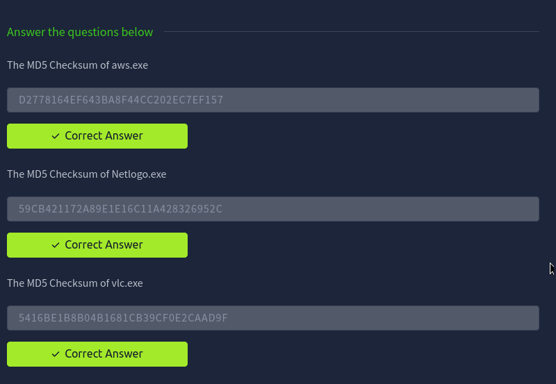

## Task 8: Now lets see if the MD5 Checksums have been analysed before

Nhiệm vụ ở đây là từ những file hash đó chúng ta có thể check xem những file đó được kiểm thử chưa, qua **VirusTotal**.

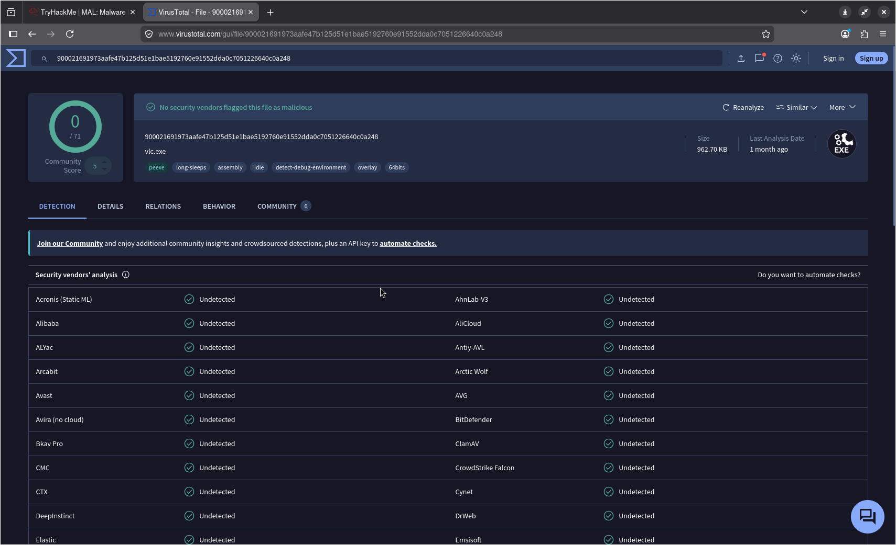

### Questions

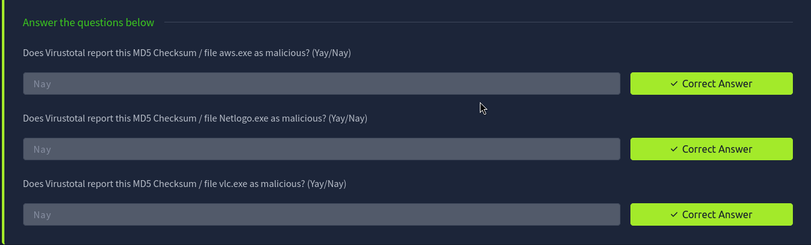

## Task 9: Identifying if the Executables are obfuscated / packed

Bây giờ sử dụng phần mềm PeID để xác định trình biên dịch / trình đóng gói của hai tệp trong thư mục `Tasks/Task 9` và trả lời các câu hỏi.

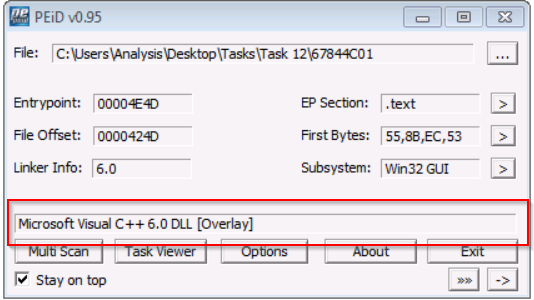

> Chú ý rằng là một tệp không có phần mở rộng ".exe" không có nghĩa là nó không phải là một tệp thực thi thực sự! Ví dụ, nó có thể mang phẩn mở rộng ".jpg" nhưng vẫn là đoạn mã thực thi được.

Các tệp luôn luôn có các thuộc tính nhận dạng nằm trong mã hex của chúng - được gọi là **file header**. Giá trị của hex của một tệp thực thi luôn là `4D 5A`.

### Questions

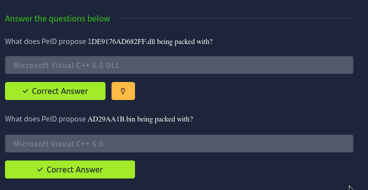

## Task 10: What is Obfuscation/Pakcing?

### Lý thuyết

Pakcing (đóng gói) là một dạng obfuscation (làm mờ/nén mã nguồn) mà các developer thường sử dụng để ngăn chặn việc phân tích các chương trình. 
- Về phía hợp pháp: Lý do rõ ràng nhất là để bảo vệ sở hữu trí tuệ.
- Xét trên cùng một góc độ: Chỉ vì bạn viết ra một chương trình... tại sao mọi người lại có quyền "sao chép" dự án của bạn? 

Tuy nhiên, các hacker cũng sử dụng các kỹ thuật obfuscation như packing - dù cung chung mục đích (ngăn chặn dịch ngược) nhưng ý đò của họ là để ngăn cản việc phân tích hành vi của mã độc.

### Thực hành

Nhiệm vụ là xác định xem tệp tin nằm trong thư mục `Tasks/Task 10` có bị đóng gói (packed) hay không sử dùng `PEiD`

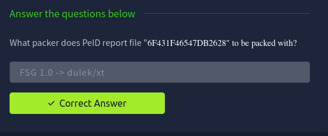

## Task 11: Visuallising the Differeneces Between Packed & Non-Packed Code

Có những dấu hiệu nhận biết file bị Packed qua IDA Freeware (Phân tích tĩnh):
- File bị Packed: thông tin hiển thị cực kỳ ít. Tab Imports gần như là trống rỗng  (khoảng 2 hàm) và sơ đồ luồng thực thi (flowchart) siêu ngắn, đơn giản.
- File bình thường: Số lượng Imports phong phú và sơ đồ lường thực thi cực kì chi tiết, phức tạp.

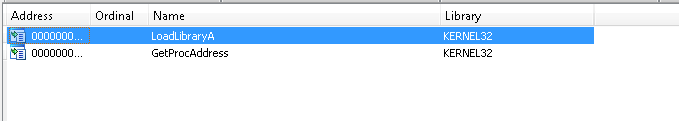
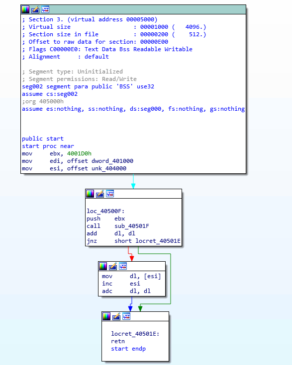

**Kết luận:** File bị đóng gói khiến việc phân tích tĩnh trở nên rất khó khăn vì lượng thoogn tin cung cấp quá ít.

## Task 12: Introduction to Strings

### Lý thuyết

Khi phân tích nội dung của các chuỗi ký tự này, đôi khi chúng ta có thể phác họa ra một bức tranh khá rõ ràng về hành vi của chương trình - chẳng hạn như việc phát hiện các ví Bitcoin sẽ chỉ ra rằng đây là mã độc tống tiền

### Questions

**What is the URL that is outputted after using "strings"?** - practicalmalwareanalysis.com

Chúng ta thực hiện mở `Command Prompt` và sử dụng hàm `strings` ở trong `Tools\Sys..` cho tệp tin ở task 12 cần thực hiện và nó cho ra như sau:

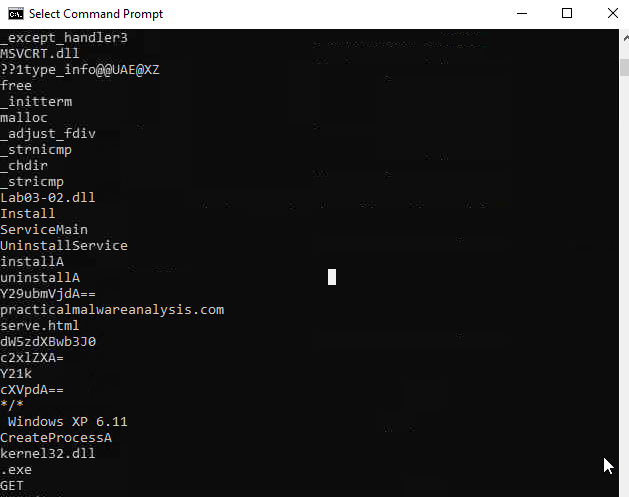

Thấy được rằng URL đó chính là `practicalmalwareanalysis.com`

**How many unique "Imports" are there?** - 5

Đẻ trả lời được câu hỏi này thì chúng ta dùng `PE Explorer` để mở tệp tin ở trong thư mục Task 12. Sau đó vào phần View -> Imports để xem được số lượng Imports được dùng. Chúng ta sẽ có kết quả như sau:

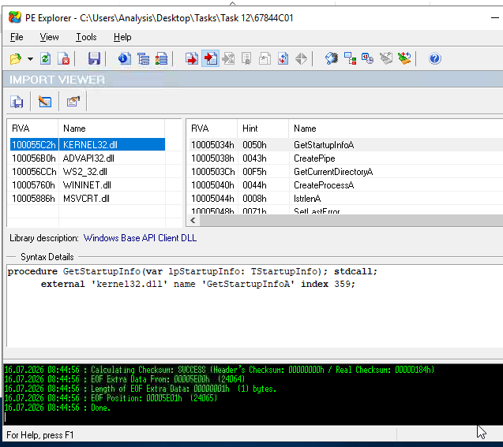

## Task 13: Introduction to Imports

### Lý thuyết

Việc phân loại IDA Freeware thuộc nhóm công cụ nào vẫn là một chủ đề gây tranh cãi, bởi vì công cụ này có thể được sử dụng cho cả lẫn phân tích tĩnh và phân tích động. Sẽ có 2 nhóm:
- Disassemblers (Trình dịch ngược mã nguồn)
- Debuggers (Trình gỡ lỗi)

Disasssemblers thực hiện dịch ngược mã đã biên dịch của một chương trình từ mã máy sang các chỉ thị mà con người có thể đọc được

Trong khi đó Debuggers tuy cũng áp dụng các kỹ thuật tương tự như "Disassemblers" nhưng về bản chất chúng hỗ trợ đắc lực cho việc thực thi chương trình - cho phép nhà phân tích quan sát trực tiếp những thay đổi diễn ra qua từng step chạy của chương trình đó.

### Questions

**How may references are there to the library "msi" in the "Imports" tab of IDA Freeware for "isntall.exe"** - 9

Để trả lời được câu hỏi này, thay vì có thể sử dụng `PE Explorer` thì chúng ta sử dụng IDA Freeware phân tích.

Bằng việc ném file `install.exe` vào trong để IDA phân tích và nhấn vào tab Imports, ta có thể thấy được số lượng imports của msi:

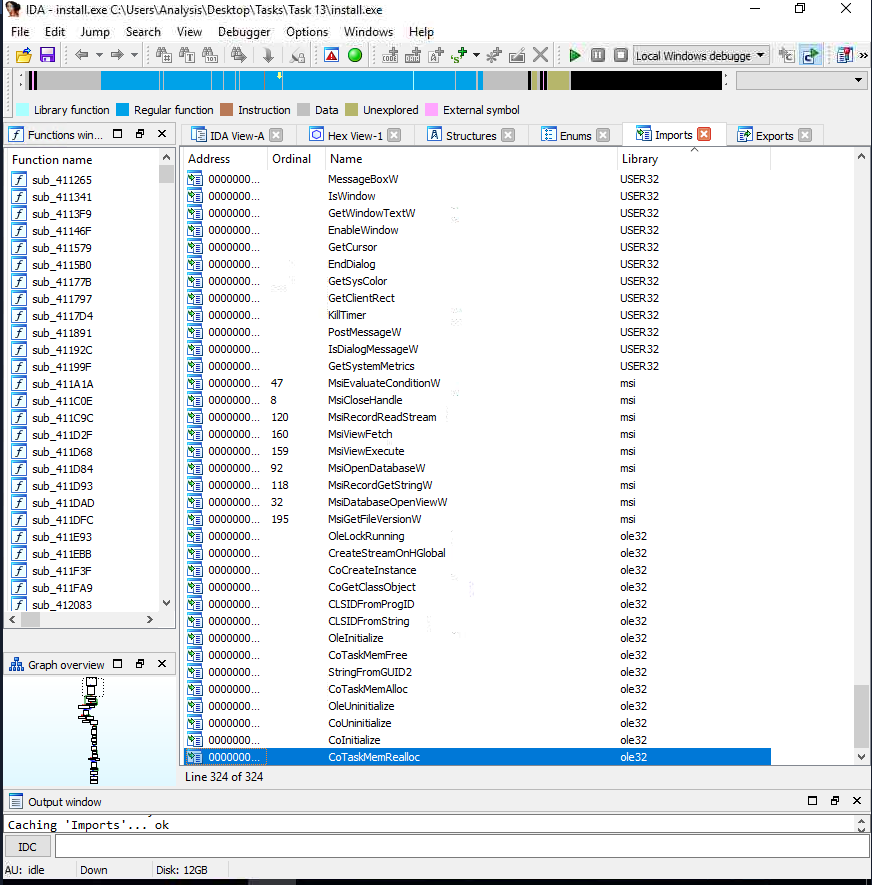

## Task 14: Pratical Summary

Đây là phần tổng kết những gì mình đã học được trong các task vừa qua, bằng việc phân tích file `ComplexCalculator.exe`.

### Questions

**What is the MD5 Checksum of the file?**

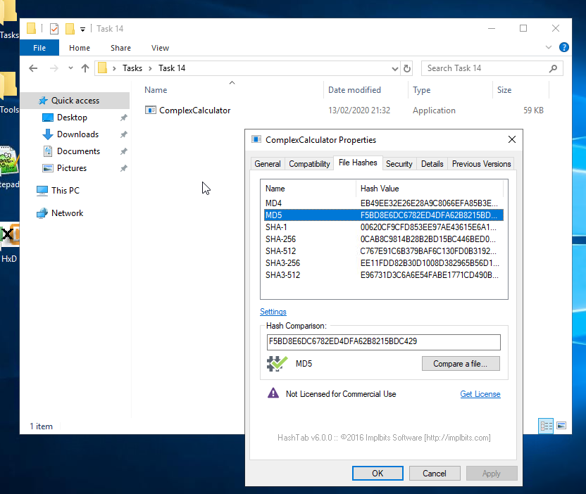

**Does Virustotal report this file as malicious?**

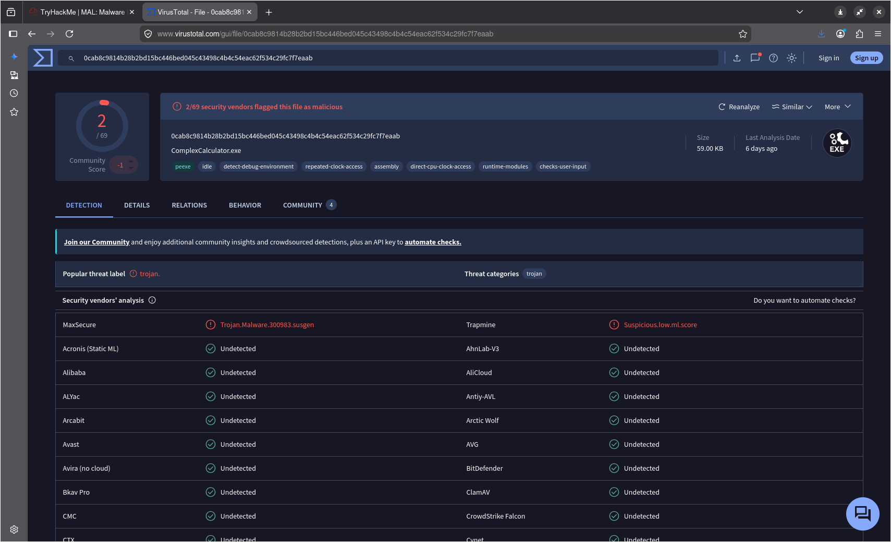

**What is the last streing outputted?**

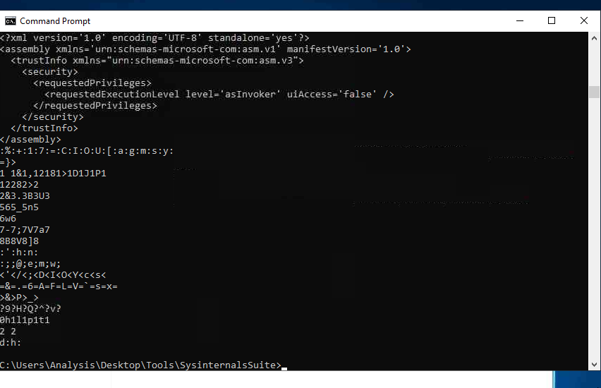

**What is the output of PeID when trying to detect what packer is used by the file?**

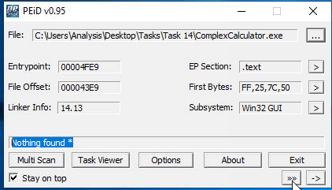

