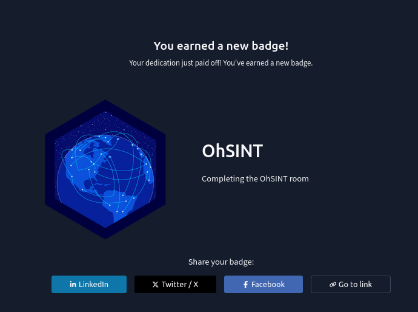
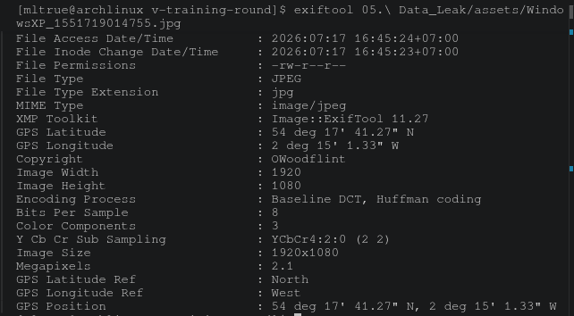
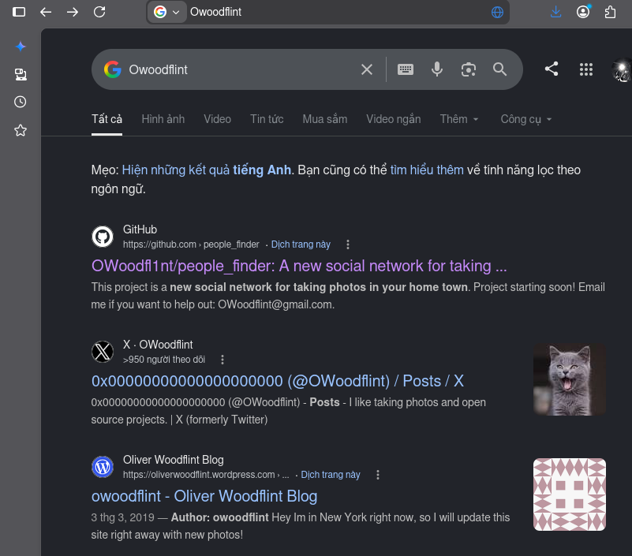
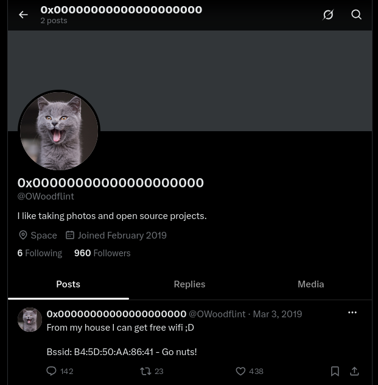
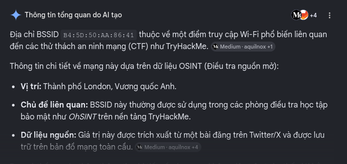
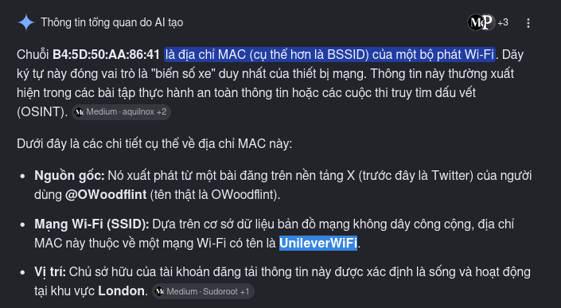
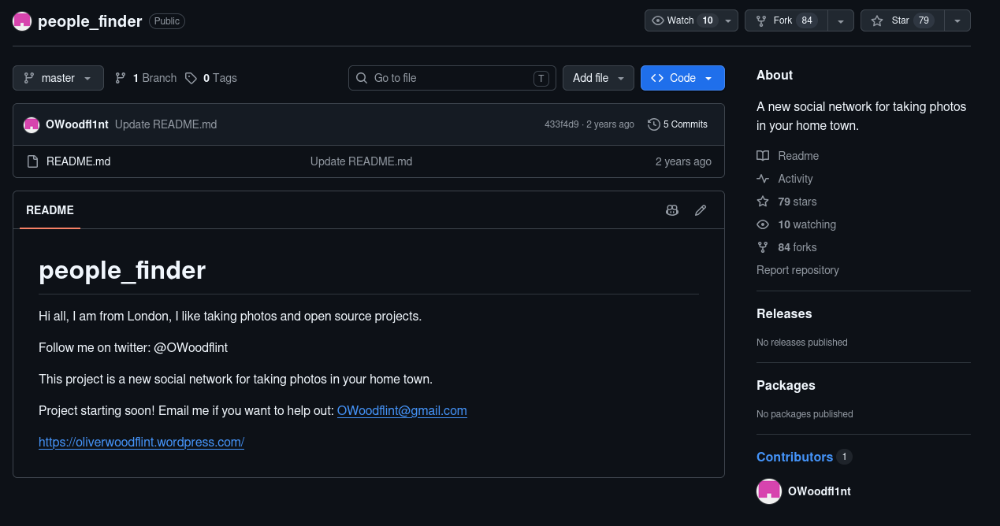
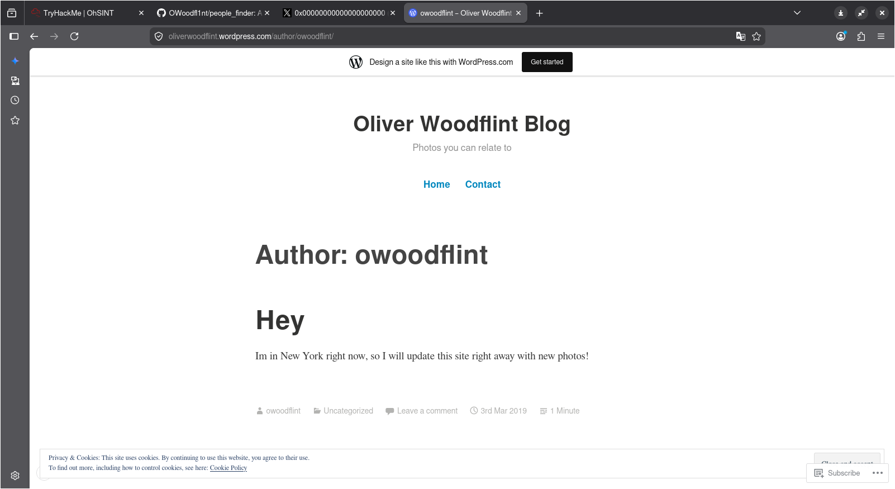
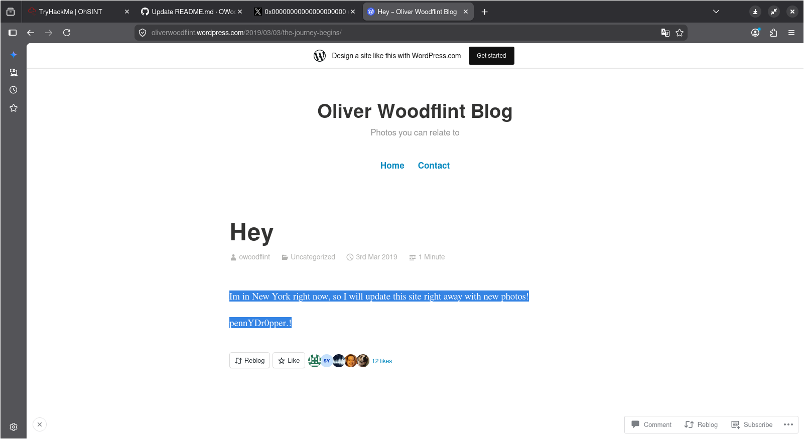

# OhSINT

Trong Room này cho trước một hình ảnh và nhiệm vụ của room này là chúng ta phải trích xuất những thông tin bên ngoài từ chính bức ảnh đó.

## Questions

**What is this user's avatar of?** - cat

Khi sử dụng `exiftool` ta biết được người chụp bức ảnh chính là OWoodflint. Khi mà tra tên người này trên google thì ra được một tài khoản X (hoặc là Twitter) với avatar là một con mèo.

Đây là kết quả sau khi search:

**What city is this person in?** - London

Khi vào trang cá nhân của người dùng trên ta nhận được một đoạn code như sau: `Bssid: B4:5D:50:AA:86:41`.

Tiếp tục tra đoạn code nó lên trên google thì ta được địa chỉ chính xác của người dùng đó ở đâu.

**What is the SSID of the WAP he connected to?** - UnileverWiFi

Sau khi tra cứu thì cụm từ "SSID of the WAP" thì nó chỉ là public name của Wifi người dùng đó.

Về cơ bản thì ta có thể dùng `wigle.net` để có thể tra được ra tên wifi của người dùng đó nhưng mà theo lời người dùng trên github và reddit nói dùng giờ wigle.net không thể check được tên wifi mà người dùng đó để sử dụng nữa nhưng mà vì sự tiến bộ của AI nên chỉ cần việc tra BSSID thôi là ta có được tất cả thông tin rồi.

**What is his personal email address?** - OWoodflint@gmail.com

**What site did you find his email address on?** - github

Sau khi tra tên người dùng trên thì có thể thấy được một đường link github repo của người dùng đó có tên là `people_finder`, từ đó mà trả lời được hai câu hỏi ở trên.

**Where has he gone on holiday?**

Khi tra tên người dùng, ta cũng tìm ra được là người này có làm một trang web blog cá nhân (được code bằng wordpress) để update tình trạng của mình. Comment đầu tiên và duy nhất của người đó nói rằng là họ đã đi New York, đó chình là câu trả lời luôn.

**What is the person's password?** - pennYDr0pper.!

Trong khi tra khảo người dùng qua trang blog cá nhân của họ thì biết đây là Oliver Wood, một developer với 20 năm kinh nghiệm (có thể tra ở github).

Nhìn qua quả post đầu tiên của đó thì thấy có một khoảng trắng lạ thường, khi bôi đen thì thấy nó hiện ra một dòng chữ bao gồm các kí tự rất lạ. Khá chắc đó là mật khẩu của người dùng đó.

