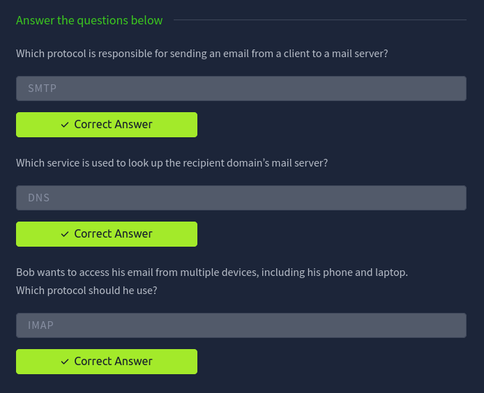
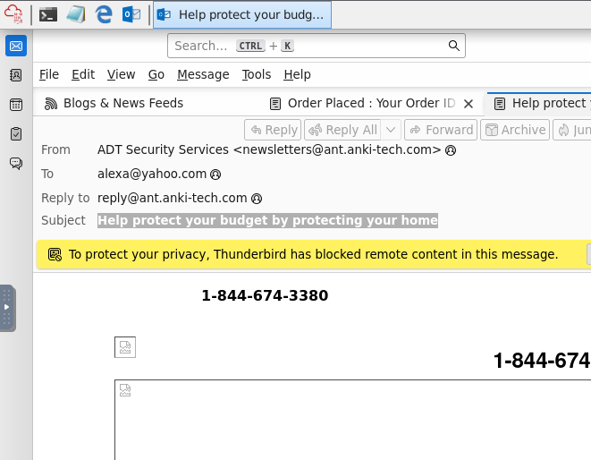
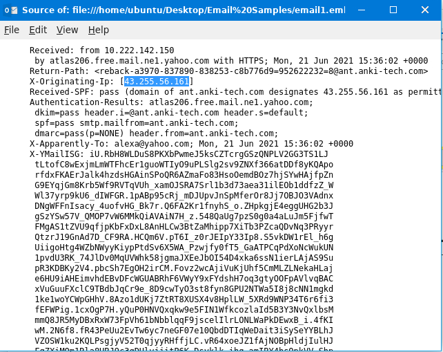
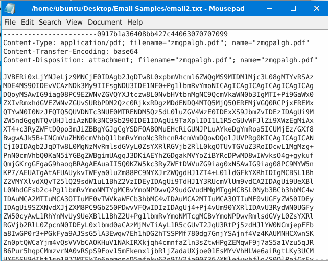
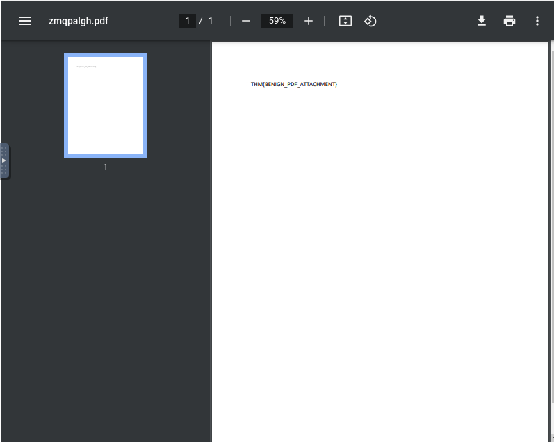
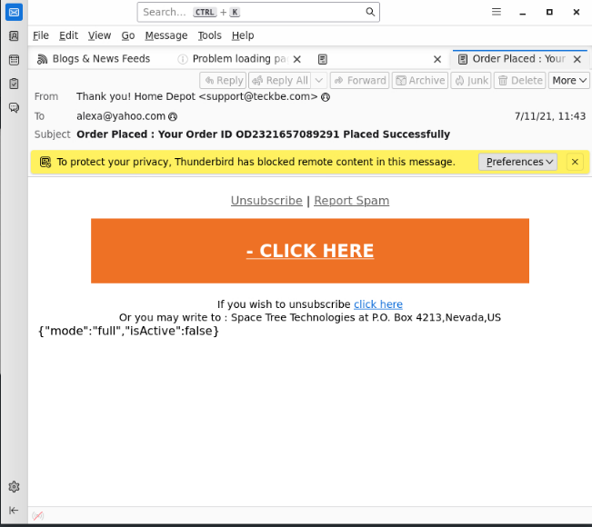
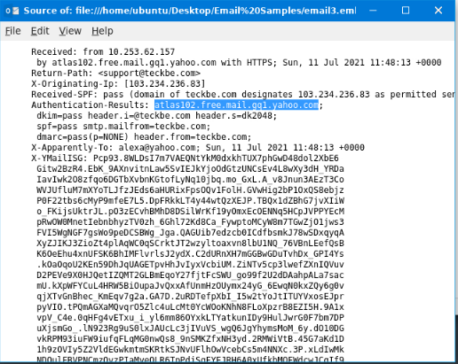
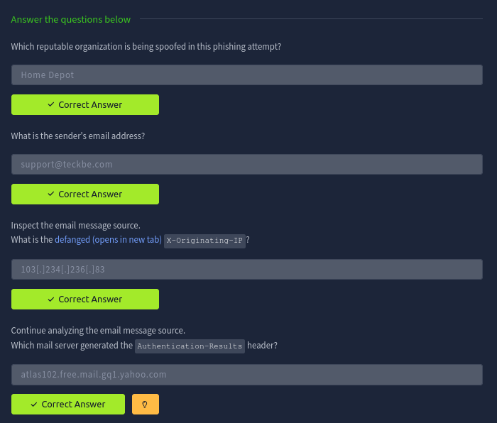

# Phishing Analysis

Tìm hiểu làm thế nào mà tạo ra 1 email.

## Task 1: Introduction

Spam (Thư rác) và Phishing (Thư điện tử giả mạo) vẫn là những mối đe dọa phổ biến nhất mà các tổ chức vẫ phải đối mặt. Trong khi thư rác thường có mức dội rủi ro thấp, thư điện tử giả mạo có thể lừa người dùng tiết lộ thông tin nhạy cảm hoặc vô tình cài đặt mã độc.

Với vai trò là một chuyên gia phòng thủ, công việc của bạn bao gồm phân tích các thành phần của email để xác định xem chúng là độc hại hay lành tính, đồng thời thu thập thông tin để giúp củng cố các biện pháp an ninh nhằm chống lại các cuộc tấn công trong tương lai.

### Mục tiêu học tập

- Nắm được các kiến thức cơ bản về quasd trình chuyển phát email.
- Khám phá cách phân tích tiêu đề email (email header).
- KIểm tra và phân tích nội dung email (email body).
- Tìm hiểu về các loại tấn công qua email khác nhau.
- Phân tích email để xác định các mối đe dọa an ninh tiềm ẩn.

## Task 2: The Email Address

Mỗi phishing email điều tra đề bắt đầu bằng một thứ rất đơn giản: địa chỉ meila. Nếu không thể hiểu cấu trúc của nó, bạn có thể bỏ oqua những manh mối mà kẻ tấn công dựa vào.

### Cấu trúc của một dịa chỉ email

Một địa chỉ email bao gồm những thành phần sau đây:
- Tên người dùng: Hộp thư người dùng xác định hộp thư của người nhận cụ thể trên máy chủ email.
- Ký hiệu `@`: Phân tách tên người dùng khỏi tên miền và cho hệ thống biết nơi cần định tuyến email.
- Tên miền: Chỉ định máy chủ thư chịu trách nhiệm nhận thư.

### Questions

Identify the domain used in the following email address: `hatsalesman@tryhatme.com` - tryhatme.com

## Task 3: Email Delivery

Khi bạn gửi email, nhiều giao thức hoạt đọng cùng nhau ở phía sau hậu trường để chuyển tải thông điệp của bạn từ người gửi cụ thể đến người nhận, và mỗi giao thức đều có một vài trò cụ thể:
- SMTP (Single Mail Transfer Protocol): Gửi email.
- POP3 (Post Office Protocol): Tải email xuống thiết bị.
- Internet Message Acccess Protocol (IMAP): Động bộ hóa email trên các thiết bị

Khi nhận email, dịch vụ email sẽ sử dụng một trong hai giao thức là POP3 hoặc IMAP, tùy thuộc vào cách cấu hình hộp thư.

### POP3

POP3 hoạt động gioongs hơn một hòm bưu điện truyền thống. Khi thư đến, bưu tá giao thư cho bạn, bạn mang về nhà vất và thư không còn ở bưu điện nữa.

- Thư điện tử (Email) được tải về và lưu trữ trên một thiết bị duy nhất.
- Các thư đã gửi chỉ được lưu trên chính thiết bị mà bạn đã dùng để gửi bức thư đó.
- Bạn chỉ có thể truy cập và đóc các email này từ thiết bị duy nhất đã tải chúng xuống.
- Email thường sẽ bị xóa khỏi máy chủ (server) ngay sau khi bạn tải chúng xuống thiết bị.

### IMAP

IMAP hoạt động dựa trên lưu trữ đám mây. Thư của bạn luôn nằm trên máy chủ bưu điện, bạn dùng bất kỳ thiết bị nào để nhìn vào hòm thư đó cũng được.

- Email được lưu trữ trực tiếp trên máy chủ và có thể được tải xuống/xem trên nhiều thiết bị khác nhau.
- Các thư đã gửi cũng được lưu lại trên máy chủ, giúp bạn xem lại được từ bất kỳ đâ
- Đồng bộ hóa tin nhắn giữa nhiều thiết bị. Nếu bạn đọc hoặc xóa một email trên điện thoại, trạng thái đó cũng sẽ thay đổi y hệt trên máy tính.
- Email sẽ luôn nằm trên máy chủ trừ khi bạn chủ động xóa chúng đi.

### Hành trình của email

1. Người dùng gửi email
2. Máy chủ thư truy vấn DNS.
3. DNS phản hồi.
4. Email đã được gửi.
5. Người nhận kiểm tra hộp thư của họ.
6. Email được truy xuất.

### Questions

## Task 4: Email Headers

Một email bao gồm hai phần chính:
- Tiêu đề email: chứa siêu dữ liệu về nội dung thư, chẳng hạn như người gửi và các máy chủ tham gia vào quá trình gửi th
- Nội dung email: Chứa nội dung thực tế của tin nhắn, có thể là văn bản thuần túy hoặc HTML.

### Tiêu đề email

Có những thành phần khác nhau tạo nên phần tiêu đề email.
1. Từ: (From) Địa chỉ email của người gửi.
2. Gửi đến (To): Đại chỉ email của người nhận
3. Trả lời đến (Reply to): Địa chỉ nhận thử trả lời (không bắt buộc)
4. Chủ đề (Subject): Dòng tiêu đề của email.
5. Ngày (Date): Thời gian và ngày tháng email được gửi đi

### Question

**What is the full subject line of `email1.eml`?**

Chúng ta sử dụng thunderbird email để file email đó lên và lập tức đập vào mặt ta là subject chính email đó:

**View the message source of `email1.eml` using Thunderbird in your VM. What the IP addresss listed as the `X-Originating-Ip`?**

Chúng ta có thể trích xuất được thông tin bằng cách đọc hẳn mã nguồn của email đó. Có thể achieve đó bằng cách View -> View page source hoặc nhập phím tắt `Ctrl + u`:

## Task 5: Email Body

Phần body của email chứa nội dung tin nhắn. Email được gửi dưới dạng văn bản thuần túy hoặc được định dạng bằng HTML. HTML hỗ trợ các phần tử như hình ảnh, liên két và kiểu dáng. 

### Questions

Khi mà mở file `email2.txt` lên thì ta có thể trả lời được luôn cho 2 câu hỏi sau:

**Open up the `email2.txt` file to veiw the source of an attachment. What is the `Content-Type` of the attachment?** - `application/pdf`

**What is the name of the attachment from the previous question?** - `zmqpalgh.pdf`

**Decode the base64 string. What is the hidden flag value?**

Ta mở lại file trên bằng Thunderbird Email thì thấy được rằng là ta có thể tải file pdf có tên ở trên.

Sau khi bấm vào file đó thì nó hiện ra được kết quả của câu hỏi:

## Task 6: Types of Phishing

Các loại email độc hại khác nhau có thể được phân loại như sau:

- Thư rác (spam): Các email hàng loạt gửi đén một số lượng lớn người nhận. Một hình thức nguy hiểm thì sẽ được gọi là malspam.
- Phishing: Email giả mạo một tổ chức đáng tin cây để lừa người nahanj tiết lộ thông tin nhạy cảm.
- Spear Phishing: Một hình thức tấn công có mục tiêu nhắm vào một cá nhân hoặc một tổ chức cụ thể, thường sử dụng thông tin cá nhân hóa.
- Whaling: Một loại Spear Phishing sử dụng để nhắm vào mục tiêu cụ thể vào các giám đốc điều hành cấp cao (CEO, CFO).
- Smishing: Các cuộc tấn công đượcthực hiện qua tin nhắn SMS.
- Vishing: Các cuộc tấn công được thực hiện thông qua cuộc gọi thoại.

### Cấu trúc của một phishing email

Có một số đặc điểm chung của những email trên:
- Địa chỉ người dùng giả mạo: Địa chỉ email của người gửi được giả mạo để trông gioogns như một thực thể đáng tin cậy (`noreplay@microsof.com`).
- Tiêu đề hoặc thông báo khẩn cấp: Email tạo cảm giác khẩn cấp. ("Tài khoản của bạn sẽ bị k hóa trong 24 giờ")
- Giả mạo thương hiệu: Email này được thiết kế để bawtse chước một tổ chức hợp pháp.
- Lỗi ngữ pháp và chính tả
- Nội dung chung chung: Tin nhắn thiếu tính cá nhân hóa.
- Liên kết ẩn hoặc rút gọn: Các hyperlink có thể che giấu đích đến thực sự của chúng (`bit.ly/secure-login`)
- Tệp đính kèm đọc hại: Các tệp đính kèm được bao gồm và ngụy trang thành cacsd tệp hợp pháp (`invoice.pdf.exe`)

## Safe Analysis

Khi  xử lý các liên kết và tệp đính kèm, phải cẩn thận đểk hhông nhấp vào chugns. Các liên kết và địa chỉ IP cần được "vô hiệu hóa". Việc vô hiệu hóa nhằm ngăn chặn các lần nhấp chuột vô tình có thể dẫn đến vi phạm bảo mật.

- URL gốc: `http://www.suspiciousdomain.com`
- URL đã được lược bỏ mã độc: `hxxp[://]www[.]suspiciousdomain[.]com`

### Questions

Mở file `email3.mel`, ta có thể trả lời được luôn 2 câu hỏi đầu và dùng View Source để có thể trả lời được 2 câu hỏi sau:

Answer:

## Task 7: Conclusion

Như này đã là kết thúc học phần.

Trước khi tiếp tục, điều quan trọng là phải hiểu về Tấn công chiếm đoạt email doanh nghiệp (BEC), một loại tấn công trong đó kẻ thù giành quyền truy cập vào tài khoản email nội bộ hợp pháp và sử dụng nó để lừa người khác thực hiện các hành động trái phép hoặc gian lận.

### Questions

**What attack, signified by the acronym BEC, uses a compromised email to trick employeees into fraud?** - Business Email Compromise