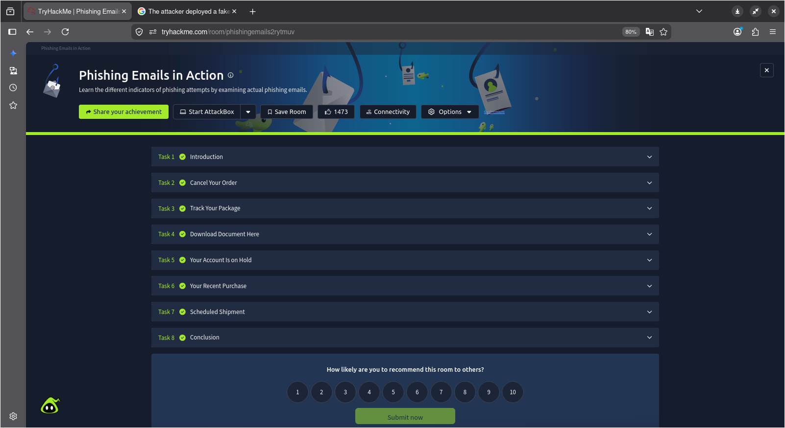
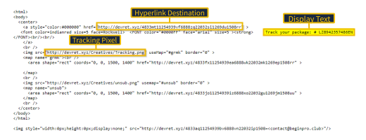
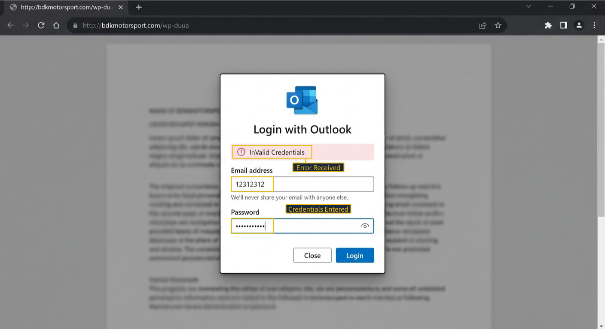
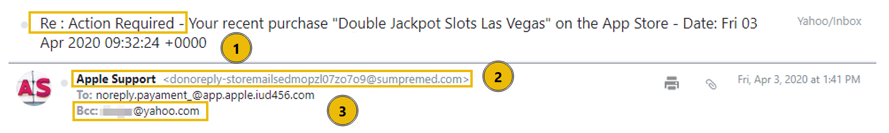

# Phishing Email in Action

Ở trong room này sẽ cover được vài các technique được dùng ở trong room này.

## Các phishing technique đã dùng

- Địa chỉ email giả mạo: Bắt chước một dịch vụ đáng tin cậy để nhanh chóng tạo được uy tín
- Rút gọn URL: Sử dụng các dịch vụ chuyển hưởng để che giấu đích đến thực sự của một liên kết.
- HTML giả mạo thương hiệu: Giả mạo hình ảnh doanh nghiệp hợp pháp để tạo cảm giác chân thực.
- Pixel tracking (theo dõi pixel): Cho một hình ảnh vô hình ảnh để thông báo cho người gửi khi email được mở.

- Thao túng liên kết: Che giấu điểm đến dộc hại bằng số theo dõi giả mạo.
- Sự cấp bách giả mạo: Tạo ra một khoảng thời gian hành động ngắn để tạo cảm giác cấp bách.
- Thu thập thông tin đăng nhập: Sử dụng cổng đăng nhập giả mạo để t hu thập và đánh cắp tên người dùng và mật khẩu.

- Hóa đơn bị BBCed: Victim không nhận được email trực tiếp.
