# GhostTrace

Mô tả nội dung: You are a blue team analyst tasked with investigating a suspected breach in an Active Directory environment named Main.local. The network includes a Domain Controller (DC01 and two client machines (Client02 and Client03)). A user on Client03 received a phishing email, leading to a series of attacks that compromised the domain. Your job is to analyze the provided Windows Event Logs and Sysmon logs from Client02, Client03, and DC01 to reconstruct the attack chain, identify the attacker’s actions, and uncover critical artifacts such as credentials, hashes, and persistence mechanisms.

Sau khi tải và giải nén file đó ra, ta nhận được file Windows Event Logs, có thể đọc qua Window Event Viewer của cả 3 máy: Client 01, 02 và Client 03. Trong những file Event Viewer đó thì ta nhận được logs của từng máy. Nhiệm vụ của chúng ta là xem 3 file đó và trả lời các câu hỏi như trên.

Bối cảnh (dịch ở trên): Client 03 nhận được phishing email và một loạt chain attack đã tấn công vào máy đó. Nhiệm vụ là đọc file logs đó để reconstruct lại attack chain, xem là attacker muốn làm gì và sau đó nhận được những gì.

## Questions

**What is the name of the malicious phishing attachment downloaded by the user on Client02?** - Profits.docm

Tại vì nó xảy ra ở trong máy Client 2, nên ta sẽ logs ở máy Client 2 trước, sau khi mở thư mục lên thì xuất hiện thấy 4 loại file logs:
- `Sysmon.evtx`: Giám sát hệ thống chi tiết, bao gồm: process creation, network connections...
- `Powershell.evtx`: Theo dõi hoạt động trên Powershell, bao gồm: script thực thi, powershell malware.
- `Security.evtx`: Nhật ký bảo mật Security của Windows, bao gồm: đăng nhập, tạo tài khoản, thay đổi quyền.
- `Application.evtx`: Nhật ký ứng dụng (bao gồm lỗi ứng dụng, software events)

Từ những lí do trên, ta bắt đầu mở file `Sysmon.evtx` thì thấy một đúng logs khá là hay ho và đọc không hiểu gì cả (dẹt sơ). Bởi vì câu hỏi là phishing attachment nào đã download trên máy Client2. Thứ đầu tiên nghĩ đến thì ta sẽ nhấn tổ hợp phím `ctrl + f` và nhập "Downloads". Ta thấy được file logs dưới đây:

> Giải thích rằng là EventID 15 với ý nghĩa là `FileCreateSteamHash` và có tên tệp tin chính là trả lời cho câu hỏi trên.

**What is the IP address from which the malicious attachment was downloaded?** - 192.168.204.152

Từ file log, ta lướt xuống tầm 4-5 logs sau đấy nữa thì ta thấy được một thông tin rất đặc biệt khi mà tải file trên với đuôi là `.Identifier`.

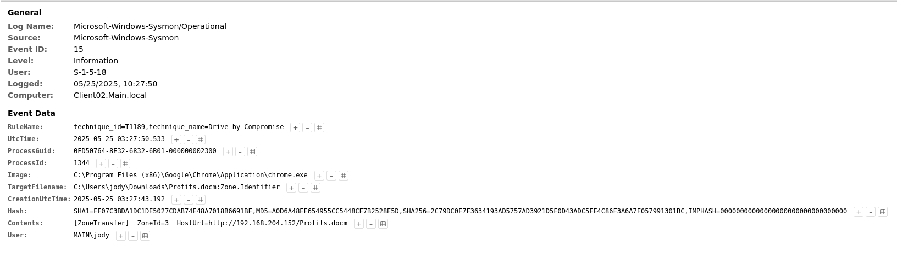

Ta thấy được trường `hostUrl=...`, đó chính là kết quả của câu hỏi trên.

**After the victim opened the file the malware initiated a network connections to a remote IP address. What is the IP address and the port number?** - 192.168.204.152:4444

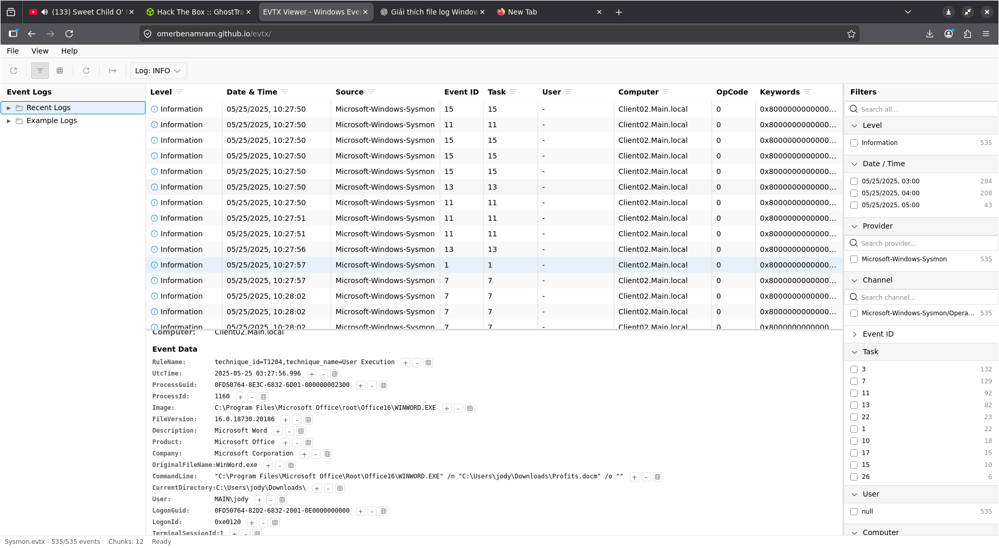

Trong lúc đang đọc logs thì dựa vào hình ảnh trên thì chính log biểu thị cho rằng người dùng đã chạy file malicious đó, với eventID = 1 là ProcessCreation, vào thời điểm là `10:27:57`.

Sau một thời gian tìm hiểu, ta biết được một số thông tin như sau:

- EventID 13: registry persistence (cái này chắc không cần care).
- EventID 3: kết nối mạng sau khi DDL được load (QUAN TRỌNG) - Network Creation 
- EventID 11: file DDL được tạo/tải xuống.
- EventID 22: DNS Query 

Để trả lời được câu hỏi trên, ta chỉ cần tìm eventID = 3 gần nhất sau khi mà eventID = 1 chạy là được. Sau một thời gian lướt xuống thì ta tìm được log này:

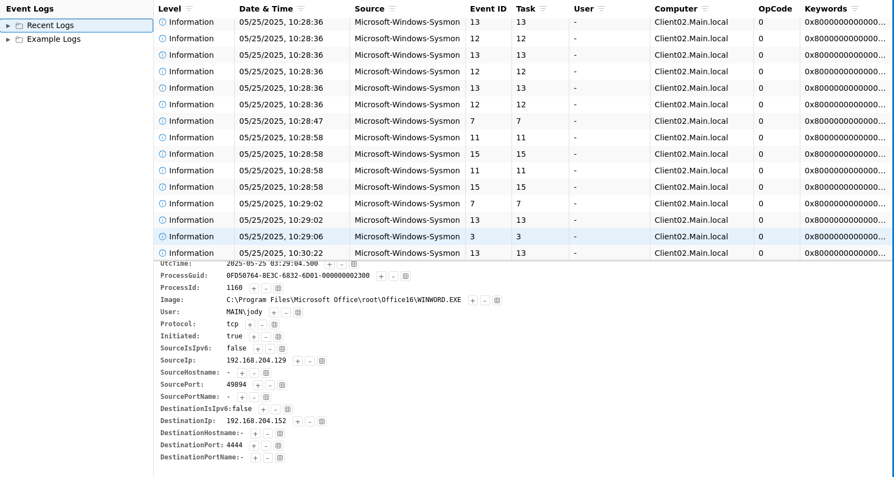

Từ đó, ta có thể trả lời câu hỏi trên.

**What is the name of the second-stage payload uploaded to Client02?** - UpdatePolicy.exe

Thường thì mỗi malware sẽ có second payload sau khi được chạy, nó sẽ được tạo tại eventID = 11, sau khi check kĩ càng sau thời gian mà file mã độc nó được chạy, ta bỏ qua các log mà nó tạo ra các file mình không cần để ý thì thấy có log sau nó tạo file tại thư mục Downloads:

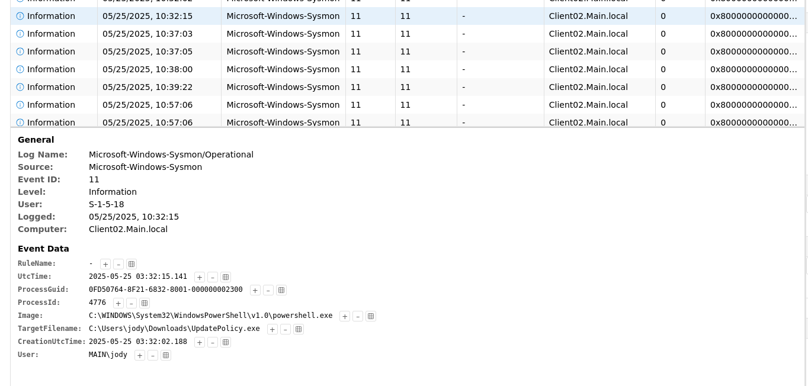

Dưới trường `targetFileName` sẽ là kết quả cho câu hỏi trên vào tại thời điểm là `10:32:15`.

**What port was used for the reverse shell connection from the second-stage payload on Client02?** - 1337

Bởi vì biết được tên file là gì, ta chỉ cần lọc eventID = 3 và tìm những file logs xuất hiện sau thời điểm mà tệp đó được tạo ra, ta có được file logs sau:

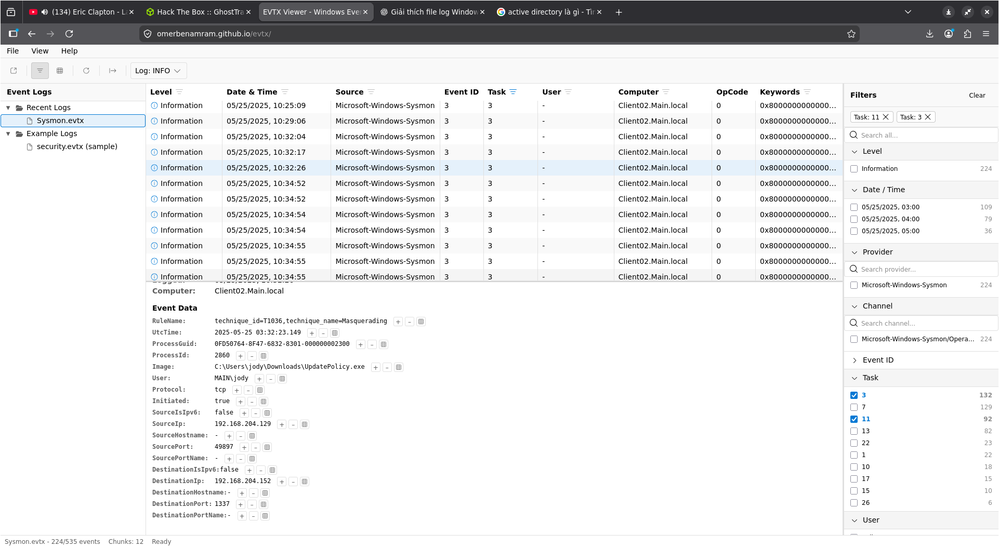

Ta có được kết quả dựa trên trường `DestinationPort`

**The attacker subsequently downloaded a tool to enumerate the Active Directory environment. What is the name of this tool?** - PowerView.ps1

Ở phần này thì mình thật sự không hiểu câu hỏi, nhưng mà khi nghe thấy từ "Downloads", thì việc đầu tiên mình làm là lọc theo EventID = 11, và ngay sau mà máy Client2 tải về  UpdatePolicy.exe thì nó có tải thêm một file với extension `.ps1` với logs sau:

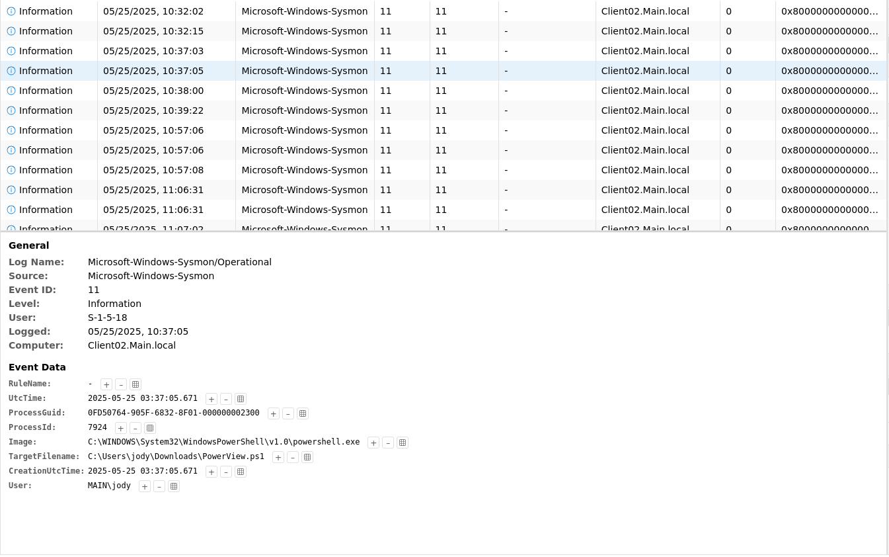

Dưới trường `targetFileName` sẽ là trả lời cho câu hỏi trên. (thật trùng hợp làm sao khi mà nó cx ở trên cùng thư mục Downloads)

> PowerView.ps1 là một tập lệnh PowerShell phổ biến dùng để do thám trong môi trường AD (Active Directory). 

**What is the username of the targeted service account?**

Sau khi liệt kê môi trường AD, những kẻ tấn công thường thực hiện một cuộc tấn công Kerberoasting nhắm vào tài khoản đích.

Câu hỏi ở đây là "targeted service account" thì chúng ta cần phải xem logs ở bên Domain Controller (DC), cụ thể là logs ở bên Security.

Chúng ta lấy mốc thời gian là sau khi mà chạy `PowerView.ps1` ta tìm logs mà có chủ thể từ judy (máy client2) thì ta có được log như sau:

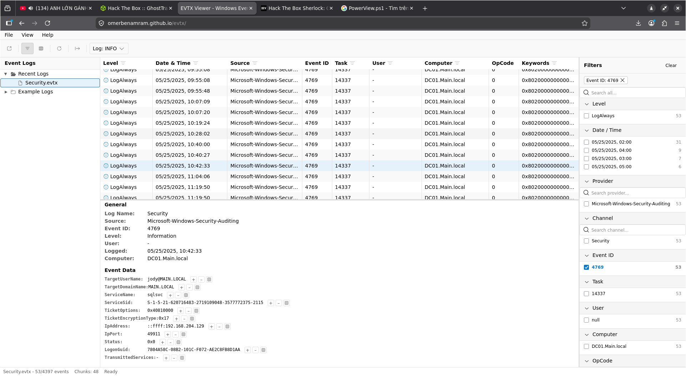

`ServiceName` chính là trả lời cho câu hỏi trên.

**After acquiring the account credentials, the attacker was able to crack the ticket. When did the attacker first use them to log in? (UTC)** - 2025-05-25 04:03:47

Khi mà login các thứ, ta nên chú ý đến các eventID sau:
- EventID 4924: Đăng nhập thành công.
- EventID 4925: Đăng nhập có 1 lần thất bại.
- EventID 4776: mã ghi nhận lại việc bộ điều khiển miền (Domain Controller) hoặc máy tính đã cố gắng xác thực thông tin đăng nhập (như tên người dùng và mật khẩu) cho một tài khoản.

Từ đó, ta áp dụng filter với 3 eventID trên và ta có kết quả logs như sau:

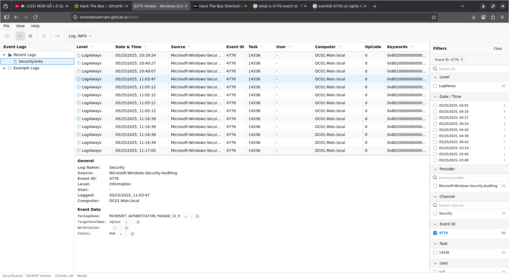

Với TargetUserName trùng với service mà bị exploit. Ta có thể chắc chắn đây là kết quả mong muốn.

**What is the executable associated with the first service created by a Sysinternals tool on the target system following the attacker's initial login attempt?** - VgYTbFEK.exe

Để trả lời được câu hỏi trên, ta lại đặt thêm filter eventID = 11 vào trong máy client2 ngay sau khoảng thời gian của câu hỏi trước. Ta được log như sau:

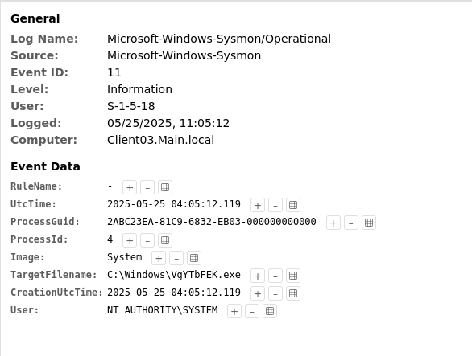

Vì tên file khá là lạ nên ta có thể suy ra đó chính là trả lời cho câu hỏi trên.

**On Client03, what was the file name of the executable used to dump cleartext credentials from memory?** - netdiag.exe

Với câu hỏi như này, ta chỉ cần nhấn tổ hợp phím `ctrl + f` và thêm chữ `dump` và ta có thể có được kết quả log như sau:

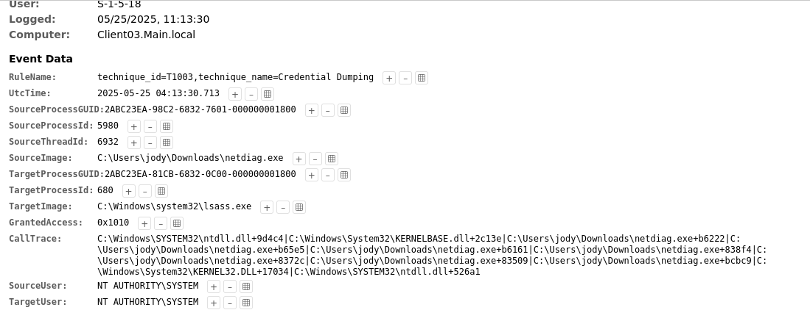

**Task 11: What is the username of the account whose cleartext password was found on Client03?** - lucas

Với câu hỏi này, ta áp dụng filter eventID = 01 vào và ta có kết quả như sau:

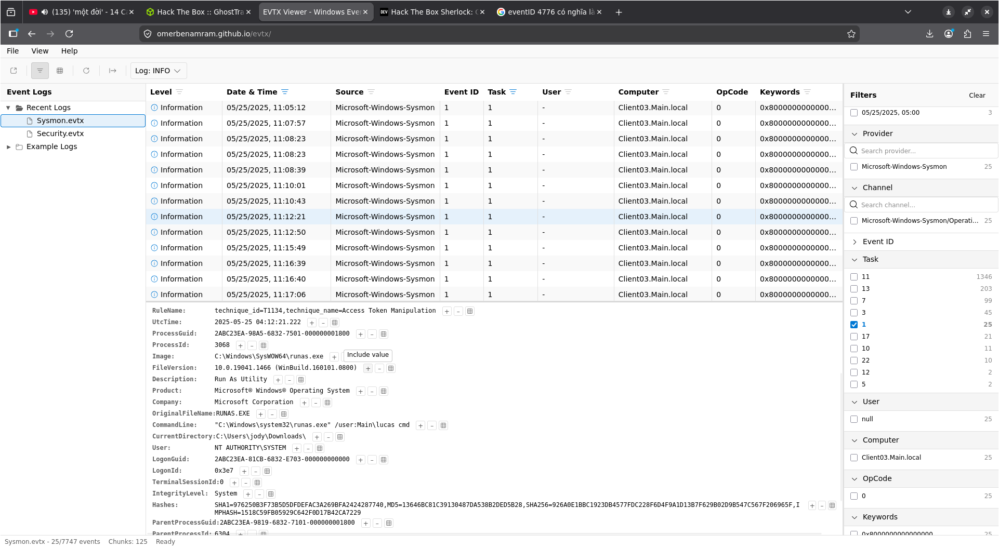

> runas.exe là một công cụ dòng lệnh của Windows giúp bạn chạy ứng dụng hoặc lệnh dưới một tài khoản người dùng khác. Công cụ này rất hữu ích khi bạn muốn mở phần mềm với quyền quản trị viên (Admin) mà không cần phải đăng xuất tài khoản hiện tại.

Ta có thể thấy trong nội dung có người dùng tên là `lucas` ở dưới với lệnh `runas`. Từ đó, ta có được câu trả lời.

**Task 12: After obtaining the cleartext password of this account, the attacker carried out a domain-level credential extraction attack. At what time did the compromised account perform this attack on the domain? (UTC)** - 2025-05-25 04:26:36

> Event ID 4662 thuộc Nhật ký Bảo mật Windows (Windows Security Log), được ghi lại khi một thao tác được thực hiện trên một đối tượng trong Active Directory (AD - hệ thống quản lý người dùng và máy tính của Windows)

Ta áp dụng lọc EventID 4662 với Security logs trong Domain Controller, hoặc là lọc theo từ khóa `lucas` thì ta có thể tìm được log sau:

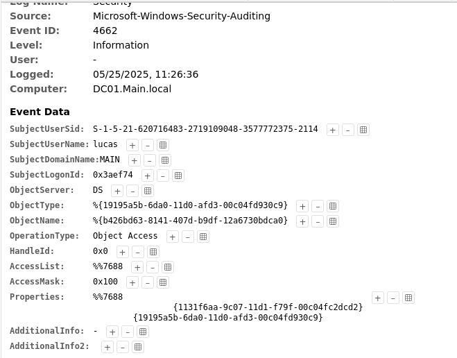

Thấy được targetUser là `lucas`, theo thời gian mà ta có câu trả lời.

**Task 13: At what time did the attacker initially authenticate using the administrator account? (UTC)** - 2025-05-25 04:34:01

Áp dụng tương tự như task12 nhưng mà ta thay từ khóa là `Adminstrator`, ta có được log như sau:

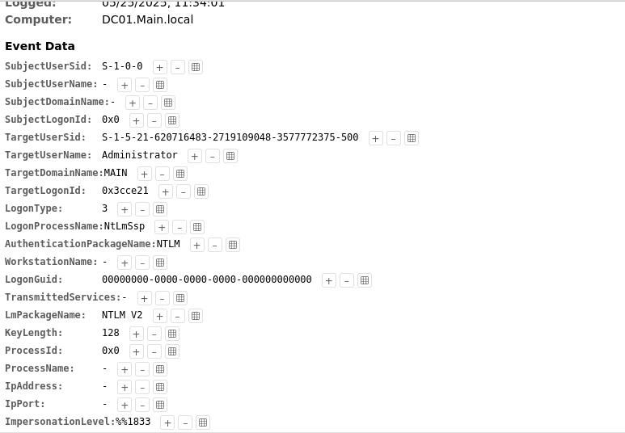

**Task 14: What is the name of the service created by the attacker on DC01 for persistence?** - WindowsUpdateSvc

Khi mà nói về tạo service thì ta luôn dùng `sc create ...` để tạo service chạy ngầm trên máy Windows và startup mỗi lần máy bật lại (nếu có thể).

Việc chúng ta làm là tìm lệnh này trong máy Domain Controller tại Sysmon, có thể thêm filter eventID = 1. Ta có được log như sau:

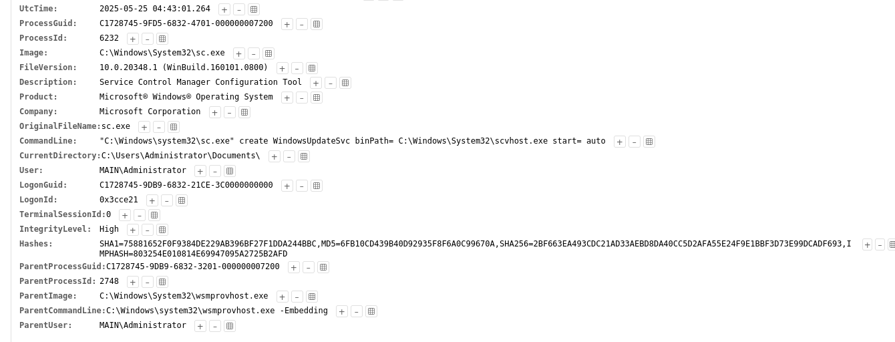

Sau hàm `sc create` đó chính là tên service, đồng thời là trả lời cho câu hỏi trên.

**Task 15: What is the name of the scheduled task created by the attacker on DC01 for persistence?** - WindowsUpdateCheck

> Event ID 4698 và 4699 là các mã ghi lại hoạt động bảo mật quan trọng của Windows, liên quan đến tính năng Trình lập lịch tác vụ (Task Scheduler). Đây là công cụ hệ thống giúp máy tính tự động chạy một chương trình vào thời gian định trước, tương tự như việc bạn cài báo thức trên điện thoại. Event ID 4698: Được tạo ra khi hệ thống phát hiện một tác vụ theo lịch mới vừa được tạo. Event ID 4699: Được tạo ra khi một tác vụ theo lịch bị xóa bỏ.

Về schedualed tasks, thì ta chỉ cần áp dụng filter 2 eventID trên tại security của Domain Controller là được, cùng với sau thời gian mà bị nhiễm malware là được.

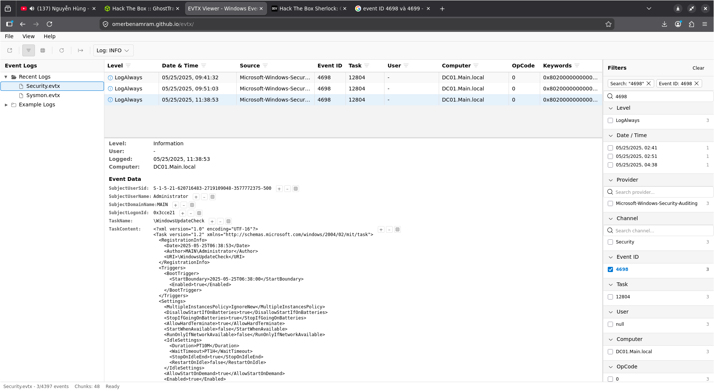

**What is the registry key name created by the attacker on DC01 for persistence?** - xcvafctr

> Trong Sysmon (System Monitor), Event ID 13 là sự kiện ghi lại việc thay đổi hoặc tạo mới một giá trị trong Windows Registry. Tên đầy đủ của nó là RegistryEvent (Value Set). Sự kiện này rất quan trọng để phát hiện tin tặc cố gắng tạo cửa hậu (backdoor) hoặc duy trì quyền truy cập lâu dài trên hệ thống.

Ta chỉ cần lọc như trên là được.

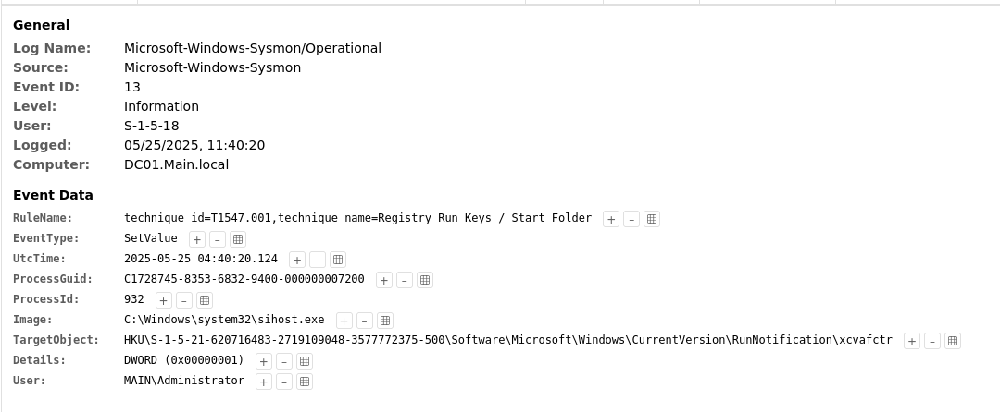

Nó có thêm rule Name là Registry Key Sets.