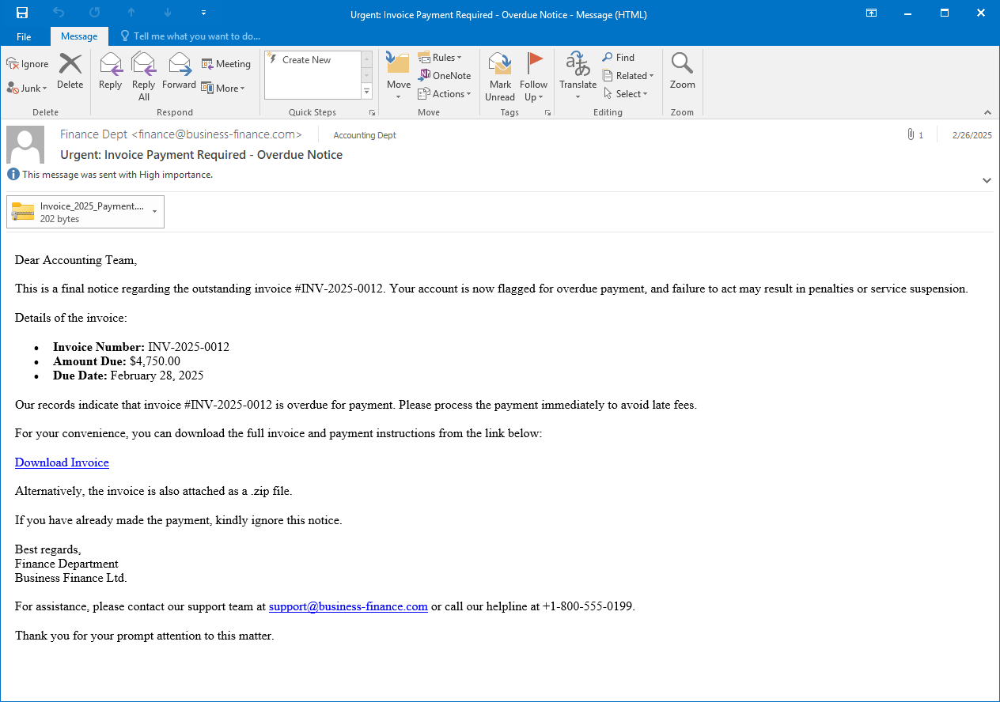
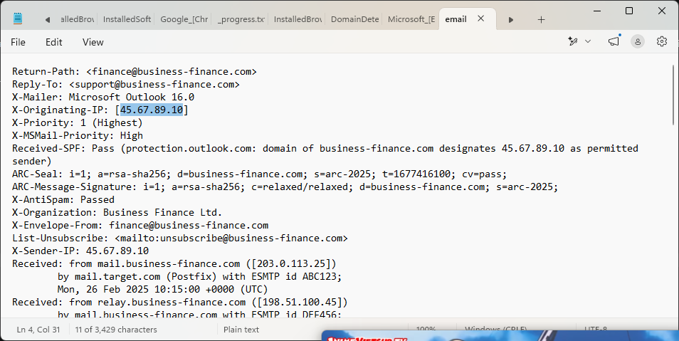
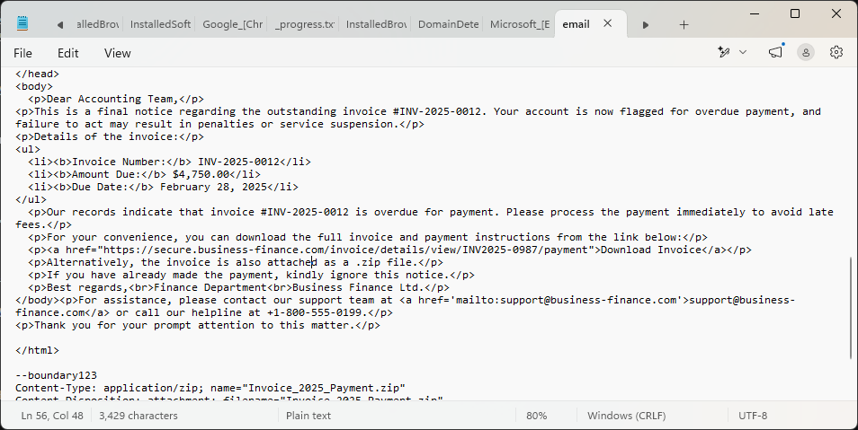
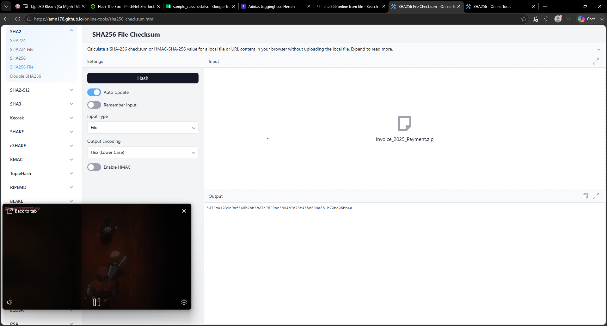
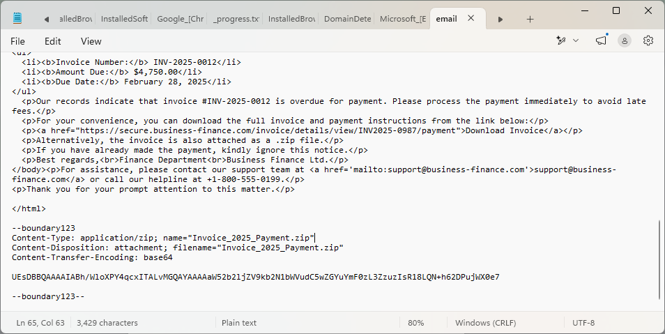
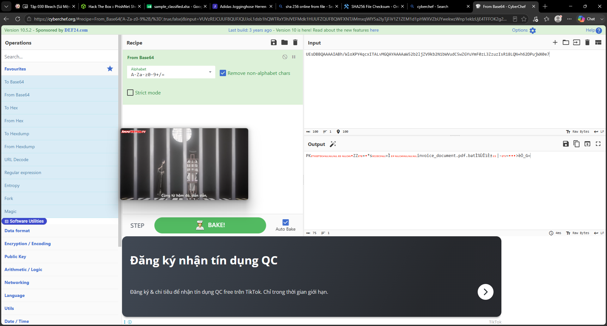

# PhishNet

Mô tả đề bài: An accounting team receives an urgent payment request from a known vendor. The email appears legitimate but contains a suspicious link and a .zip attachment hiding malware. Your task is to analyze the email headers, and uncover the attacker's scheme.

Sau khi đã tải xong và giải nén file ra thì ta có được file `email.eml`. Từ đó, ta sẽ tiến hành sâu thông qua ứng dụng Outlook.

Đây chính là nội dung của email đó:



## Questions

**What is the originating IP address of the sender?** - 45.67.89.10


Khi mở bằng `notepad` thì ta có thể đọc được những header và content (nội dung) của email đó, trong này có bao gồm cả `Originating-ip-address `.



**Which mail server relayed this email before reaching the victim?** - 203.0.113.25

Đọc tiếp các header trong nội dung mail, ta thấy được dòng như sau, nó là địa chỉ email người nhận và IP address.

```
Received: from mail.business-finance.com ([203.0.113.25])
	by mail.target.com (Postfix) with ESMTP id ABC123;
	Mon, 26 Feb 2025 10:15:00 +0000 (UTC)
Received: from relay.business-finance.com ([198.51.100.45])
	by mail.business-finance.com with ESMTP id DEF456;
	Mon, 26 Feb 2025 10:10:00 +0000 (UTC)
Received: from finance@business-finance.com ([198.51.100.75])
	by relay.business-finance.com with ESMTP id GHI789;
	Mon, 26 Feb 2025 10:05:00 +0000 (UTC)
```

Từ đó ta có thể thấy được mail đã được relay trước khi chạm đến victim.


**What is the sender's email address?** - finance@business-finance.com

Ta có thể thấy được trong header có nội dung như này:

```
From: "Finance Dept" <finance@business-finance.com>
```

Từ thông tin ở trên, ta cx có có thể trả lời được câu hỏi luôn.

**What is the 'Reply-To' email address specified in the email?** - support@business-finance.com

Thông tin này cx có trong phần header của email, từ đó ta có thể trả lời được câu hỏi:

```
Reply-To: <support@business-finance.com>
```

**What is the SPF (Sender Policy Framework) result for this email?** - pass

Phần này thì ta có thể thấy được ở trong phần header `Authentication Result`, ta thấy được từ `spf=pass` và từ đó có thể trả lời được câu hỏi luôn.

```
Authentication-Results: spf=pass (domain business-finance.com designates 45.67.89.10 as permitted sender)
	 smtp.mailfrom=business-finance.com;
	 dkim=pass header.d=business-finance.com;
	 dmarc=pass action=none header.from=business-finance.com;
```

**What is the domain used in the phishing URL inside the email?** - secure.business-finance.com

Để check xem được xem domain mà nó được sử dụng ở trong nội dung thư thì ta phải biết được phần nội dung thư ở đâu trước đã.



Ở trong đó, ta có thể thấy được ở phần `href=...`, nó có hiện ra đường link mà mail này đã dùng cho việc phishing.

**What is the fake company name used in the email?** - Business Finance Ltd.

Ở phần này, ta chỉ càn đọc nội dung thư là trả lời được câu hỏi (thông tin nằm ở trước phần "Best Regards", đó là công ty mà mail đã impersonate thành công ty như trên).

**What is the name of the attachment included in the email?** - Invoice_2025_Payment.zip

Cũng tương tự như câu hỏi ở trên, ta chỉ cần đọc nội dung thư qua Outlook là trả lời được câu hỏi.

**What is the SHA-256 hash of the attachment?** - 8379C41239E9AF845B2AB6C27A7509AE8804D7D73E455C800A551B22BA25BB4A

Để có thể check được mã hash của file attchement, việc đầu tiên thì ta phải tải xuống file attachment đó trước đã.

Sau khi có được file, ta đưa file vào trang web SHA256 File Checksum để biết được checksum của file đó và sau đó ta có kết được kết quả.




**What is the filename of the malicious file contained within the ZIP attachment?** - invoice_document.pdf.bat

Để trả lời được câu hỏi trên thì gần như ta có thể giải nén file .zip đó ra và đọc được tên file đó. Nhưng mà Window Defender đã can thiệp và xóa file đó trước khi chúng ta giải nén ra khiến ta không thể đọc được tên file đó được.

Ta chỉ cần thay đổi môi trường làm việc trên Linux là được.

---
**HOẶC**

Ta đọc nội dung mail trên notepad thì có dòng như sau, dòng đó chính là nội dung của file được đính kèm và ta thấy được rằng là file đó được encode bởi mã 64 (base64-encoding).



Ta dịch dòng trên từ base64 và ta có được tên file nằm trong chính file zip đó.



**Which MITRE ATT&CK techniques are associated with this attack?** - T1566.001

Lab này đã sử dụng MITRE với mã là `T1566.001`, nội dung của nó chính là: **Phishing: Spearphishing Attachment**