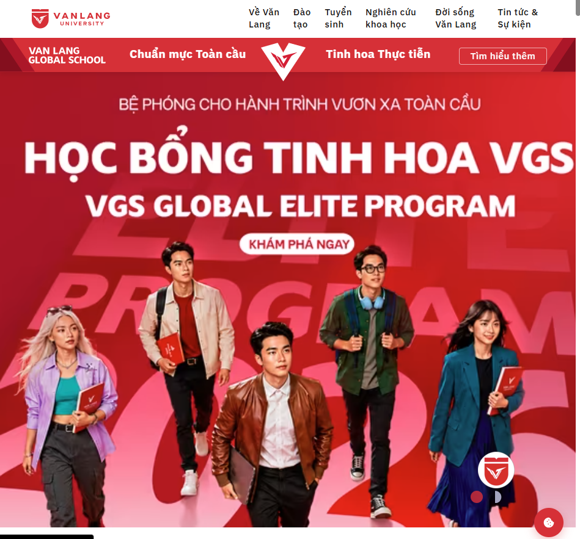

# Xử lý các use case thực tế

Hiện tại thì tôi đã tìm ra và tìm được 2 vụ lừa đảo phishing khá là nổi tiếng vào những năm 2023-2025: bao gồm **Vụ việc lộ lọt >  15.000 tài khoản sinh viên tại trường đại học Văn Lang vào tháng 4/2025** và **Vụ việc lừa đảo hàng nghìn tỷ của Mai Văn Tới vào 2023**.

Yêu cầu khi mà viết báo cáo cần phải bao gồm các tiêu chí tối thiểu:
- Đánh giá mức độ ảnh hưởng (đưa ra các tiêu chí lý giải cho mức độ ảnh hưởng)
- Nội dung tổng quan, mục tiêu tin tặc nhắm đế 
- Thời gian diễn ra chiến dịch lừa đảo.
- Đối tượng/tổ chức/lĩnh vực nhắm đến
- Kịch bản thực hiện
- Lý giải phương pháp/hạ tầng/công nghệ sử dụng trong chiến dịch cảnh báo (có thông tin nào thì cứ mô tả ra).
- Nhận định, đánh giá hậu quả.
- Khuyến nghị cho tổ chức bị ảnh hưởng và người dân.
- Danh sách IOC, hạ tầng, tài khoản liên quan.

> Chú ý khi đưa các nội dung nhạy cảm vào bài cảnh báo: không đưa vào hoặc che các nội dung mang tính định danh cá nhân, thương hiệu để tránh các vấn đề pháp lý.

## Vụ việc lộ lọt > 15.000 tài khoản sinh viên tại đại học Văn Lang

> Email phishing - cổ điển

> Kỹ thuật : Spoofing, typosquatting. file Excel macro, vượt lọc thư rác. 

### 1. Thông tin chung

| Trường thông tin | Nội dung |
|---|---|
| Tên sự cố | Nghi vấn lộ lọt dữ liệu cá nhân sinh viên Trường Đại học Văn Lang |
| Thời gian phát hiện/công bố | Đầu tháng 5/2024 |
| Tổ chức bị ảnh hưởng | Trường Đại học Văn Lang (Van Lang University - VLU), TP. Hồ Chí Minh |
| Quy mô dữ liệu bị lộ | Hơn **15.000 dòng dữ liệu** (theo nguồn duy nhất tìm được) |
| Loại dữ liệu | Thông tin cá nhân, tài khoản, mật khẩu sinh viên |
| Vector tấn công (nghi vấn) | **Chưa xác minh được** — chưa có nguồn công khai xác nhận đây là phishing qua email; đây là một khả năng phổ biến trong các vụ lộ dữ liệu giáo dục nhưng KHÔNG được xác nhận cho riêng vụ việc này |
| Nguồn duy nhất xác nhận | Bài viết tổng hợp "Rủi ro lộ lọt tài khoản – Nhận diện và phương pháp phòng chống", ictvietnam.vn (12/2024) |
 
**Trích dẫn nguyên văn nội dung xác nhận được (dịch ý, không trích dẫn nguyên câu do giới hạn bản quyền):** Nguồn tin cho biết đầu tháng 5/2024, hơn 15.000 dòng dữ liệu gồm thông tin cá nhân, tài khoản và mật khẩu của sinh viên Trường Đại học Văn Lang đã bị rò rỉ trên Internet. Đây là một trong nhiều vụ việc được liệt kê trong thống kê tổng quan về tình hình lộ lọt dữ liệu tại Việt Nam năm 2024, bên cạnh các vụ việc khác như lộ hơn 80.000 tài khoản cơ quan nhà nước và vụ lộ hơn 465.000 tài khoản khách hàng của một công ty bảo hiểm vào tháng 9/2024.
 
---
 
### 2. Đánh giá mức độ ảnh hưởng
 
Do thiếu dữ liệu chi tiết (loại trường dữ liệu cụ thể, số lượng nạn nhân thực tế đã bị khai thác, phạm vi lan truyền), mức độ ảnh hưởng dưới đây được đánh giá theo khung tiêu chí định tính, dựa trên **loại dữ liệu bị lộ** đã xác nhận (thông tin cá nhân + tài khoản + mật khẩu) — đây là tổ hợp dữ liệu có rủi ro cao dù số lượng nạn nhân cụ thể chưa rõ.
 
| Tiêu chí | Đánh giá | Lý giải |
|---|---|---|
| **Tính nhạy cảm của dữ liệu** | Cao | Tổ hợp "thông tin cá nhân + tài khoản + mật khẩu" cho phép đối tượng xấu vừa chiếm quyền truy cập tài khoản, vừa dựng "hồ sơ định danh" phục vụ lừa đảo cá nhân hóa |
| **Số lượng bản ghi** | Trung bình đến cao | 15.000 dòng dữ liệu là con số đáng kể đối với một cơ sở giáo dục, dù chưa rõ số cá nhân duy nhất tương ứng (một người có thể có nhiều dòng dữ liệu) |
| **Khả năng bị lạm dụng** | Cao | Dữ liệu sinh viên (MSSV, email trường, mật khẩu) thường bị dùng để giả mạo phòng đào tạo, cố vấn học tập, hoặc để tấn công lặp lại (credential stuffing) sang các dịch vụ khác nếu sinh viên dùng chung mật khẩu |
| **Đối tượng bị ảnh hưởng** | Nhóm dễ tổn thương | Sinh viên đại học phần lớn là người trẻ, chưa có nhiều kinh nghiệm nhận diện lừa đảo trực tuyến tinh vi |
| **Phản ứng/khắc phục công khai** | Không xác minh được | Không tìm thấy thông báo chính thức, biện pháp khắc phục hay xác nhận từ phía nhà trường trong phạm vi tra cứu |
| **Mức độ lan truyền** | Không xác minh được | Không có dữ liệu về việc dữ liệu có được rao bán trên diễn đàn dark web/Telegram cụ thể nào, hay chỉ dừng ở mức "rò rỉ trên Internet" như mô tả chung chung |
 
**Kết luận đánh giá:** Ở mức độ thông tin hiện có, đây được xếp loại là sự cố lộ lọt dữ liệu **mức độ Trung bình–Cao (chưa đủ cơ sở xác định chính xác mức độ Nghiêm trọng)**, chủ yếu dựa trên tính nhạy cảm của loại dữ liệu bị lộ (bao gồm mật khẩu) hơn là số liệu thiệt hại thực tế đã được xác nhận.
 
---
 
### 3. Nội dung tổng quan & mục tiêu nhắm đến
 
- **Tổ chức bị nhắm đến:** Trường Đại học Văn Lang (khối giáo dục đại học tư thục tại Việt Nam)
- **Mục tiêu suy đoán của đối tượng tấn công (nếu có):** Thông thường, dữ liệu sinh viên bị lộ (họ tên, MSSV, email, mật khẩu) được dùng cho các mục đích: (1) bán lại trên chợ đen/diễn đàn dữ liệu, (2) làm nguyên liệu cho các chiến dịch lừa đảo tiếp theo (giả danh nhà trường thu học phí, giả danh cơ quan chức năng), (3) tấn công dò mật khẩu chéo dịch vụ (credential stuffing) nếu sinh viên dùng lại mật khẩu ở nơi khác.
- **Mức độ xác nhận:** Đây là suy luận dựa trên các mô hình tấn công phổ biến ghi nhận trong các báo cáo an ninh mạng Việt Nam năm 2024 nói chung, **không phải thông tin đặc thù đã được xác nhận cho vụ việc Văn Lang**.
---
 
### 4. Thời gian diễn ra
 
| Mốc thời gian | Sự kiện |
|---|---|
| Đầu tháng 5/2024 | Dữ liệu được ghi nhận là "bị rò rỉ trên Internet" (theo nguồn duy nhất tìm được) |
| Trước/trong đó | **Chưa xác minh** — không có dữ liệu công khai về thời điểm dữ liệu bị xâm nhập lần đầu, thời điểm rao bán, hay thời điểm bị phát hiện bởi bên thứ ba |
| Sau sự việc | **Chưa xác minh** — không tìm thấy thông tin về phản ứng, điều tra, hay xử lý hậu sự cố |
 
---
 
### 5. Đối tượng / tổ chức / lĩnh vực nhắm đến
 
- **Lĩnh vực:** Giáo dục đại học
- **Tổ chức cụ thể:** Trường Đại học Văn Lang
- **Đối tượng nạn nhân trực tiếp:** Sinh viên đang theo học (dữ liệu tài khoản email/hệ thống nội bộ dạng `ten.MSSV@vanlanguni.vn`, theo cấu trúc tài khoản email trường được công bố công khai trên cổng thông tin IT của trường)
- **Bối cảnh liên quan:** Vụ việc Văn Lang không phải là trường hợp cá biệt. Cùng năm 2024–2025, nhiều vụ lộ lọt dữ liệu sinh viên tại Việt Nam đã được ghi nhận qua các kênh khác nhau (nền tảng chia sẻ tài liệu như Studocu/Scribd, các diễn đàn rao bán dữ liệu quy mô lớn tới 300.000 hồ sơ sinh viên nhiều trường từng được ghi nhận trong quá khứ), cho thấy đây là rủi ro mang tính hệ thống của khối giáo dục đại học tại Việt Nam chứ không riêng một trường.
---
 
### 6. Kịch bản thực hiện
 
**⚠️ Không có dữ liệu công khai.**
 
Không tìm thấy nguồn nào mô tả cụ thể: nội dung email/tin nhắn mồi nhử, đường link giả mạo, trang đăng nhập giả (fake login page), hay bất kỳ bước nào trong chuỗi tấn công (attack chain) áp dụng riêng cho vụ Văn Lang. Việc trường có cấu trúc tài khoản email dạng `ten.MSSV@vanlanguni.vn` với mật khẩu mặc định theo công thức `VLU + ngày sinh (ddmmyyyy)` là thông tin được công bố công khai trên cổng thông tin sinh viên của trường — đây là một yếu tố rủi ro tiềm ẩn (dễ đoán nếu sinh viên không đổi mật khẩu mặc định) nhưng **không có bằng chứng cho thấy đây là nguyên nhân trực tiếp của vụ lộ dữ liệu tháng 5/2024**.
 
---
 
### 7. Phương pháp / hạ tầng / công nghệ sử dụng
 
**⚠️ Không có dữ liệu công khai** về tên miền giả mạo, hạ tầng máy chủ điều khiển (C2), công cụ phishing kit, hay kỹ thuật kỹ nghệ xã hội cụ thể được sử dụng trong vụ việc này.
 
Bối cảnh chung ngành (không đặc thù cho vụ Văn Lang): Theo các báo cáo an ninh mạng Việt Nam năm 2024 (Hiệp hội An ninh mạng Quốc gia, NCS), <cite index="22-1">tấn công có chủ đích (APT) là hình thức phổ biến nhất trong năm, chiếm 26,14% tổng số vụ tấn công</cite>, và <cite index="24-1">có hai nguyên nhân chính dẫn đến lộ lọt dữ liệu: hệ thống lưu trữ không đảm bảo an ninh bị xâm nhập (hoặc bị nội gián bán dữ liệu), và người dùng chủ quan tự làm lộ thông tin</cite>. Đây chỉ là thông tin bối cảnh ngành, không thể dùng để khẳng định nguyên nhân cụ thể của vụ Văn Lang.
 
---
 
### 8. Nhận định, đánh giá hậu quả
 
| Loại hậu quả | Đánh giá | Ghi chú |
|---|---|---|
| Hậu quả trực tiếp đã ghi nhận | Không xác minh được | Không có báo cáo về thiệt hại tài chính, khiếu nại, hay vụ lừa đảo phái sinh cụ thể được xác nhận là bắt nguồn từ vụ lộ dữ liệu này |
| Rủi ro tiềm ẩn cho sinh viên | Cao (suy luận) | Nguy cơ bị lừa đảo giả danh nhà trường/phòng đào tạo yêu cầu đóng học phí, nguy cơ tài khoản email trường bị chiếm quyền nếu chưa đổi mật khẩu mặc định |
| Rủi ro uy tín tổ chức | Có khả năng | Các sự cố lộ dữ liệu giáo dục thường ảnh hưởng đến niềm tin của phụ huynh, sinh viên vào năng lực bảo mật của nhà trường, dù mức độ cụ thể với Văn Lang chưa được đánh giá công khai |
| Rủi ro pháp lý | Có khả năng | Theo quy định về bảo vệ dữ liệu cá nhân tại Việt Nam (Nghị định 13/2023/NĐ-CP), tổ chức để xảy ra lộ lọt dữ liệu cá nhân có trách nhiệm thông báo và có thể chịu chế tài xử phạt, tuy nhiên chưa rõ vụ việc này đã được xử lý theo quy trình này hay chưa |
 
---
 
### 9. Khuyến nghị
 
### Đối với tổ chức (Trường Đại học Văn Lang và các cơ sở giáo dục tương tự)
1. Rà soát và công bố minh bạch nguyên nhân gốc rễ của sự cố (nếu xác nhận có xảy ra), tuân thủ quy định thông báo vi phạm dữ liệu cá nhân theo Nghị định 13/2023/NĐ-CP.
2. Bắt buộc đổi mật khẩu mặc định ngay lần đăng nhập đầu tiên, không cho phép duy trì mật khẩu theo công thức dễ đoán (VLU + ngày sinh).
3. Triển khai xác thực đa yếu tố (MFA) cho hệ thống email và cổng thông tin sinh viên.
4. Rà soát định kỳ các nền tảng chia sẻ tài liệu, diễn đàn, dark web để phát hiện sớm dữ liệu nội bộ bị rò rỉ.
5. Tổ chức đào tạo nhận thức an ninh mạng định kỳ cho sinh viên và cán bộ, đặc biệt về nhận diện email/tin nhắn giả mạo nhà trường.
6. Xây dựng quy trình ứng phó sự cố (Incident Response Plan) rõ ràng, có kênh thông báo chính thức cho sinh viên khi phát hiện sự cố.
### Đối với sinh viên và người dân
1. Đổi mật khẩu tài khoản email trường ngay nếu vẫn đang dùng mật khẩu mặc định dạng `VLU[ngày sinh]`.
2. Không sử dụng lại cùng một mật khẩu cho nhiều dịch vụ (email trường, ngân hàng, mạng xã hội).
3. Cảnh giác với các email/tin nhắn giả danh phòng đào tạo, cố vấn học tập yêu cầu đóng học phí gấp hoặc cung cấp lại thông tin cá nhân, mã OTP.
4. Kiểm tra kỹ đường link trước khi nhấp, đặc biệt các đường dẫn rút gọn hoặc tên miền lạ giả dạng tên miền trường (`vanlanguni.vn`).
5. Bật xác thực hai yếu tố (2FA) cho tài khoản email và các dịch vụ quan trọng khác nếu hệ thống hỗ trợ.
6. Tra cứu MSSV/thông tin cá nhân của bản thân trên công cụ tìm kiếm để kiểm tra mức độ lộ lọt hiện có, và yêu cầu gỡ bỏ nếu phát hiện tài liệu chứa dữ liệu cá nhân bị công khai trái phép trên các nền tảng chia sẻ tài liệu.
---
 
### 10. Danh sách IOC, hạ tầng, tài khoản liên quan
 
**⚠️ KHÔNG CÓ DỮ LIỆU CÔNG KHAI.**
 
Không tìm thấy bất kỳ nguồn nào công bố: tên miền phishing, địa chỉ IP máy chủ, mẫu email lừa đảo, chữ ký mã độc (hash), tài khoản mạng xã hội/diễn đàn rao bán dữ liệu, hay bất kỳ chỉ dấu tấn công (Indicator of Compromise) cụ thể nào liên quan đến vụ việc này. Việc đưa ra danh sách IOC trong tình huống này sẽ đồng nghĩa với việc bịa đặt thông tin kỹ thuật, do đó phần này được để trống có chủ đích.
 
*Nếu tổ chức của bạn có quyền truy cập vào log hệ thống, mẫu email đáng ngờ, hoặc thông tin từ đơn vị điều tra, phần này có thể được bổ sung để phục vụ công tác cảnh báo cộng đồng.*
 
---
 
### 11. Nguồn tham khảo
 
1. ictvietnam.vn – "Rủi ro lộ lọt tài khoản - Nhận diện và phương pháp phòng chống" (12/2024)
2. vlu.edu.vn – Trang tiện ích IT, hướng dẫn cấu trúc tài khoản email sinh viên
3. baochinhphu.vn – "Nhiều vấn đề nổi cộm về an ninh mạng và dự báo năm 2024"
4. nld.com.vn – "Hơn 659.000 vụ tấn công mạng xảy ra trong năm 2024" (Hiệp hội An ninh mạng Quốc gia)
5. ncsgroup.vn – "Tổng kết An ninh mạng Việt Nam năm 2023 và dự báo 2024"
6. svvn.tienphong.vn – "Nhiều sinh viên phát hiện bị lộ thông tin cá nhân từ nền tảng chia sẻ tài liệu..."
---
 
*Báo cáo được biên soạn ngày 21/07/2026 dựa trên thông tin công khai có thể tra cứu được tại thời điểm biên soạn. Báo cáo có thể chưa đầy đủ do hạn chế về nguồn thông tin công khai và cần được đối chiếu, bổ sung bởi các bên có thẩm quyền (Trường Đại học Văn Lang, cơ quan chức năng, hoặc đơn vị điều tra sự cố) trước khi sử dụng cho mục đích chính thức.*

## Vụ việc lừa đảo hàng nghìn tỷ của Mai Văn Tới.

> Spear Phishing

> Kỹ thuật: Dữ liệu lộ + crawl MHX; backend thao túng giao dịch; mule accounts.

> Một vài chi tiết nhỏ (ví dụ số bị can bị khởi tố: 21 hay 28) có sự chênh lệch nhẹ giữa các nguồn tin ở các thời điểm đưa tin khác nhau — báo cáo ghi chú rõ khi có sự khác biệt.

### 1. Thông tin chung
 
| Trường thông tin | Nội dung |
|---|---|
| Tên vụ án | Đường dây lừa đảo đầu tư tiền ảo xuyên quốc gia do Mai Văn Tới cầm đầu |
| Đối tượng cầm đầu | Mai Văn Tới (sinh năm 2001), trú tại xã Nga Sơn, tỉnh Thanh Hóa |
| Cơ quan triệt phá | Công an tỉnh Thanh Hóa (Phòng An ninh mạng và phòng, chống tội phạm sử dụng công nghệ cao – PA05, phối hợp Phòng An ninh điều tra) |
| Thời điểm công bố triệt phá | 04/12/2025 |
| Địa bàn điều hành | Tầng 4, tòa nhà số 10, khu TiTan, thành phố Bavet, tỉnh Svay Rieng, Campuchia (thuê trọn 12 phòng) |
| Nền tảng lừa đảo | Sàn đầu tư tiền ảo nhị phân giả mạo, tên miền **jpx-exchange.com** |
| Số bị hại | Hàng nghìn người trên phạm vi toàn quốc |
| Thiệt hại ước tính | Hàng nghìn tỷ đồng; riêng giai đoạn 23/6–18/7/2025 chiếm đoạt khoảng 200 tỷ đồng qua 20 tài khoản ngân hàng |
| Số đối tượng liên quan | 29 đối tượng bị đấu tranh, làm rõ (tính cả Mai Văn Tới) |
| Số bị can bị khởi tố | 21 bị can (theo Nhân Dân) / 28 bị can (theo Tiền Phong, cập nhật 04/12/2025) — chênh lệch do thời điểm đưa tin khác nhau trong quá trình mở rộng điều tra |
| Tội danh khởi tố | "Sử dụng mạng máy tính, mạng viễn thông, phương tiện điện tử thực hiện hành vi chiếm đoạt tài sản" |
| Tang vật thu giữ | 2 bộ máy tính, 32 điện thoại di động, hơn 1,5 tỷ đồng tiền mặt cùng nhiều tài liệu liên quan |
 
---
 
### 2. Đánh giá mức độ ảnh hưởng
 
| Tiêu chí | Đánh giá | Lý giải |
|---|---|---|
| **Quy mô thiệt hại tài chính** | Rất nghiêm trọng | Thiệt hại ước tính lên tới hàng nghìn tỷ đồng trên phạm vi toàn quốc; riêng một giai đoạn ngắn (23/6–18/7/2025) đã chiếm đoạt 200 tỷ đồng |
| **Số lượng nạn nhân** | Rất lớn | Hàng nghìn bị hại trên cả nước, không giới hạn ở một địa phương hay một nhóm nhân khẩu học cụ thể |
| **Tính tổ chức của đường dây** | Cao | Có phân cấp rõ ràng (chủ mưu điều hành từ nước ngoài, tuyển dụng nhân sự trong nước đưa ra nước ngoài, quy trình 4 bước bài bản), tổ chức xuyên quốc gia (Việt Nam – Campuchia) |
| **Mức độ tinh vi thủ đoạn** | Cao | Sử dụng kỹ thuật tạo niềm tin (cho thắng nhỏ, rút được tiền thật), "chim mồi" trong nhóm Telegram, viện đủ lý do kỹ thuật (sai nội dung chuyển khoản, tiền treo, vượt hợp đồng) để trì hoãn/chặn rút tiền |
| **Khó khăn trong điều tra, truy vết** | Cao | Hạ tầng vận hành đặt hoàn toàn ở nước ngoài; dòng tiền luân chuyển qua nhiều tài khoản ngân hàng khác nhau; đối tượng xóa dữ liệu, tẩy xóa chứng cứ trên thiết bị |
| **Tác động xã hội** | Nghiêm trọng | Ảnh hưởng tâm lý, tài chính của hàng nghìn gia đình; góp phần vào bức tranh chung về nạn lừa đảo đầu tư tài chính/tiền ảo và nạn lôi kéo lao động Việt Nam sang Campuchia làm việc trong các tổ chức lừa đảo (khoảng 70 người bị dụ dỗ đưa sang) |
 
**Kết luận đánh giá:** Đây là vụ án lừa đảo công nghệ cao ở mức độ **Nghiêm trọng/Đặc biệt nghiêm trọng**, cả về quy mô thiệt hại tài chính, số lượng nạn nhân, tính tổ chức xuyên quốc gia lẫn hệ lụy xã hội (bao gồm cả việc lôi kéo công dân Việt Nam ra nước ngoài làm việc cho tổ chức tội phạm).
 
---
 
### 3. Nội dung tổng quan & mục tiêu nhắm đến
 
Đường dây do Mai Văn Tới cầm đầu vận hành một mô hình lừa đảo đầu tư tài chính trực tuyến điển hình dạng "nuôi - giết" (thường được quốc tế gọi là *pig-butchering scam*): dụ dỗ nạn nhân đầu tư vào một sàn giao dịch tiền ảo nhị phân giả mạo mang tên **JPX** (qua tên miền jpx-exchange.com), để họ thắng nhỏ ban đầu nhằm tạo lòng tin, sau đó khi nạn nhân đầu tư số tiền lớn thì can thiệp hệ thống hoặc viện lý do kỹ thuật để chiếm đoạt toàn bộ.
 
**Mục tiêu chính của nhóm đối tượng:**
- Chiếm đoạt tiền của nạn nhân thông qua "đầu tư" vào sàn giao dịch giả mạo.
- Mở rộng mạng lưới bằng cách tuyển dụng, lôi kéo người Việt Nam sang Campuchia làm nhân sự vận hành đường dây (khoảng 70 người).
---
 
### 4. Thời gian diễn ra
 
| Mốc thời gian | Sự kiện |
|---|---|
| Đầu năm 2023 | Mai Văn Tới xuất cảnh sang Campuchia, thuê 12 phòng tại tầng 4 tòa nhà số 10, khu TiTan, TP. Bavet, tỉnh Svay Rieng để lập "tổng hành dinh" điều hành đường dây |
| Đầu năm 2023 (sau đó) | Liên kết với đối tượng người nước ngoài vận hành sàn JPX; móc nối đối tượng trong nước tuyển nhân sự, mua thiết bị; dụ dỗ khoảng 70 người Việt Nam sang Campuchia làm việc |
| 23/6 – 18/7/2025 | Giai đoạn được xác định cụ thể: nhóm chiếm đoạt khoảng 200 tỷ đồng thông qua 20 tài khoản ngân hàng |
| Giữa năm 2025 | Công an tỉnh Thanh Hóa bắt đầu theo dõi, thu thập chứng cứ chuyên án |
| 04/12/2025 | Công an tỉnh Thanh Hóa họp báo công bố triệt phá đường dây, thông tin về việc bắt giữ/đấu tranh 29 đối tượng, khởi tố vụ án và bị can, thu giữ tang vật |
| Sau 04/12/2025 | Vụ án tiếp tục được mở rộng điều tra (theo thông tin công bố tại thời điểm 04/12/2025) |
 
---
 
### 5. Đối tượng / tổ chức / lĩnh vực nhắm đến
 
- **Lĩnh vực bị lợi dụng:** Đầu tư tài chính/tiền ảo trực tuyến (sàn giao dịch nhị phân giả mạo)
- **Kênh tiếp cận nạn nhân:** Mạng xã hội Facebook (tài khoản cá nhân và fanpage chạy quảng cáo)
- **Đối tượng nạn nhân:** Người dân trên phạm vi cả nước, không giới hạn độ tuổi hay nghề nghiệp cụ thể — đặc trưng của loại hình lừa đảo đầu tư tài chính là nhắm vào những người có nhu cầu tìm kiếm lợi nhuận nhanh hoặc thiếu kinh nghiệm về đầu tư tài chính/tiền ảo
- **Đối tượng bị lợi dụng làm nhân lực:** Khoảng 70 công dân Việt Nam bị dụ dỗ, lôi kéo sang Campuchia làm việc cho đường dây (bản thân họ vừa là công cụ vừa có thể là nạn nhân của hình thức lôi kéo lao động ra nước ngoài)
---
 
### 6. Kịch bản thực hiện
 
Theo thông tin từ Công an tỉnh Thanh Hóa, Mai Văn Tới xây dựng quy trình lừa đảo khép kín gồm **4 bước**:
 
1. **Bước 1 – "Bắt khách":** Nhân viên (đặt tại Campuchia) sử dụng tài khoản mạng xã hội, fanpage chạy quảng cáo để tiếp cận nạn nhân, trò chuyện theo kịch bản có sẵn, mời chào tham gia đầu tư vào sàn JPX.
2. **Bước 2 – "Nuôi khách":** Tư vấn, dụ dỗ khách tham gia đầu tư trên sàn tiền ảo nhị phân; để khách thắng liên tục với số tiền nhỏ và cho phép rút tiền thật về, nhằm tạo cảm giác "đầu tư thật, sinh lời thật".
3. **Bước 3 – "Khách vào tiền":** Lôi kéo nạn nhân vào một nhóm Telegram gồm nhiều tài khoản ảo, sử dụng các "chim mồi" (tài khoản giả đóng vai nhà đầu tư thành công khác) để kích thích nạn nhân đầu tư gói lớn hơn.
4. **Bước 4 – "Giết khách":** Khi nạn nhân đã đầu tư số tiền lớn, nhóm đối tượng can thiệp hệ thống khiến tài khoản thua liên tiếp, hoặc viện các lý do như "sai nội dung chuyển khoản", "tiền rút bị treo", "vượt quá hợp đồng"... để chặn rút tiền, sau đó cắt liên lạc với nạn nhân.
---
 
### 7. Phương pháp / hạ tầng / công nghệ sử dụng
 
- **Nền tảng lừa đảo:** Sàn giao dịch tiền ảo nhị phân giả mạo mang thương hiệu "JPX", được truy cập qua tên miền **jpx-exchange.com** (lưu ý: đây là tên tự đặt trùng/gợi liên tưởng đến các thương hiệu sàn giao dịch có thật, không có liên hệ với Sở giao dịch chứng khoán Nhật Bản – Japan Exchange Group thật).
- **Kênh tiếp thị/tiếp cận nạn nhân:** Facebook (tài khoản cá nhân và fanpage chạy quảng cáo trả phí).
- **Kênh duy trì tương tác, tạo niềm tin và thao túng tâm lý:** Nhóm chat Telegram chứa nhiều tài khoản ảo đóng vai "chim mồi".
- **Hạ tầng vật lý:** Văn phòng vận hành đặt tại nước ngoài (Campuchia) — 12 phòng thuê trọn tại tầng 4 một tòa nhà ở TP. Bavet, tỉnh Svay Rieng.
- **Hạ tầng nhân sự:** Khoảng 70 người Việt Nam được tuyển dụng, đưa sang Campuchia trực tiếp vận hành các bước tiếp cận và duy trì liên lạc với nạn nhân.
- **Dòng tiền:** Chuyển tiền chiếm đoạt qua nhiều tài khoản ngân hàng trong nước khác nhau (ghi nhận cụ thể 20 tài khoản ngân hàng chỉ trong giai đoạn 23/6–18/7/2025) nhằm gây khó khăn cho việc truy vết.
- **Kỹ thuật xóa dấu vết:** Một số đối tượng đã xóa dữ liệu, tẩy xóa chứng cứ trên điện thoại và máy tính cá nhân trước hoặc trong quá trình bị điều tra.
---
 
### 8. Nhận định, đánh giá hậu quả
 
| Loại hậu quả | Đánh giá |
|---|---|
| Thiệt hại tài chính trực tiếp | Hàng nghìn tỷ đồng bị chiếm đoạt từ hàng nghìn nạn nhân trên cả nước |
| Hậu quả tâm lý – xã hội | Nạn nhân mất niềm tin, ảnh hưởng tài chính gia đình; một bộ phận công dân Việt Nam bị lôi kéo, bóc lột lao động tại các "tổng hành dinh" lừa đảo ở Campuchia |
| Hậu quả pháp lý đối với các đối tượng | 21–28 bị can (tùy nguồn, tùy thời điểm) bị khởi tố về tội "Sử dụng mạng máy tính, mạng viễn thông, phương tiện điện tử thực hiện hành vi chiếm đoạt tài sản"; vụ án tiếp tục được mở rộng điều tra |
| Hậu quả với công tác phòng chống tội phạm | Vụ án minh chứng cho xu hướng tội phạm công nghệ cao xuyên quốc gia ngày càng có tổ chức, khó truy vết do đặt hạ tầng ở nước ngoài và luân chuyển dòng tiền phức tạp |
| Rủi ro tiếp diễn | Mô hình sàn đầu tư giả + mạng xã hội + Telegram là mô hình lừa đảo phổ biến, có khả năng bị các nhóm tội phạm khác sao chép dưới tên gọi/thương hiệu sàn khác |
 
---
 
## 9. Khuyến nghị
 
#### Đối với cơ quan quản lý, tổ chức tài chính
1. Tăng cường phối hợp giữa công an, ngân hàng, nhà mạng để phát hiện sớm dòng tiền bất thường luân chuyển qua nhiều tài khoản trong thời gian ngắn.
2. Cảnh báo công khai, định kỳ về các sàn đầu tư tiền ảo/tài chính không rõ nguồn gốc, chưa được cấp phép hoạt động hợp pháp tại Việt Nam.
3. Phối hợp quốc tế (đặc biệt với Campuchia) trong điều tra, truy vết các đường dây tội phạm công nghệ cao đặt trụ sở ở nước ngoài.
4. Rà soát, xử lý nghiêm các quảng cáo mời gọi đầu tư tài chính/tiền ảo trên nền tảng mạng xã hội, yêu cầu nền tảng (Facebook/Meta) tăng cường kiểm duyệt quảng cáo tài chính.
5. Tuyên truyền, cảnh báo về thủ đoạn lôi kéo lao động "việc nhẹ lương cao" ra nước ngoài — vốn thường là bước đầu để tuyển người vào các tổ chức lừa đảo.
#### Đối với người dân
1. Cảnh giác tuyệt đối với các lời mời đầu tư tài chính/tiền ảo hứa hẹn lợi nhuận cao, "thắng dễ" thông qua quảng cáo trên mạng xã hội.
2. Không tin vào việc "rút được tiền thắng ban đầu" như một bằng chứng cho thấy nền tảng đáng tin cậy — đây là kỹ thuật tạo niềm tin kinh điển của lừa đảo dạng "nuôi - giết".
3. Không tham gia các nhóm đầu tư qua Telegram/Zalo không rõ danh tính quản trị viên, đặc biệt khi trong nhóm liên tục xuất hiện người "khoe lãi lớn".
4. Chỉ giao dịch, đầu tư qua các sàn/tổ chức tài chính được cấp phép hợp pháp tại Việt Nam; kiểm tra thông tin pháp lý của sàn trước khi nạp tiền.
5. Cảnh giác với các lời mời "việc nhẹ lương cao" ở nước ngoài, đặc biệt là các công việc liên quan đến vận hành hệ thống máy tính/gọi điện/chat mà không rõ tính chất công việc thực tế.
6. Nếu nghi ngờ bị lừa đảo, giữ lại toàn bộ chứng cứ giao dịch (ảnh chụp màn hình, sao kê ngân hàng, lịch sử chat) và trình báo ngay cơ quan công an gần nhất.
---
 
### 10. Danh sách IOC, hạ tầng, tài khoản liên quan
 
| Loại | Thông tin | Nguồn xác nhận |
|---|---|---|
| Tên miền sàn giao dịch giả mạo | `jpx-exchange.com` | Báo Tiền Phong (04/12/2025) |
| Thương hiệu giả mạo được sử dụng | "JPX" (sàn đầu tư tiền ảo nhị phân) | Nhiều nguồn |
| Kênh tiếp cận nạn nhân | Tài khoản/fanpage Facebook chạy quảng cáo (tên cụ thể không được công bố công khai) | Công an tỉnh Thanh Hóa |
| Kênh duy trì tương tác | Nhóm chat Telegram (tên nhóm cụ thể không được công bố công khai) | Công an tỉnh Thanh Hóa |
| Địa điểm đặt "tổng hành dinh" | Tầng 4, tòa nhà số 10, khu TiTan, TP. Bavet, tỉnh Svay Rieng, Campuchia | Nhiều nguồn |
| Đối tượng cầm đầu | Mai Văn Tới (SN 2001, xã Nga Sơn, tỉnh Thanh Hóa) | Nhiều nguồn |
| Bị can khác được nêu tên | Ngô Văn Nguyên, Đồng Văn Chung | CafeF |
| Số tài khoản ngân hàng dùng nhận tiền chiếm đoạt | 20 tài khoản (giai đoạn 23/6–18/7/2025); tên/số tài khoản cụ thể không được công bố công khai (thuộc dữ liệu điều tra) | Báo Tiền Phong |
| Tang vật thu giữ | 2 bộ máy tính, 32 điện thoại di động, hơn 1,5 tỷ đồng tiền mặt | Báo Nhân Dân, Tiền Phong |
 
**Lưu ý:** Các thông tin định danh chi tiết hơn (số tài khoản ngân hàng cụ thể, tên tài khoản Facebook/Telegram cụ thể, danh tính đầy đủ của 29 đối tượng) thuộc phạm vi hồ sơ điều tra và **không được cơ quan chức năng công bố công khai** tại thời điểm biên soạn báo cáo này, nhằm đảm bảo tính toàn vẹn của quá trình tố tụng.
 
---
 
### 11. Hình ảnh minh họa / nguồn tham khảo hình ảnh
 
Do giới hạn bản quyền báo chí, báo cáo không đính kèm trực tiếp ảnh chụp các bị can hay tài liệu điều tra. Tham khảo hình ảnh gốc tại các nguồn sau:
 
- Ảnh Mai Văn Tới và các đối tượng tại cơ quan điều tra: https://tienphong.vn/quy-trinh-4-buoc-cua-duong-day-lua-dao-nghin-ty-co-ban-doanh-tai-campuchia-post1801822.tpo
- Ảnh các bị can (Ngô Văn Nguyên, Đồng Văn Chung, Mai Văn Tới) tại cơ quan công an: https://cafef.vn/thu-doan-lua-dao-hang-nghin-ty-cua-ong-trum-mai-van-toi-188251205080823971.chn
- Thông tin chính thức từ Cổng TTĐT Bộ Công an: https://bocongan.gov.vn/bai-viet/cong-an-tinh-thanh-hoa-triet-pha-duong-day-lua-dao-xuyen-quoc-gia-dac-biet-lon-tren-khong-gian-mang-1764900177
---
 
### 12. Nguồn tham khảo
 
1. Báo Nhân Dân – "Thanh Hóa triệt phá đường dây lừa đảo xuyên quốc gia"
2. Báo Người Lao Động – "'Lật tẩy' thủ đoạn của đường dây lừa đảo xuyên quốc gia khiến hàng ngàn người 'sập bẫy'"
3. Báo Thanh Hóa (baothanhhoa.vn) – "Công an Thanh Hóa triệt xóa đường dây lừa đảo hàng nghìn tỷ đồng hoạt động xuyên quốc gia"
4. Cổng TTĐT Bộ Công an (bocongan.gov.vn) – "Công an tỉnh Thanh Hóa triệt phá đường dây lừa đảo xuyên quốc gia đặc biệt lớn trên không gian mạng"
5. CafeF – "Thủ đoạn lừa đảo hàng nghìn tỷ của ông trùm Mai Văn Tới"
6. ANTV (antv.gov.vn) – "Kịch bản 'bắt - nuôi - giết' khách của đường dây lừa đảo đầu tư xuyên biên giới"
7. VnExpress – "Chủ mưu người Việt sang Campuchia lập nhóm lừa hàng nghìn tỷ đồng"
8. Báo Tiền Phong – "Quy trình 4 bước của đường dây lừa đảo nghìn tỷ có bản doanh tại Campuchia" (04/12/2025)
---
 
*Báo cáo được biên soạn ngày 21/07/2026 dựa trên các nguồn tin chính thống công khai, chủ yếu từ thông tin do Công an tỉnh Thanh Hóa công bố tại họp báo ngày 04/12/2025. Các chi tiết thuộc hồ sơ điều tra chưa công bố (danh tính đầy đủ các bị can, số tài khoản ngân hàng cụ thể...) không được đưa vào báo cáo. Vụ án tại thời điểm công bố vẫn đang được mở rộng điều tra, do đó thông tin có thể được cập nhật, bổ sung trong thời gian tới.*